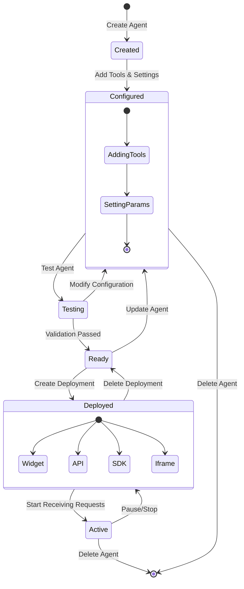
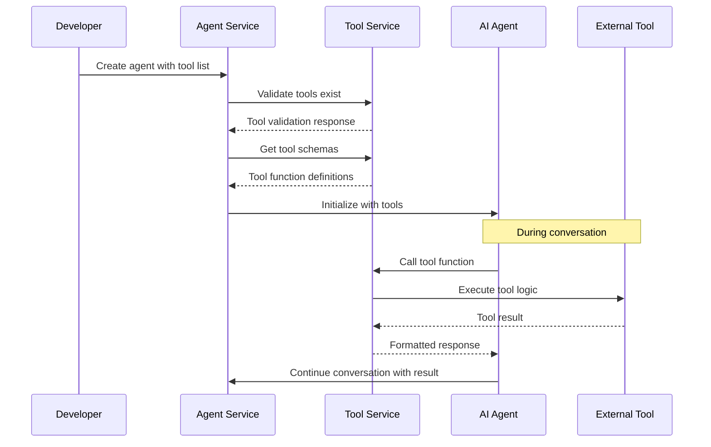

The Agents Service provides endpoints for creating, configuring, and deploying AI agents within your organization. It enables you to define agent behaviors, tools, and deployment configurations.

## Agent Lifecycle Overview



## Agent-Tool Integration Flow



## Authentication

All endpoints require a valid Bearer token in the Authorization header.

## Base URL

```
/api/agents
```

## Agent Endpoints

### Create Agent

Create a new AI agent for your organization.

<CodeGroup>
```bash curl
curl -X POST {{baseUrl}}/api/agents?org_id=your-org-id \
  -H "Authorization: Bearer YOUR_TOKEN" \
  -H "Content-Type: application/json" \
  -d '{
    "name": "Customer Support Agent",
    "description": "AI agent for handling customer support inquiries",
    "agent_type": "chat",
    "model_id": "3fa85f64-5717-4562-b3fc-2c963f66afa6",
    "tools": [
      {
        "tool_id": "3fa85f64-5717-4562-b3fc-2c963f66afa6",
        "config": [
          {
            "name": "api_key",
            "value": "sk-123456789"
          }
        ]
      }
    ],
    "params": {
      "system_prompt": "You are a helpful customer support agent for our e-commerce platform. Your goal is to assist customers with their inquiries, help them track orders, and resolve issues with their purchases. If you don't know the answer, you can use available tools to look up information.",
      "temperature": 0.7,
      "max_tokens": 1000
    },
    "is_public": false
  }'
```
```python python
import requests

url = "{{baseUrl}}/api/agents?org_id=your-org-id"
headers = {
    "Authorization": "Bearer YOUR_TOKEN",
    "Content-Type": "application/json"
}
data = {
    "name": "Customer Support Agent",
    "description": "AI agent for handling customer support inquiries",
    "agent_type": "chat",
    "model_id": "3fa85f64-5717-4562-b3fc-2c963f66afa6",
    "tools": [
        {
            "tool_id": "3fa85f64-5717-4562-b3fc-2c963f66afa6",
            "config": [
                {
                    "name": "api_key",
                    "value": "sk-123456789"
                }
            ]
        }
    ],
    "params": {
        "system_prompt": "You are a helpful customer support agent for our e-commerce platform. Your goal is to assist customers with their inquiries, help them track orders, and resolve issues with their purchases. If you don't know the answer, you can use available tools to look up information.",
        "temperature": 0.7,
        "max_tokens": 1000
    },
    "is_public": False
}

response = requests.post(url, headers=headers, json=data)
print(response.json())
```

```typescript typescript
interface AgentConfig {
  name: string;
  description: string;
  agent_type: string;
  model_id: string;
  tools?: Array<{
    tool_id: string;
    config: Array<{
      name: string;
      value: string;
    }>;
  }>;
  params: {
    system_prompt: string;
    temperature: number;
    max_tokens: number;
  };
  is_public: boolean;
}

const createAgent = async (orgId: string, config: AgentConfig): Promise<any> => {
  const response = await fetch(`{{baseUrl}}/api/agents?org_id=${orgId}`, {
    method: 'POST',
    headers: {
      'Authorization': 'Bearer YOUR_TOKEN',
      'Content-Type': 'application/json',
    },
    body: JSON.stringify(config),
  });
  
  if (!response.ok) {
    throw new Error(`HTTP error! status: ${response.status}`);
  }
  
  return await response.json();
};

// Usage
const agent = await createAgent('your-org-id', {
  name: "Customer Support Agent",
  description: "AI agent for handling customer support inquiries",
  agent_type: "chat",
  model_id: "3fa85f64-5717-4562-b3fc-2c963f66afa6",
  tools: [
    {
      tool_id: "3fa85f64-5717-4562-b3fc-2c963f66afa6",
      config: [
        {
          name: "api_key",
          value: "sk-123456789"
        }
      ]
    }
  ],
  params: {
    system_prompt: "You are a helpful customer support agent for our e-commerce platform. Your goal is to assist customers with their inquiries, help them track orders, and resolve issues with their purchases. If you don't know the answer, you can use available tools to look up information.",
    temperature: 0.7,
    max_tokens: 1000
  },
  is_public: false
});
```

```go go
package main

import (
    "bytes"
    "encoding/json"
    "fmt"
    "net/http"
    "net/url"
)

type ToolConfig struct {
    Name  string `json:"name"`
    Value string `json:"value"`
}

type AgentTool struct {
    ToolID string       `json:"tool_id"`
    Config []ToolConfig `json:"config"`
}

type AgentParams struct {
    SystemPrompt string  `json:"system_prompt"`
    Temperature  float64 `json:"temperature"`
    MaxTokens    int     `json:"max_tokens"`
}

type AgentConfig struct {
    Name        string      `json:"name"`
    Description string      `json:"description"`
    AgentType   string      `json:"agent_type"`
    ModelID     string      `json:"model_id"`
    Tools       []AgentTool `json:"tools,omitempty"`
    Params      AgentParams `json:"params"`
    IsPublic    bool        `json:"is_public"`
}

func createAgent(baseURL, orgID, token string, config AgentConfig) error {
    apiURL := fmt.Sprintf("%s/api/agents?org_id=%s", baseURL, url.QueryEscape(orgID))
    
    jsonData, err := json.Marshal(config)
    if err != nil {
        return fmt.Errorf("error marshaling config: %v", err)
    }
    
    req, err := http.NewRequest("POST", apiURL, bytes.NewBuffer(jsonData))
    if err != nil {
        return fmt.Errorf("error creating request: %v", err)
    }
    
    req.Header.Set("Authorization", "Bearer "+token)
    req.Header.Set("Content-Type", "application/json")
    
    client := &http.Client{}
    resp, err := client.Do(req)
    if err != nil {
        return fmt.Errorf("error sending request: %v", err)
    }
    defer resp.Body.Close()
    
    if resp.StatusCode != http.StatusOK && resp.StatusCode != http.StatusCreated {
        return fmt.Errorf("API request failed with status: %d", resp.StatusCode)
    }
    
    fmt.Println("Agent created successfully!")
    return nil
}

func main() {
    config := AgentConfig{
        Name:        "Customer Support Agent",
        Description: "AI agent for handling customer support inquiries",
        AgentType:   "chat",
        ModelID:     "3fa85f64-5717-4562-b3fc-2c963f66afa6",
        Tools: []AgentTool{
            {
                ToolID: "3fa85f64-5717-4562-b3fc-2c963f66afa6",
                Config: []ToolConfig{
                    {
                        Name:  "api_key",
                        Value: "sk-123456789",
                    },
                },
            },
        },
        Params: AgentParams{
            SystemPrompt: "You are a helpful customer support agent for our e-commerce platform. Your goal is to assist customers with their inquiries, help them track orders, and resolve issues with their purchases. If you don't know the answer, you can use available tools to look up information.",
            Temperature:  0.7,
            MaxTokens:    1000,
        },
        IsPublic: false,
    }
    
    err := createAgent("{{baseUrl}}", "your-org-id", "YOUR_TOKEN", config)
    if err != nil {
        fmt.Printf("Error: %v\n", err)
    }
}
```

```json Response
{
  "id": "9d8e7f6g-5h4i-3j2k-1l0m-9n8o7p6q5r4s",
  "name": "Customer Support Agent",
  "description": "AI agent for handling customer support inquiries",
  "agent_type": "chat",
  "model_id": "3fa85f64-5717-4562-b3fc-2c963f66afa6",
  "created_at": "2023-08-01T10:00:00Z",
  "updated_at": "2023-08-01T10:00:00Z",
  "org_id": "your-org-id",
  "is_public": false
}
```
</CodeGroup>

**Endpoint:** `POST /api/agents`

**Query Parameters:**

| Parameter | Required | Description |
|-----------|----------|-------------|
| `org_id` | Yes | Organization ID |

**Request Body:**

| Field | Type | Required | Description |
|-------|------|----------|-------------|
| `name` | string | Yes | Name of the agent |
| `description` | string | Yes | Description of the agent's purpose |
| `agent_type` | string | Yes | Type of agent (e.g., "chat", "function") |
| `model_id` | string | Yes | ID of the LLM model to use |
| `tools` | array | No | List of tools to provide to the agent |
| `params` | object | Yes | Configuration parameters for the agent |
| `is_public` | boolean | No | Whether the agent is publicly available (default: false) |

**Agent Parameters:**

| Field | Type | Description |
|-------|------|-------------|
| `system_prompt` | string | The system instructions for the agent |
| `temperature` | number | Sampling temperature (0-1) |
| `max_tokens` | number | Maximum tokens in the response |

### List Agents

Retrieve all agents for an organization.

<CodeGroup>
```bash Request
curl -X GET {{baseUrl}}/api/agents/list?org_id=your-org-id \
  -H "Authorization: Bearer YOUR_TOKEN"
```

```python Python
import requests

url = "{{baseUrl}}/api/agents/list"
headers = {
    "Authorization": "Bearer YOUR_TOKEN"
}
params = {
    "org_id": "your-org-id"
}

response = requests.get(url, headers=headers, params=params)
print(response.json())
```

```javascript JavaScript
const axios = require('axios');

const url = "{{baseUrl}}/api/agents/list";
const headers = {
    Authorization: "Bearer YOUR_TOKEN"
};
const params = {
    org_id: "your-org-id"
};

axios.get(url, { headers, params })
    .then(response => console.log(response.data))
    .catch(error => console.error(error));
```

```json Response
[
  {
    "id": "9d8e7f6g-5h4i-3j2k-1l0m-9n8o7p6q5r4s",
    "name": "Customer Support Agent",
    "description": "AI agent for handling customer support inquiries",
    "agent_type": "chat",
    "model": {
      "id": "3fa85f64-5717-4562-b3fc-2c963f66afa6",
      "name": "Claude 3 Opus"
    },
    "created_at": "2023-08-01T10:00:00Z",
    "updated_at": "2023-08-01T10:00:00Z",
    "org_id": "your-org-id",
    "is_public": false,
    "deployments_count": 1
  },
  {
    "id": "1a2b3c4d-5e6f-7g8h-9i0j-1k2l3m4n5o6p",
    "name": "Sales Assistant",
    "description": "AI agent for handling sales inquiries",
    "agent_type": "chat",
    "model": {
      "id": "7fa85f64-5717-4562-b3fc-2c963f66afa9",
      "name": "GPT-4 Turbo"
    },
    "created_at": "2023-08-02T10:00:00Z",
    "updated_at": "2023-08-02T10:00:00Z",
    "org_id": "your-org-id",
    "is_public": false,
    "deployments_count": 0
  }
]
```
</CodeGroup>

**Endpoint:** `GET /api/agents/list`

**Query Parameters:**

| Parameter | Required | Description |
|-----------|----------|-------------|
| `org_id` | Yes | Organization ID |

### Get Agent Details

Retrieve detailed information about a specific agent.

<CodeGroup>
```bash Request
curl -X GET {{baseUrl}}/api/agents/get?agent_id=9d8e7f6g-5h4i-3j2k-1l0m-9n8o7p6q5r4s \
  -H "Authorization: Bearer YOUR_TOKEN"
```

```python Python
import requests

url = "{{baseUrl}}/api/agents/get"
headers = {
    "Authorization": "Bearer YOUR_TOKEN"
}
params = {
    "agent_id": "9d8e7f6g-5h4i-3j2k-1l0m-9n8o7p6q5r4s"
}

response = requests.get(url, headers=headers, params=params)
print(response.json())
```

```javascript JavaScript
const axios = require('axios');

const url = "{{baseUrl}}/api/agents/get";
const headers = {
    Authorization: "Bearer YOUR_TOKEN"
};
const params = {
    agent_id: "9d8e7f6g-5h4i-3j2k-1l0m-9n8o7p6q5r4s"
};

axios.get(url, { headers, params })
    .then(response => console.log(response.data))
    .catch(error => console.error(error));
```

```json Response
{
  "id": "9d8e7f6g-5h4i-3j2k-1l0m-9n8o7p6q5r4s",
  "name": "Customer Support Agent",
  "description": "AI agent for handling customer support inquiries",
  "agent_type": "chat",
  "model": {
    "id": "3fa85f64-5717-4562-b3fc-2c963f66afa6",
    "name": "Claude 3 Opus"
  },
  "tools": [
    {
      "id": "3fa85f64-5717-4562-b3fc-2c963f66afa6",
      "name": "Order Lookup Tool",
      "category": {
        "id": "6a5b4c3d-2e1f-0g9h-8i7j-6k5l4m3n2o1p",
        "name": "E-commerce"
      },
      "config": [
        {
          "name": "api_key",
          "value": "sk-123456789"
        }
      ]
    }
  ],
  "params": {
    "system_prompt": "You are a helpful customer support agent for our e-commerce platform...",
    "temperature": 0.7,
    "max_tokens": 1000
  },
  "created_at": "2023-08-01T10:00:00Z",
  "updated_at": "2023-08-01T10:00:00Z",
  "org_id": "your-org-id",
  "is_public": false,
  "deployments": [
    {
      "id": "5a4b3c2d-1e0f-9g8h-7i6j-5k4l3m2n1o0p",
      "name": "Web Widget Deployment",
      "description": "Customer support agent for the web widget",
      "created_at": "2023-08-01T11:00:00Z"
    }
  ]
}
```
</CodeGroup>

**Endpoint:** `GET /api/agents/get`

**Query Parameters:**

| Parameter | Required | Description |
|-----------|----------|-------------|
| `agent_id` | Yes | ID of the agent to retrieve |

### Update Agent

Update an existing agent's configuration.

<CodeGroup>
```bash Request
curl -X PUT {{baseUrl}}/api/agents/update?agent_id=9d8e7f6g-5h4i-3j2k-1l0m-9n8o7p6q5r4s \
  -H "Authorization: Bearer YOUR_TOKEN" \
  -H "Content-Type: application/json" \
  -d '{
    "name": "Premium Customer Support Agent",
    "description": "Enhanced AI agent for handling premium customer support inquiries",
    "params": {
      "system_prompt": "You are a helpful premium customer support agent...",
      "temperature": 0.5
    }
  }'
```

```python Python
import requests

url = "{{baseUrl}}/api/agents/update"
headers = {
    "Authorization": "Bearer YOUR_TOKEN",
    "Content-Type": "application/json"
}
params = {
    "agent_id": "9d8e7f6g-5h4i-3j2k-1l0m-9n8o7p6q5r4s"
}
data = {
    "name": "Premium Customer Support Agent",
    "description": "Enhanced AI agent for handling premium customer support inquiries",
    "params": {
        "system_prompt": "You are a helpful premium customer support agent...",
        "temperature": 0.5
    }
}

response = requests.put(url, headers=headers, params=params, json=data)
print(response.json())
```

```javascript JavaScript
const axios = require('axios');

const url = "{{baseUrl}}/api/agents/update";
const headers = {
    Authorization: "Bearer YOUR_TOKEN",
    "Content-Type": "application/json"
};
const params = {
    agent_id: "9d8e7f6g-5h4i-3j2k-1l0m-9n8o7p6q5r4s"
};
const data = {
    name: "Premium Customer Support Agent",
    description: "Enhanced AI agent for handling premium customer support inquiries",
    params: {
        system_prompt: "You are a helpful premium customer support agent...",
        temperature: 0.5
    }
};

axios.put(url, data, { headers, params })
    .then(response => console.log(response.data))
    .catch(error => console.error(error));
```

```json Response
{
  "id": "9d8e7f6g-5h4i-3j2k-1l0m-9n8o7p6q5r4s",
  "name": "Premium Customer Support Agent",
  "description": "Enhanced AI agent for handling premium customer support inquiries",
  "updated_at": "2023-08-02T10:00:00Z"
}
```
</CodeGroup>

**Endpoint:** `PUT /api/agents/update`

**Query Parameters:**

| Parameter | Required | Description |
|-----------|----------|-------------|
| `agent_id` | Yes | ID of the agent to update |

**Request Body:**

| Field | Type | Required | Description |
|-------|------|----------|-------------|
| `name` | string | No | New name for the agent |
| `description` | string | No | New description |
| `model_id` | string | No | New model ID |
| `tools` | array | No | Updated list of tools |
| `params` | object | No | Updated configuration parameters |
| `is_public` | boolean | No | Update public availability |

### Delete Agent

Delete an agent from the organization.

<CodeGroup>
```bash Request
curl -X DELETE {{baseUrl}}/api/agents/delete?agent_id=9d8e7f6g-5h4i-3j2k-1l0m-9n8o7p6q5r4s \
  -H "Authorization: Bearer YOUR_TOKEN"
```

```python Python
import requests

url = "{{baseUrl}}/api/agents/delete"
headers = {
    "Authorization": "Bearer YOUR_TOKEN"
}
params = {
    "agent_id": "9d8e7f6g-5h4i-3j2k-1l0m-9n8o7p6q5r4s"
}

response = requests.delete(url, headers=headers, params=params)
print(response.json())
```

```javascript JavaScript
const axios = require('axios');

const url = "{{baseUrl}}/api/agents/delete";
const headers = {
    Authorization: "Bearer YOUR_TOKEN"
};
const params = {
    agent_id: "9d8e7f6g-5h4i-3j2k-1l0m-9n8o7p6q5r4s"
};

axios.delete(url, { headers, params })
    .then(response => console.log(response.data))
    .catch(error => console.error(error));
```

```json Response
{
  "success": true,
  "message": "Agent deleted successfully"
}
```
</CodeGroup>

**Endpoint:** `DELETE /api/agents/delete`

**Query Parameters:**

| Parameter | Required | Description |
|-----------|----------|-------------|
| `agent_id` | Yes | ID of the agent to delete |

## Agent Deployment Endpoints

### Create Deployment

Create a new deployment for an existing agent.

<CodeGroup>
```bash Request
curl -X POST {{baseUrl}}/api/agent_deploy/create?org_id=your-org-id \
  -H "Authorization: Bearer YOUR_TOKEN" \
  -H "Content-Type: application/json" \
  -d '{
    "agent_id": "9d8e7f6g-5h4i-3j2k-1l0m-9n8o7p6q5r4s",
    "name": "Web Widget Deployment",
    "description": "Customer support agent for the web widget",
    "deployment_type": "widget",
    "config": {
      "theme": {
        "primary_color": "#4f46e5",
        "font_family": "Inter, sans-serif"
      },
      "branding": {
        "logo_url": "https://example.com/logo.png",
        "company_name": "Example Corp"
      },
      "widget_placement": "bottom-right",
      "welcome_message": "👋 Hi there! How can I help you today?"
    }
  }'
```

```python Python
import requests

url = "{{baseUrl}}/api/agent_deploy/create"
headers = {
    "Authorization": "Bearer YOUR_TOKEN",
    "Content-Type": "application/json"
}
params = {
    "org_id": "your-org-id"
}
data = {
    "agent_id": "9d8e7f6g-5h4i-3j2k-1l0m-9n8o7p6q5r4s",
    "name": "Web Widget Deployment",
    "description": "Customer support agent for the web widget",
    "deployment_type": "widget",
    "config": {
        "theme": {
            "primary_color": "#4f46e5",
            "font_family": "Inter, sans-serif"
        },
        "branding": {
            "logo_url": "https://example.com/logo.png",
            "company_name": "Example Corp"
        },
        "widget_placement": "bottom-right",
        "welcome_message": "👋 Hi there! How can I help you today?"
    }
}

response = requests.post(url, headers=headers, params=params, json=data)
print(response.json())
```

```javascript JavaScript
const axios = require('axios');

const url = "{{baseUrl}}/api/agent_deploy/create";
const headers = {
    Authorization: "Bearer YOUR_TOKEN",
    "Content-Type": "application/json"
};
const params = {
    org_id: "your-org-id"
};
const data = {
    agent_id: "9d8e7f6g-5h4i-3j2k-1l0m-9n8o7p6q5r4s",
    name: "Web Widget Deployment",
    description: "Customer support agent for the web widget",
    deployment_type: "widget",
    config: {
        theme: {
            primary_color: "#4f46e5",
            font_family: "Inter, sans-serif"
        },
        branding: {
            logo_url: "https://example.com/logo.png",
            company_name: "Example Corp"
        },
        widget_placement: "bottom-right",
        welcome_message: "👋 Hi there! How can I help you today?"
    }
};

axios.post(url, data, { headers, params })
    .then(response => console.log(response.data))
    .catch(error => console.error(error));
```

```json Response
{
  "id": "5a4b3c2d-1e0f-9g8h-7i6j-5k4l3m2n1o0p",
  "name": "Web Widget Deployment",
  "description": "Customer support agent for the web widget",
  "deployment_type": "widget",
  "agent_id": "9d8e7f6g-5h4i-3j2k-1l0m-9n8o7p6q5r4s",
  "created_at": "2023-08-01T11:00:00Z",
  "updated_at": "2023-08-01T11:00:00Z",
  "org_id": "your-org-id",
  "api_key": "deploy_5a4b3c2d1e0f9g8h7i6j5k4l3m2n1o0p",
  "integration_code": "<script src=\"https://cdn.example.com/agent-widget.js\" data-key=\"deploy_5a4b3c2d1e0f9g8h7i6j5k4l3m2n1o0p\"></script>"
}
```
</CodeGroup>

**Endpoint:** `POST /api/agent_deploy/create`

**Query Parameters:**

| Parameter | Required | Description |
|-----------|----------|-------------|
| `org_id` | Yes | Organization ID |

**Request Body:**

| Field | Type | Required | Description |
|-------|------|----------|-------------|
| `agent_id` | string | Yes | ID of the agent to deploy |
| `name` | string | Yes | Name of the deployment |
| `description` | string | Yes | Description of the deployment |
| `deployment_type` | string | Yes | Type of deployment (e.g., "widget", "api", "iframe") |
| `config` | object | Yes | Configuration parameters for the deployment |

### List Deployments

Retrieve all deployments for an organization.

<CodeGroup>
```bash Request
curl -X GET {{baseUrl}}/api/agent_deploy/list?org_id=your-org-id \
  -H "Authorization: Bearer YOUR_TOKEN"
```

```python Python
import requests

url = "{{baseUrl}}/api/agent_deploy/list"
headers = {
    "Authorization": "Bearer YOUR_TOKEN"
}
params = {
    "org_id": "your-org-id"
}

response = requests.get(url, headers=headers, params=params)
print(response.json())
```

```javascript JavaScript
const axios = require('axios');

const url = "{{baseUrl}}/api/agent_deploy/list";
const headers = {
    Authorization: "Bearer YOUR_TOKEN"
};
const params = {
    org_id: "your-org-id"
};

axios.get(url, { headers, params })
    .then(response => console.log(response.data))
    .catch(error => console.error(error));
```

```json Response
[
  {
    "id": "5a4b3c2d-1e0f-9g8h-7i6j-5k4l3m2n1o0p",
    "name": "Web Widget Deployment",
    "description": "Customer support agent for the web widget",
    "deployment_type": "widget",
    "agent": {
      "id": "9d8e7f6g-5h4i-3j2k-1l0m-9n8o7p6q5r4s",
      "name": "Customer Support Agent"
    },
    "created_at": "2023-08-01T11:00:00Z",
    "updated_at": "2023-08-01T11:00:00Z",
    "org_id": "your-org-id"
  },
  {
    "id": "6b5c4d3e-2f1g-0h9i-8j7k-6l5m4n3o2p1q",
    "name": "Mobile SDK Deployment",
    "description": "Customer support agent for the mobile app",
    "deployment_type": "sdk",
    "agent": {
      "id": "9d8e7f6g-5h4i-3j2k-1l0m-9n8o7p6q5r4s",
      "name": "Customer Support Agent"
    },
    "created_at": "2023-08-02T11:00:00Z",
    "updated_at": "2023-08-02T11:00:00Z",
    "org_id": "your-org-id"
  }
]
```
</CodeGroup>

**Endpoint:** `GET /api/agent_deploy/list`

**Query Parameters:**

| Parameter | Required | Description |
|-----------|----------|-------------|
| `org_id` | Yes | Organization ID |

### Get Deployment Details

Retrieve detailed information about a specific deployment.

<CodeGroup>
```bash Request
curl -X GET {{baseUrl}}/api/agent_deploy/get?deployment_id=5a4b3c2d-1e0f-9g8h-7i6j-5k4l3m2n1o0p \
  -H "Authorization: Bearer YOUR_TOKEN"
```

```python Python
import requests

url = "{{baseUrl}}/api/agent_deploy/get"
headers = {
    "Authorization": "Bearer YOUR_TOKEN"
}
params = {
    "deployment_id": "5a4b3c2d-1e0f-9g8h-7i6j-5k4l3m2n1o0p"
}

response = requests.get(url, headers=headers, params=params)
print(response.json())
```

```javascript JavaScript
const axios = require('axios');

const url = "{{baseUrl}}/api/agent_deploy/get";
const headers = {
    Authorization: "Bearer YOUR_TOKEN"
};
const params = {
    deployment_id: "5a4b3c2d-1e0f-9g8h-7i6j-5k4l3m2n1o0p"
};

axios.get(url, { headers, params })
    .then(response => console.log(response.data))
    .catch(error => console.error(error));
```

```json Response
{
  "id": "5a4b3c2d-1e0f-9g8h-7i6j-5k4l3m2n1o0p",
  "name": "Web Widget Deployment",
  "description": "Customer support agent for the web widget",
  "deployment_type": "widget",
  "agent": {
    "id": "9d8e7f6g-5h4i-3j2k-1l0m-9n8o7p6q5r4s",
    "name": "Customer Support Agent",
    "description": "AI agent for handling customer support inquiries"
  },
  "config": {
    "theme": {
      "primary_color": "#4f46e5",
      "font_family": "Inter, sans-serif"
    },
    "branding": {
      "logo_url": "https://example.com/logo.png",
      "company_name": "Example Corp"
    },
    "widget_placement": "bottom-right",
    "welcome_message": "👋 Hi there! How can I help you today?"
  },
  "created_at": "2023-08-01T11:00:00Z",
  "updated_at": "2023-08-01T11:00:00Z",
  "org_id": "your-org-id",
  "api_key": "deploy_5a4b3c2d1e0f9g8h7i6j5k4l3m2n1o0p",
  "integration_code": "<script src=\"https://cdn.example.com/agent-widget.js\" data-key=\"deploy_5a4b3c2d1e0f9g8h7i6j5k4l3m2n1o0p\"></script>",
  "usage_stats": {
    "total_conversations": 125,
    "total_messages": 843,
    "avg_conversation_length": 6.7,
    "avg_response_time": 1.2
  }
}
```
</CodeGroup>

**Endpoint:** `GET /api/agent_deploy/get`

**Query Parameters:**

| Parameter | Required | Description |
|-----------|----------|-------------|
| `deployment_id` | Yes | ID of the deployment to retrieve |

### Update Deployment

Update an existing deployment configuration.

<CodeGroup>
```bash Request
curl -X PUT {{baseUrl}}/api/agent_deploy/update?deployment_id=5a4b3c2d-1e0f-9g8h-7i6j-5k4l3m2n1o0p \
  -H "Authorization: Bearer YOUR_TOKEN" \
  -H "Content-Type: application/json" \
  -d '{
    "name": "Web Widget Deployment v2",
    "config": {
      "theme": {
        "primary_color": "#3b82f6"
      },
      "welcome_message": "👋 Hello! How may I assist you today?"
    }
  }'
```

```python Python
import requests

url = "{{baseUrl}}/api/agent_deploy/update"
headers = {
    "Authorization": "Bearer YOUR_TOKEN",
    "Content-Type": "application/json"
}
params = {
    "deployment_id": "5a4b3c2d-1e0f-9g8h-7i6j-5k4l3m2n1o0p"
}
data = {
    "name": "Web Widget Deployment v2",
    "config": {
        "theme": {
            "primary_color": "#3b82f6"
        },
        "welcome_message": "👋 Hello! How may I assist you today?"
    }
}

response = requests.put(url, headers=headers, params=params, json=data)
print(response.json())
```

```javascript JavaScript
const axios = require('axios');

const url = "{{baseUrl}}/api/agent_deploy/update";
const headers = {
    Authorization: "Bearer YOUR_TOKEN",
    "Content-Type": "application/json"
};
const params = {
    deployment_id: "5a4b3c2d-1e0f-9g8h-7i6j-5k4l3m2n1o0p"
};
const data = {
    name: "Web Widget Deployment v2",
    config: {
        theme: {
            primary_color: "#3b82f6"
        },
        welcome_message: "👋 Hello! How may I assist you today?"
    }
};

axios.put(url, data, { headers, params })
    .then(response => console.log(response.data))
    .catch(error => console.error(error));
```

```json Response
{
  "id": "5a4b3c2d-1e0f-9g8h-7i6j-5k4l3m2n1o0p",
  "name": "Web Widget Deployment v2",
  "updated_at": "2023-08-03T11:00:00Z"
}
```
</CodeGroup>

**Endpoint:** `PUT /api/agent_deploy/update`

**Query Parameters:**

| Parameter | Required | Description |
|-----------|----------|-------------|
| `deployment_id` | Yes | ID of the deployment to update |

**Request Body:**

| Field | Type | Required | Description |
|-------|------|----------|-------------|
| `name` | string | No | New name for the deployment |
| `description` | string | No | New description |
| `config` | object | No | Updated configuration parameters |

### Delete Deployment

Delete a deployment.

<CodeGroup>
```bash Request
curl -X DELETE {{baseUrl}}/api/agent_deploy/delete?deployment_id=5a4b3c2d-1e0f-9g8h-7i6j-5k4l3m2n1o0p \
  -H "Authorization: Bearer YOUR_TOKEN"
```

```python Python
import requests

url = "{{baseUrl}}/api/agent_deploy/delete"
headers = {
    "Authorization": "Bearer YOUR_TOKEN"
}
params = {
    "deployment_id": "5a4b3c2d-1e0f-9g8h-7i6j-5k4l3m2n1o0p"
}

response = requests.delete(url, headers=headers, params=params)
print(response.json())
```

```javascript JavaScript
const axios = require('axios');

const url = "{{baseUrl}}/api/agent_deploy/delete";
const headers = {
    Authorization: "Bearer YOUR_TOKEN"
};
const params = {
    deployment_id: "5a4b3c2d-1e0f-9g8h-7i6j-5k4l3m2n1o0p"
};

axios.delete(url, { headers, params })
    .then(response => console.log(response.data))
    .catch(error => console.error(error));
```

```json Response
{
  "success": true,
  "message": "Deployment deleted successfully"
}
```
</CodeGroup>

**Endpoint:** `DELETE /api/agent_deploy/delete`

**Query Parameters:**

| Parameter | Required | Description |
|-----------|----------|-------------|
| `deployment_id` | Yes | ID of the deployment to delete |

### Regenerate API Key

Regenerate the API key for a deployment.

<CodeGroup>
```bash Request
curl -X POST {{baseUrl}}/api/agent_deploy/regenerate_key?deployment_id=5a4b3c2d-1e0f-9g8h-7i6j-5k4l3m2n1o0p \
  -H "Authorization: Bearer YOUR_TOKEN"
```

```python Python
import requests

url = "{{baseUrl}}/api/agent_deploy/regenerate_key"
headers = {
    "Authorization": "Bearer YOUR_TOKEN"
}
params = {
    "deployment_id": "5a4b3c2d-1e0f-9g8h-7i6j-5k4l3m2n1o0p"
}

response = requests.post(url, headers=headers, params=params)
print(response.json())
```

```javascript JavaScript
const axios = require('axios');

const url = "{{baseUrl}}/api/agent_deploy/regenerate_key";
const headers = {
    Authorization: "Bearer YOUR_TOKEN"
};
const params = {
    deployment_id: "5a4b3c2d-1e0f-9g8h-7i6j-5k4l3m2n1o0p"
};

axios.post(url, {}, { headers, params })
    .then(response => console.log(response.data))
    .catch(error => console.error(error));
```

```json Response
{
  "api_key": "deploy_6b5c4d3e2f1g0h9i8j7k6l5m4n3o2p1q",
  "integration_code": "<script src=\"https://cdn.example.com/agent-widget.js\" data-key=\"deploy_6b5c4d3e2f1g0h9i8j7k6l5m4n3o2p1q\"></script>"
}
```
</CodeGroup>

**Endpoint:** `POST /api/agent_deploy/regenerate_key`

**Query Parameters:**

| Parameter | Required | Description |
|-----------|----------|-------------|
| `deployment_id` | Yes | ID of the deployment for which to regenerate the API key |

## Error Responses

| Status Code | Description |
|-------------|-------------|
| 400 | Bad Request - Invalid input or validation error |
| 401 | Unauthorized - Invalid or missing token |
| 403 | Forbidden - Insufficient permissions |
| 404 | Not Found - Resource doesn't exist |
| 409 | Conflict - Resource already exists or conflict with existing resource |
| 500 | Internal Server Error - Server-side error |

## Implementation Notes

- Agents are configured with specific LLM models, tools, and parameters
- Agents can be deployed in multiple ways (widget, API, SDK)
- Each deployment has its own API key for authentication
- Deployments can be customized with different themes and configurations
- Usage statistics are available for each deployment
- Organization-based access control ensures separation between tenants
