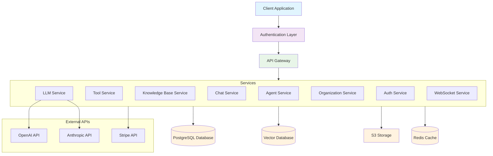
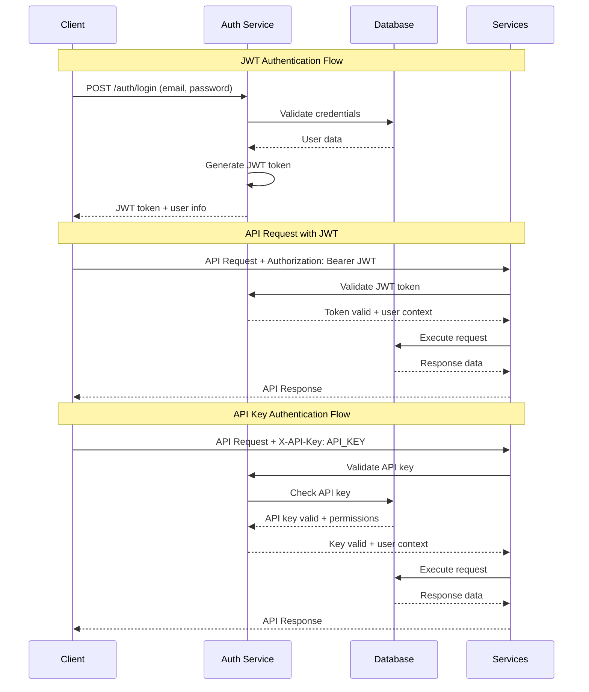
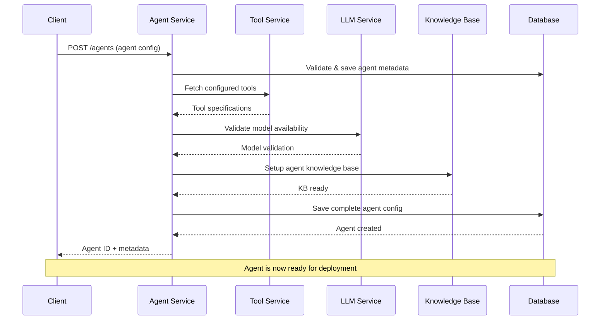
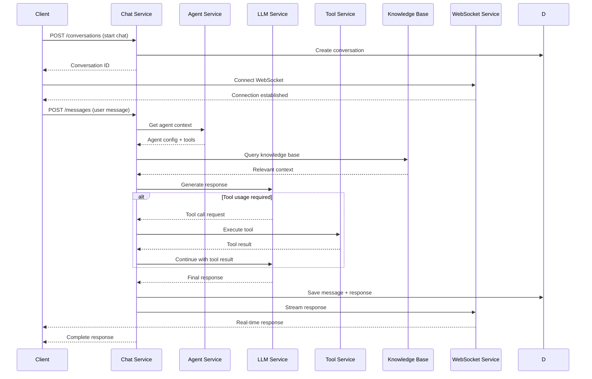
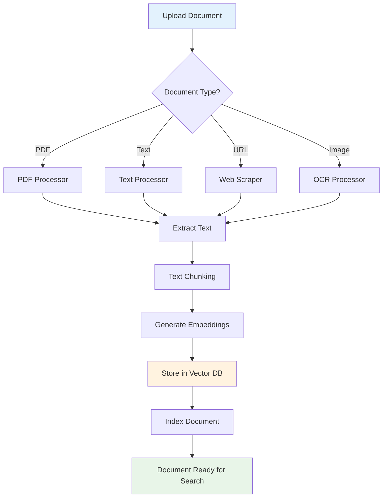

# Definable.ai API Reference

The Definable.ai API is organized around REST principles, using standard HTTP verbs, returning JSON responses, and using standard HTTP status codes to indicate errors. Our API enables you to create, manage, and deploy AI agents and tools programmatically.

## API Architecture Overview



## Base URL

All API requests should be made to the following base URL:

```
https://api.definable.ai
```

For local development, the base URL is:

```
http://localhost:8000
```

## Authentication

All API endpoints require authentication using either JWT tokens or API keys. See the [Authentication Guide](/pages/authentication/overview) for details on how to authenticate your requests.

### Bearer Token Authentication

```bash
curl -H "Authorization: Bearer YOUR_JWT_TOKEN" \
  https://api.definable.ai/v1/agents
```

### API Key Authentication

```bash
curl -H "X-API-Key: YOUR_API_KEY" \
  https://api.definable.ai/v1/agents
```

## Authentication Flow



## Response Format

Responses are returned in JSON format. Successful responses typically include:

```json
{
  "status": "success",
  "data": {
    // Response data here
  }
}
```

Error responses follow a consistent structure:

```json
{
  "status": "error",
  "error": {
    "code": "ERROR_CODE",
    "message": "Human-readable error message",
    "details": {} // Optional additional details
  }
}
```

## HTTP Status Codes

The API uses standard HTTP status codes to indicate the success or failure of a request:

| Code | Description |
| ---- | ----------- |
| 200  | OK - The request was successful |
| 201  | Created - A new resource was successfully created |
| 400  | Bad Request - The request was invalid |
| 401  | Unauthorized - Authentication failed or not provided |
| 403  | Forbidden - The authenticated user doesn't have permission |
| 404  | Not Found - The requested resource doesn't exist |
| 422  | Unprocessable Entity - Validation error |
| 429  | Too Many Requests - Rate limit exceeded |
| 500  | Internal Server Error - Something went wrong on the server |

## Rate Limiting

API requests are subject to rate limiting to ensure stability and fair usage. The current limits are:

- 100 requests per minute per IP address
- 1000 requests per hour per authenticated user

Rate limit headers are included in all API responses:

```
X-RateLimit-Limit: 100
X-RateLimit-Remaining: 95
X-RateLimit-Reset: 1620000000
```

## Pagination

For endpoints that return lists of items, the API uses cursor-based pagination. Parameters:

- `limit`: Number of items to return (default: 20, max: 100)
- `cursor`: Cursor for pagination (obtained from previous responses)

Paginated responses include:

```json
{
  "status": "success",
  "data": [
    // Items here
  ],
  "pagination": {
    "next_cursor": "next_page_cursor",
    "has_more": true
  }
}
```

## 🚀 API Endpoints

The Definable.ai API is organized into logical categories for easy navigation:

### 🤖 AI & Intelligence APIs

<CardGroup cols={2}>
  <Card 
    title="🤖 Agents API" 
    icon="robot" 
    href="/pages/api-reference/agents-service" 
    color="#6366F1"
  >
    **Core Intelligence** - Create, configure, and deploy AI agents with custom personalities, tools, and capabilities 🎯
  </Card>
  <Card 
    title="🧠 LLM Services" 
    icon="brain" 
    href="/pages/api-reference/llm-service" 
    color="#8B5CF6"
  >
    **Language Models** - Integrate with GPT-4, Claude, and other cutting-edge models for natural conversation 💬
  </Card>
  <Card 
    title="🛠️ Tools API" 
    icon="wrench" 
    href="/pages/api-reference/tools-service" 
    color="#A855F7"
  >
    **Agent Superpowers** - Build and manage custom functions that extend agent capabilities ⚡
  </Card>
  <Card 
    title="📚 Knowledge Base API" 
    icon="database" 
    href="/pages/api-reference/kb-service" 
    color="#C084FC"
  >
    **Smart Memory** - Upload, process, and query documents with semantic search capabilities 🔍
  </Card>
</CardGroup>

### 💬 Communication APIs

<CardGroup cols={2}>
  <Card 
    title="💬 Conversations API" 
    icon="chat" 
    href="/pages/api-reference/conversation-service" 
    color="#10B981"
  >
    **Chat Management** - Handle multi-turn conversations, context, and message history 📝
  </Card>
  <Card 
    title="⚡ WebSocket API" 
    icon="bolt" 
    href="/pages/api-reference/ws-service" 
    color="#059669"
  >
    **Real-time Streaming** - Live communication with agents through WebSocket connections 🔄
  </Card>
</CardGroup>

### 👥 Organization & Security

<CardGroup cols={2}>
  <Card 
    title="🔐 Authentication API" 
    icon="shield" 
    href="/pages/api-reference/auth-service" 
    color="#DC2626"
  >
    **Security Layer** - JWT tokens, API keys, and secure authentication flows 🛡️
  </Card>
  <Card 
    title="🏢 Organizations API" 
    icon="building" 
    href="/pages/api-reference/org-service" 
    color="#EA580C"
  >
    **Team Management** - Multi-tenant organization structure and user management 👥
  </Card>
  <Card 
    title="👤 Roles & Permissions" 
    icon="users" 
    href="/pages/api-reference/roles-service" 
    color="#D97706"
  >
    **Access Control** - Fine-grained permissions and role-based access control (RBAC) ⚖️
  </Card>
  <Card 
    title="📧 Invitations API" 
    icon="mail" 
    href="/pages/api-reference/invitations-service" 
    color="#CA8A04"
  >
    **User Onboarding** - Invite users and manage team member access 🎫
  </Card>
</CardGroup>

### 🔧 Utility APIs

<CardGroup cols={1}>
  <Card 
    title="📁 File Upload API" 
    icon="upload" 
    href="/pages/api-reference/public-upload-service" 
    color="#6B7280"
  >
    **Asset Management** - Secure file uploads, processing, and storage for documents, images, and media 📎
  </Card>
</CardGroup>

## OpenAPI Specification

The complete OpenAPI specification for the Definable.ai API is available at:

```
https://api.definable.ai/openapi.json
```

You can also explore the API interactively using Swagger UI:

```
https://api.definable.ai/docs
```

## Agent Creation Flow



## Conversation Flow



## Knowledge Base Processing Flow



## Code Examples

### Creating an AI Agent

<CodeGroup>

```bash curl
curl -X POST "https://api.definable.ai/v1/agents" \
  -H "Authorization: Bearer YOUR_JWT_TOKEN" \
  -H "Content-Type: application/json" \
  -d '{
    "name": "Customer Support Agent",
    "description": "AI agent for handling customer inquiries",
    "model": "gpt-4",
    "system_prompt": "You are a helpful customer support assistant.",
    "tools": ["web_search", "knowledge_base"]
  }'
```

```python python
import requests

url = "https://api.definable.ai/v1/agents"
headers = {
    "Authorization": "Bearer YOUR_JWT_TOKEN",
    "Content-Type": "application/json"
}
data = {
    "name": "Customer Support Agent",
    "description": "AI agent for handling customer inquiries",
    "model": "gpt-4",
    "system_prompt": "You are a helpful customer support assistant.",
    "tools": ["web_search", "knowledge_base"]
}

response = requests.post(url, headers=headers, json=data)
agent = response.json()
print(f"Created agent: {agent['data']['id']}")
```

```typescript typescript
interface Agent {
  name: string;
  description: string;
  model: string;
  system_prompt: string;
  tools: string[];
}

const createAgent = async (agent: Agent): Promise<any> => {
  const response = await fetch('https://api.definable.ai/v1/agents', {
    method: 'POST',
    headers: {
      'Authorization': 'Bearer YOUR_JWT_TOKEN',
      'Content-Type': 'application/json',
    },
    body: JSON.stringify(agent),
  });
  
  return await response.json();
};

const newAgent = await createAgent({
  name: "Customer Support Agent",
  description: "AI agent for handling customer inquiries",
  model: "gpt-4",
  system_prompt: "You are a helpful customer support assistant.",
  tools: ["web_search", "knowledge_base"]
});
```

```go go
package main

import (
    "bytes"
    "encoding/json"
    "fmt"
    "net/http"
)

type Agent struct {
    Name         string   `json:"name"`
    Description  string   `json:"description"`
    Model        string   `json:"model"`
    SystemPrompt string   `json:"system_prompt"`
    Tools        []string `json:"tools"`
}

func createAgent(agent Agent) error {
    url := "https://api.definable.ai/v1/agents"
    
    jsonData, err := json.Marshal(agent)
    if err != nil {
        return err
    }
    
    req, err := http.NewRequest("POST", url, bytes.NewBuffer(jsonData))
    if err != nil {
        return err
    }
    
    req.Header.Set("Authorization", "Bearer YOUR_JWT_TOKEN")
    req.Header.Set("Content-Type", "application/json")
    
    client := &http.Client{}
    resp, err := client.Do(req)
    if err != nil {
        return err
    }
    defer resp.Body.Close()
    
    fmt.Println("Agent created successfully!")
    return nil
}

func main() {
    agent := Agent{
        Name:         "Customer Support Agent",
        Description:  "AI agent for handling customer inquiries",
        Model:        "gpt-4",
        SystemPrompt: "You are a helpful customer support assistant.",
        Tools:        []string{"web_search", "knowledge_base"},
    }
    
    createAgent(agent)
}
```

</CodeGroup>

## Client Libraries

Official client libraries for the Definable.ai API:

- [Python SDK](https://github.com/Neuron-Square/definable-python) - Full-featured Python client
- [TypeScript/JavaScript SDK](https://github.com/Neuron-Square/definable-js) - Browser and Node.js support
- [Go SDK](https://github.com/Neuron-Square/definable-go) - Lightweight Go client

## Webhooks

Definable.ai supports webhooks for real-time notifications about events in your account, including:

- Agent deployment status changes
- Conversation updates
- Billing events
- Knowledge base processing completion

See the [Webhooks Guide](/pages/development-guides/webhooks) for implementation details. 