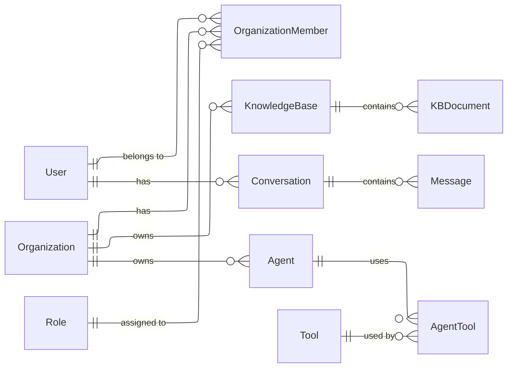

Definable uses SQLAlchemy ORM with asynchronous operations to interact with a PostgreSQL database. The models are organized in a structured hierarchy that promotes code reuse through mixins and inheritance.

## Model Architecture

### Base Classes and Mixins

All database models are built on top of a common foundation of base classes and mixins:

```python
class Base(DeclarativeBase):
    pass

class UUIDMixin:
    id: Mapped[uuid_pkg.UUID] = mapped_column(
        UUID(as_uuid=True),
        primary_key=True,
        server_default=text("gen_random_uuid()"),
    )

class TimestampMixin:
    created_at: Mapped[datetime] = mapped_column(
        DateTime(timezone=True),
        default=datetime.now(timezone.utc),
        server_default=text("CURRENT_TIMESTAMP"),
    )

class CRUD(Base, UUIDMixin, TimestampMixin):
    """Base class with CRUD operations."""
    __abstract__ = True
    
    # CRUD operations implemented here...
```

The architecture follows these core principles:

- **Base**: The foundational class for all SQLAlchemy models
- **UUIDMixin**: Provides a UUID primary key for all models
- **TimestampMixin**: Adds creation timestamps to track when records are created
- **CRUD**: Combines the Base and mixins while adding async CRUD operations

### CRUD Operations

Every model inherits standardized CRUD operations:

<AccordionGroup>
  <Accordion title="Create">
    ```python
    async def create(self):
        async with async_session() as session:
            session.add(self)
            await session.commit()
            return self
    ```
  </Accordion>
  <Accordion title="Read">
    ```python
    @classmethod
    async def read(cls, _id: uuid_pkg.UUID):
        async with async_session() as session:
            query = select(cls).where(cls.id == _id)
            result = await session.execute(query)
            instance = result.scalars().first()
            return instance
    ```
  </Accordion>
  <Accordion title="Update">
    ```python
    async def update(self, **kwargs):
        async with async_session() as session:
            for attr, value in kwargs.items():
                setattr(self, attr, value)
            session.add(self)
            await session.commit()
            return self
    ```
  </Accordion>
  <Accordion title="Delete">
    ```python
    async def delete(self):
        async with async_session() as session:
            await session.delete(self)
            await session.commit()
    ```
  </Accordion>
</AccordionGroup>

## Core Domain Models

Definable's domain is represented by the following core models:

### User and Authentication

- **UserModel**: Stores user account information
  - Email, password (hashed), name, active status
  - Relationships to organizations and invitations

### Organizations and Teams

- **OrganizationModel**: Represents a customer organization
  - Name, description, settings
  - Relationships to members, knowledge bases, etc.
- **OrganizationMemberModel**: Maps users to organizations with roles
  - Organization ID, user ID, role ID
  - Activity status

### Knowledge Bases

- **KnowledgeBaseModel**: Stores metadata about knowledge bases
  - Name, description, settings, embedding model
  - Relationships to documents and organization
- **KBDocumentModel**: Represents documents in a knowledge base
  - Content, metadata, processing status
  - Vector embeddings for semantic search

### Conversations and Messages

- **ConversationModel**: Tracks conversation history
  - Title, context, metadata
  - Relationships to messages and user
- **MessageModel**: Individual messages in a conversation
  - Content, role (user/assistant), metadata
  - Processing timestamps and status

### Agents and Tools

- **AgentModel**: Configuration for AI agents
  - Name, description, capabilities, prompt template
  - Relationships to tools and conversations
- **ToolModel**: Custom tools for agent use
  - Name, description, implementation details
  - Input/output schemas and API integration details

## Model Relationships

The database schema uses relationships to model domain connections:



## PostgreSQL Features

Definable leverages PostgreSQL-specific features:

- **UUID Generation**: Native `gen_random_uuid()` function
- **pgvector Extension**: Enables vector embeddings storage and similarity search
- **Full Text Search**: Used for content indexing and searching
- **JSON/JSONB**: Flexible storage of metadata and configurations

## Example Model

Here's an example of a model implementation:

```python
class UserModel(CRUD):
    """User model."""

    __tablename__ = "users"

    email: Mapped[str] = mapped_column(String(255), nullable=False, unique=True, index=True)
    password: Mapped[str] = mapped_column(String(64), nullable=False)
    first_name: Mapped[str] = mapped_column(String(50), nullable=False)
    last_name: Mapped[str] = mapped_column(String(50), nullable=False)
    is_active: Mapped[bool] = mapped_column(Boolean, default=True, server_default="true", nullable=False)

    # Relationships
    sent_invitations = relationship("InvitationModel", foreign_keys="InvitationModel.invited_by", back_populates="inviter")

    @property
    def full_name(self) -> str:
        """Get full name."""
        return f"{self.first_name} {self.last_name}"
```

## Database Connections

Database connections are handled through asynchronous session management:

```python
# Creating the engine and session factory
async_engine = create_async_engine(
    DATABASE_URL,
    echo=settings.sql_echo,
    pool_size=settings.db_pool_size,
    max_overflow=settings.db_max_overflow,
)

async_session = sessionmaker(
    async_engine, expire_on_commit=False, class_=AsyncSession
)

# Session dependency for FastAPI
async def get_db():
    async with async_session() as session:
        try:
            yield session
        finally:
            await session.close()
```

## Best Practices for Model Development

When extending or creating models in Definable:

1. **Inherit from CRUD**: Always extend the CRUD base class
2. **Use Type Annotations**: Leverage SQLAlchemy's `Mapped[Type]` for clarity
3. **Define Relationships**: Explicitly define relationships between models
4. **Add Comments**: Document the purpose of each model and complex attributes
5. **Keep Models Focused**: Each model should represent a single domain entity
6. **Index for Performance**: Add indexes to frequently queried columns
