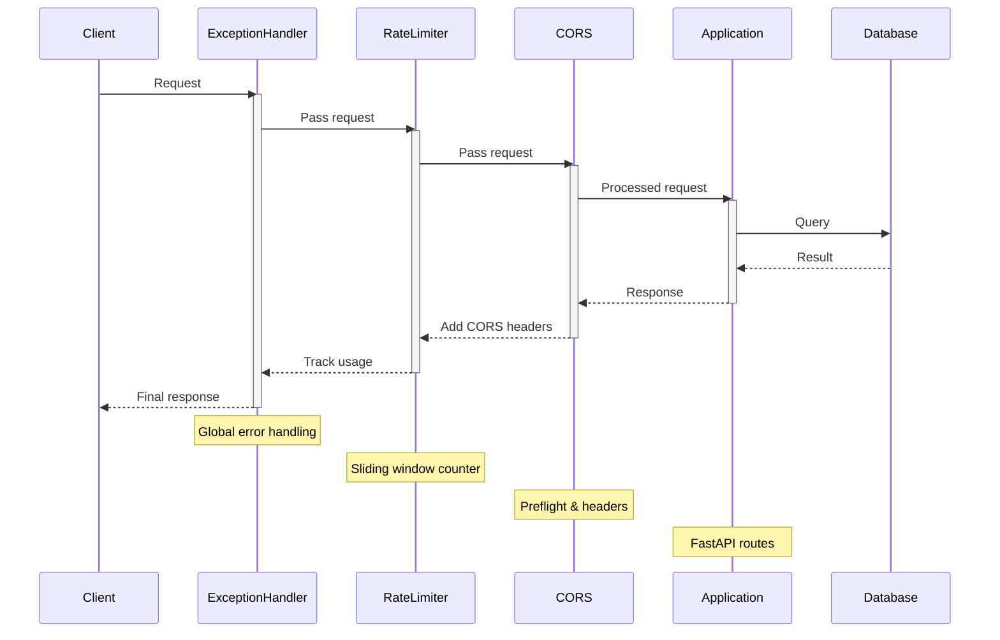

Middlewares play a crucial role in the Zyeta backend, providing cross-cutting functionality that applies to all requests and responses. This document explains the middleware architecture and how it fits into the overall application flow.

## What are Middlewares?

Middlewares in Zyeta are components that process HTTP requests and responses at the global level. They wrap around the request handling process, allowing code to be executed:

1. Before the request is processed by the route handlers
2. After the route handler generates a response



## Middleware Implementation

Zyeta middlewares are implemented using Starlette's `BaseHTTPMiddleware` class, which FastAPI inherits from. Each middleware follows a consistent pattern:

```python
class Middleware(BaseHTTPMiddleware):
  """Middleware description."""

  def __init__(self, app, acquire: Acquire = None):
    super().__init__(app)
    # Initialize dependencies if needed
    if acquire:
      self.some_dependency = acquire.some_dependency
  
  async def dispatch(self, request: Request, call_next: RequestResponseEndpoint) -> Response:
    # Pre-processing logic (runs before request handling)
    
    # Call the next middleware or the route handler
    response = await call_next(request)
    
    # Post-processing logic (runs after request handling)
    
    return response
```

## Middleware Registration

Middlewares are automatically discovered and registered in the FastAPI application by the `Manager` class, which scans the `middlewares` directory for Python files:

```python
def register_middlewares(self) -> None:
  """Register middlewares with the FastAPI application."""
  for mw_name in os.listdir(self.mws_dir):
    if mw_name.startswith("__"):
      continue
    if os.path.isfile(mw_path) and mw_name.endswith(".py"):
      mw_module_name = mw_name[:-3]
      mw_module_path = f"middlewares.{mw_module_name}"
      mw_module = importlib.import_module(mw_module_path)
      mw_class = getattr(mw_module, "Middleware", None)
      if mw_class:
        # Check if middleware needs Acquire for dependency injection
        init_params = inspect.signature(mw_class.__init__).parameters
        if "acquire" in init_params:
          self.app.add_middleware(mw_class, acquire=self.acquire)
        else:
          self.app.add_middleware(mw_class)
```

This approach allows middlewares to be added or removed without modifying the application's core code.

## Middleware Stack

Middlewares are executed in the reverse order they are added to the FastAPI application. The current middleware stack in Zyeta is:

1. **CORS Middleware** - Added directly in `app.py` for handling Cross-Origin Resource Sharing
2. **RateLimiting Middleware** - Limits the number of requests per client IP
3. **Exceptions Middleware** - Global exception handling and formatting

<Note>
The middleware stack order is important as it determines both the pre-processing and post-processing execution sequence. CORS middleware is executed first for pre-processing but last for post-processing.
</Note>

## Core Middlewares

### Exception Handling Middleware

The `exceptions.py` middleware provides centralized error handling for the application:

```python
class Middleware(BaseHTTPMiddleware):
  """Middleware to handle service exceptions and WebSocket broadcasting."""

  def __init__(self, app, acquire: Acquire):
    super().__init__(app)
    self.ws_manager = acquire.ws_manager
    self.logger = acquire.logger

  async def dispatch(self, request: Request, call_next: RequestResponseEndpoint) -> Response:
    try:
      # Call the route handler
      response = await call_next(request)
      return response
    except Exception:
      # Extract error information
      exc_type, exc_value, exc_traceback = sys.exc_info()
      
      # Format detailed error info for development
      error_info = {...}  # Full error details with stack trace
      
      # Return appropriate error response based on environment
      if settings.environment == "dev":
        return JSONResponse(status_code=500, content=error_info)
      return JSONResponse(status_code=500, content="Internal server error")
```

Key features:
- Catches all unhandled exceptions from route handlers
- Provides detailed error information in development mode
- Logs exceptions with full stack trace
- Returns simplified error messages in production

### Rate Limiting Middleware

The `ratelimit.py` middleware implements a sliding window rate limiter to prevent API abuse:

```python
class Middleware(BaseHTTPMiddleware):
  """Rate limiting middleware for FastAPI applications."""

  def __init__(self, app: FastAPI, max_requests: int = 100, window_size: int = 60):
    super().__init__(app)
    self.max_requests = max_requests
    self.window_size = window_size
    self.ip_requests: dict[str, list[float]] = {}

  async def dispatch(self, request: Request, call_next) -> Response:
    client_ip = request.client.host
    current_time = time.time()
    window_start = current_time - self.window_size
    
    # Get and clean up request timestamps for this IP
    request_times = [t for t in self.ip_requests.get(client_ip, [])
                     if t > window_start]
    
    # Check rate limit
    if len(request_times) >= self.max_requests:
      return JSONResponse(status_code=429, content={"detail": "Too many requests"})
    
    # Add timestamp and continue
    request_times.append(current_time)
    self.ip_requests[client_ip] = request_times
    return await call_next(request)
```

Key features:
- Implements a sliding window algorithm rather than a fixed time bucket
- Tracks requests per client IP address
- Configurable maximum requests and time window
- Returns HTTP 429 (Too Many Requests) when rate limit is exceeded

### CORS Middleware

The Cross-Origin Resource Sharing middleware is added directly in `app.py`:

```python
app.add_middleware(
  CORSMiddleware,
  allow_origins=["*"],  # Allow specific origins
  allow_credentials=True,
  allow_methods=["*"],  # Allow all methods (GET, POST, etc.)
  allow_headers=["*"],  # Allow all headers
)
```

Key features:
- Controls which domains can access the API
- Configures allowed HTTP methods and headers
- Manages preflight requests automatically
- Essential for browser-based clients accessing the API

## Middleware vs. Dependencies

Zyeta uses both middlewares and FastAPI dependencies to handle cross-cutting concerns, but they serve different purposes:

### Middlewares

- **Global scope**: Applied to all requests
- **Pre/post processing**: Can modify both requests and responses
- **Application-level concerns**: Logging, error handling, rate limiting
- **No access to route-specific details**: Limited context about the specific endpoint

### Dependencies (like `RBAC` and `JWTBearer`)

- **Route-specific**: Applied only to routes that declare them
- **Integrated with OpenAPI**: Included in API documentation
- **Request-specific validation**: Can validate and extract route-specific data
- **Type safety**: Provide type hints for route handlers

## Creating New Middlewares

To add a new middleware to the Zyeta backend:

1. Create a new file in the `src/middlewares/` directory
2. Implement a class named `Middleware` that inherits from `BaseHTTPMiddleware`
3. Implement the `__init__` and `dispatch` methods
4. The middleware will be automatically discovered and registered

Example of a new logging middleware:

```python
from fastapi import Request, Response
from starlette.middleware.base import BaseHTTPMiddleware

from services.__base.acquire import Acquire

class Middleware(BaseHTTPMiddleware):
    """Middleware for request/response logging."""

    def __init__(self, app, acquire: Acquire):
        super().__init__(app)
        self.logger = acquire.logger

    async def dispatch(self, request: Request, call_next):
        # Pre-processing
        self.logger.info(f"Request: {request.method} {request.url}")
        
        # Process request
        response = await call_next(request)
        
        # Post-processing
        self.logger.info(f"Response: {response.status_code}")
        
        return response
```

## Middleware Best Practices

When working with middlewares in Zyeta, follow these best practices:

1. **Keep middlewares focused**: Each middleware should have a single responsibility
2. **Minimize middleware overhead**: Optimize performance-critical code
3. **Handle exceptions**: Catch and handle exceptions within the middleware
4. **Use dependency injection**: Leverage the `Acquire` class for dependencies
5. **Consider order**: Be aware of middleware execution order
6. **Prefer dependencies for route-specific concerns**: Use FastAPI dependencies instead of parsing route data in middlewares

## Performance Considerations

Middlewares run for every request, so they can impact API performance:

- **Memory usage**: Avoid storing large amounts of data in middleware instances
- **Computation overhead**: Minimize complex calculations in the request path
- **Database access**: Avoid database queries in middlewares when possible
- **Caching**: Consider caching results for expensive operations

## Security Middlewares

While authentication in Zyeta is primarily handled by dependencies (`JWTBearer` and `RBAC`), security-related middlewares could be added for:

- **IP filtering**: Blocking requests from suspicious IPs
- **Request validation**: Scanning for malicious patterns
- **Response headers**: Adding security headers like CSP, HSTS
- **Request throttling**: More advanced rate limiting strategies

## Summary

Middlewares in Zyeta provide a powerful mechanism for implementing cross-cutting concerns that apply to all API requests. They are automatically discovered and registered, making the architecture extensible and maintainable.

The core middlewares handle essential functionality like exception management, rate limiting, and CORS, while working alongside FastAPI dependencies to create a comprehensive request processing pipeline.
