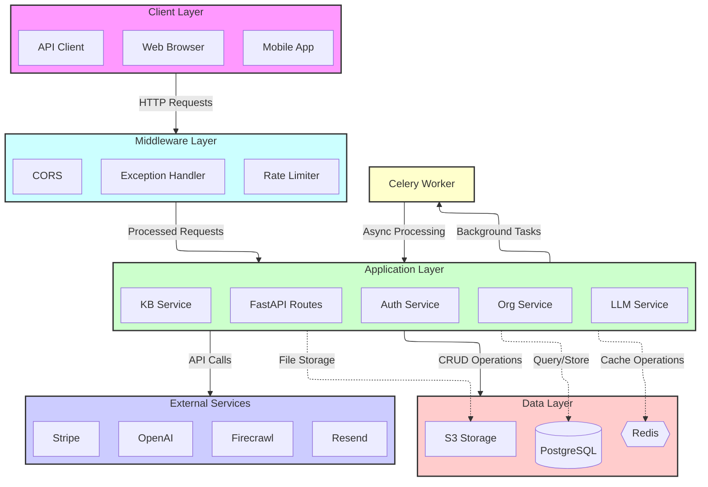

Definable follows a modular, service-oriented architecture built with FastAPI that emphasizes scalability, maintainability, and developer experience. This document provides a high-level overview of the system architecture and its core design principles.

## Core Architecture

The Definable backend is built with a clean, layered architecture that separates concerns and promotes reusability:



## Key Components

### API Layer

- **FastAPI Application**: The entry point for all HTTP requests, providing automatic OpenAPI documentation
- **Manager**: Automatically discovers and registers service endpoints
- **Middlewares**: Handle cross-cutting concerns like authentication, error handling, and request logging
- **Router**: Maps HTTP requests to appropriate service methods

### Service Layer

- **Service Classes**: Each service encapsulates a domain-specific set of functionality
- **Service Discovery**: Services are automatically discovered and registered by the Manager
- **HTTP Exposure**: Services define which methods are exposed as HTTP endpoints via the `http_exposed` property
- **Business Logic**: Implements core application functionality separated by domain

### Data Layer

- **Models**: SQLAlchemy ORM models representing database entities
- **Schemas**: Pydantic models for request/response validation and serialization
- **Database**: Asynchronous PostgreSQL connections managed through SQLAlchemy
- **Migrations**: Managed with Alembic for version-controlled schema changes

### Integration Layer

- **Libraries**: Pluggable components for integrating with external services
- **Vector Storage**: PGVector for embeddings storage and similarity search
- **Cloud Storage**: S3 integration for file storage
- **LLM Providers**: Adapters for OpenAI, Anthropic, and other LLM providers

## Design Patterns

### Service Pattern

Services in Definable follow a consistent pattern:

```python
class AuthService:
  """Authentication service."""

  http_exposed = ["post=signup", "post=login", "get=me"]

  def __init__(self, acquire: Acquire):
    """Initialize service with dependencies."""
    self.acquire = acquire
    self.logger = acquire.logger
    
  async def post_signup(self, user_data: UserSignup) -> UserResponse:
    """Handle user signup endpoint."""
    # Implementation...
```

Each service:
- Defines which methods are exposed as HTTP endpoints
- Receives dependencies through the `Acquire` class
- Uses consistent naming conventions (`method_resource` format)
- Uses Pydantic schemas for input validation and response serialization

### Dependency Injection

The `Acquire` class serves as a central dependency container:

- Provides access to database sessions
- Makes services available to other services
- Supplies utilities, logging, and configuration
- Manages WebSocket connections and caching

### Repository Pattern

Database operations are encapsulated in models that implement a common CRUD interface:

```python
# Example of querying a model
user = await UserModel.read(user_id, session)
```

This approach:
- Centralizes data access logic
- Provides a consistent interface for common operations
- Simplifies transaction management

## Request Lifecycle

<Steps>
  <Step title="HTTP Request">
    Client sends an HTTP request to an API endpoint
  </Step>
  <Step title="Middleware Processing">
    Request passes through global middlewares (CORS, authentication, etc.)
  </Step>
  <Step title="Route Matching">
    FastAPI matches the request path to the appropriate service method
  </Step>
  <Step title="Schema Validation">
    Request data is validated against Pydantic schemas
  </Step>
  <Step title="Service Method">
    Service method executes business logic, interacting with the database as needed
  </Step>
  <Step title="Response Generation">
    Result is serialized to JSON using Pydantic models
  </Step>
  <Step title="HTTP Response">
    Response is returned to the client
  </Step>
</Steps>

## Key Design Principles

### 1. Service Modularity

Each service is self-contained and focused on a specific domain:
- Authentication (`auth`)
- Organizations (`org`)
- Knowledge bases (`kb`)
- Conversations
- Agents
- Tools

This allows for independent development and testing of features.

### 2. Asynchronous First

Definable is designed from the ground up for asynchronous operation:
- Asynchronous database queries with SQLAlchemy and asyncpg
- Asynchronous HTTP endpoints with FastAPI
- Asynchronous task processing for long-running operations

### 3. Strong Typing and Validation

- All inputs and outputs are validated using Pydantic models
- Type annotations throughout the codebase
- Mypy type checking enforced via pre-commit hooks

### 4. Automatic API Documentation

- OpenAPI documentation generated automatically by FastAPI
- Interactive Swagger UI available at `/docs`
- Self-documenting endpoints with clear parameter descriptions

### 5. Extensibility

- Pluggable architecture with clear extension points
- Support for multiple LLM providers
- Modular vector store implementation 
- Customizable authentication flows

## Security Architecture

- **JWT Authentication**: Secure token-based authentication
- **Role-Based Access Control**: Fine-grained permission system
- **API Key Authentication**: For service-to-service communication
- **Input Validation**: Prevents injection attacks
- **Middleware Protection**: Guards against common attack vectors

## Scalability Considerations

- **Database Connection Pooling**: Efficient use of database connections
- **Async Processing**: Non-blocking I/O for high throughput
- **Stateless Design**: Enables horizontal scaling
- **Background Tasks**: Offloads long-running operations

## Integration Architecture

Definable integrates with various external services:

- **OpenAI/Anthropic**: For LLM capabilities
- **S3-Compatible Storage**: For file storage
- **PostgreSQL with pgvector**: For vector embeddings
- **Email Services**: For notifications

## Next Steps

To dive deeper into Definable's architecture:

- [Directory Structure](/pages/architecture/directory-structure): Explore the organization of the codebase
- [Services Overview](/pages/architecture/services): Learn about the key services and their responsibilities
- [Database Design](/pages/architecture/database): Understand the data model and relationships
- [Development Workflow](/pages/getting-started/development-workflow): Learn how to develop new features
