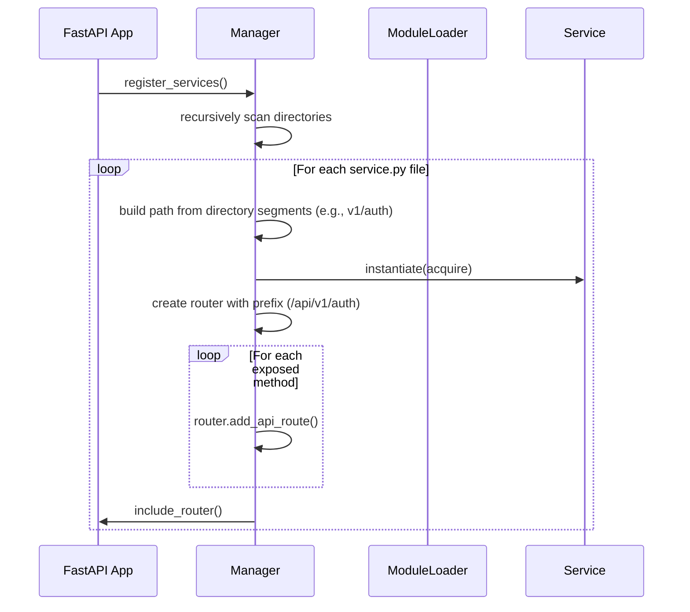
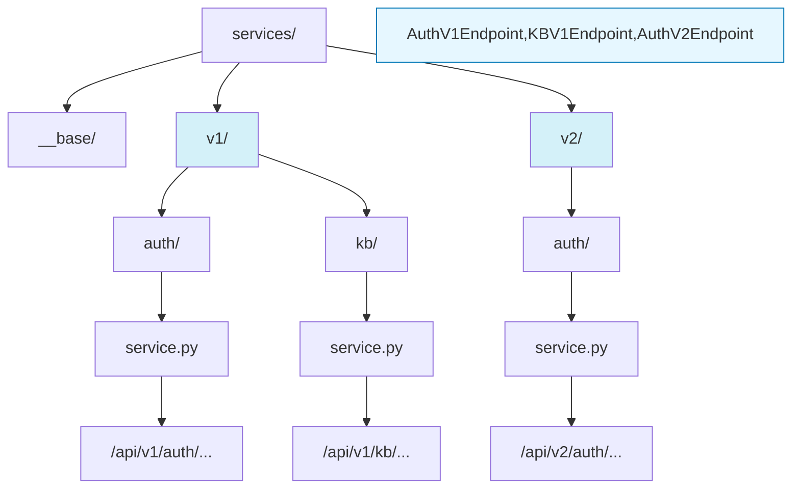
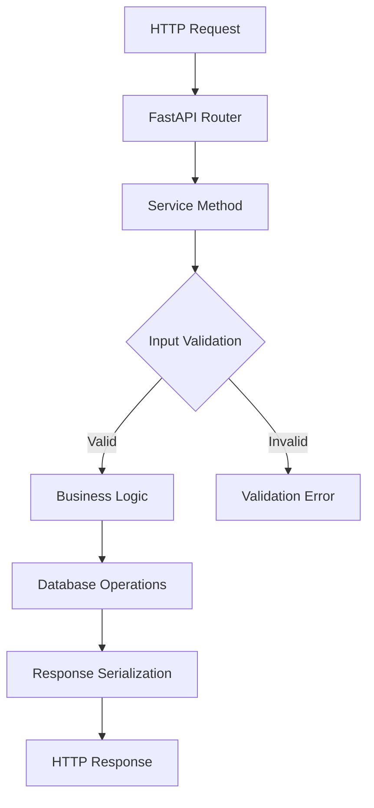

Definable employs a service-oriented architecture built on FastAPI that emphasizes modularity, discoverability, and maintainability. This document explains the core components and patterns used in the service layer.

## Core Concepts

The service architecture is built around these key concepts:

1. **Service Classes**: Self-contained modules that handle specific domain functionality
2. **Automatic Discovery**: Services are automatically discovered and registered with the FastAPI application
3. **HTTP Exposure**: Methods can be selectively exposed as HTTP endpoints
4. **Dependency Injection**: Services receive dependencies through a centralized Acquire class

## Service Structure

Each service in Definable follows a consistent pattern:

```python
class AuthService:
  """Authentication service."""

  http_exposed = ["post=signup", "post=login", "get=me"]

  def __init__(self, acquire: Acquire):
    """Initialize service with dependencies."""
    self.acquire = acquire
    self.logger = acquire.logger
    
  async def post_signup(self, user_data: UserSignup) -> UserResponse:
    """Handle user signup endpoint."""
    # Implementation...
```

### Key Components

- **Service Class**: Named with a `Service` suffix (e.g., `AuthService`, `KBService`)
- **HTTP Exposure List**: Lists methods to be exposed as HTTP endpoints
- **Acquire Dependency**: Receives centralized dependencies
- **Method Naming**: Follows `http_method_resource_name` pattern

## Service Registration

Services are automatically discovered and registered with the FastAPI application through the Manager class:



The service discovery process:

1. The Manager recursively searches for `service.py` files in all subdirectories
2. It captures the directory path segments (e.g., v1/auth) to build the API path
3. It looks for classes ending with `Service` suffix
4. It instantiates the service with the Acquire dependency
5. It creates a FastAPI router with the appropriate prefix (e.g., /api/v1/auth)
6. It registers routes based on the `http_exposed` list
7. It includes the router in the main FastAPI application

## API Versioning

Definable supports API versioning through its directory structure. The Manager class automatically handles versioning by including directory names in the API path:

```
services/
├── __base/
├── v1/
│   ├── auth/
│   │   └── service.py  # Exposes endpoints at /api/v1/auth/...
│   └── kb/
│       └── service.py  # Exposes endpoints at /api/v1/kb/...
└── v2/
    └── auth/
        └── service.py  # Exposes endpoints at /api/v2/auth/...
```

The versioning system works by:

1. Recursively scanning all subdirectories in the services directory
2. Including all directory names in the API route path
3. Creating appropriate routers with prefixes matching the directory structure
4. Allowing multiple versions of the same service to coexist

This enables:
- **API Evolution**: Maintaining backward compatibility while adding new features
- **Clean Migrations**: Moving clients from one API version to another
- **Feature Testing**: Testing new API versions with limited users

For example, a method `post_signup` in `services/v1/auth/service.py` would be exposed at `/api/v1/auth/signup`, while the same method in `services/v2/auth/service.py` would be exposed at `/api/v2/auth/signup`.

The following diagram illustrates how the service directory structure maps to API endpoints:



## HTTP Endpoint Exposure

Services explicitly define which methods are exposed as HTTP endpoints using the `http_exposed` list:

```python
http_exposed = [
  "get=me",            # GET /api/auth/me
  "post=signup",       # POST /api/auth/signup
  "put=update_profile" # PUT /api/auth/update_profile
]
```

The format follows `http_method=resource_name` pattern, which maps to method names of the form `http_method_resource_name` (e.g., `post_signup`).

## The Acquire Pattern

The Acquire class serves as a centralized dependency container that provides services with:

- Access to database sessions
- References to other services
- Shared utilities and configurations
- Logging capabilities
- WebSocket management

```python
class Acquire:
  """Acquire class."""

  def __init__(self):
    self.db_session = async_session
    self.schemas = self._register_schemas()
    self.services = self._register_services()
    self.settings: Settings = settings
    self.utils = utils
    self.logger = log
    self.cache = Cache()
    self.deps_cache = deps_cache
    self.ws_manager = WebSocketManager()
```

This pattern enables:
- **Service-to-service** communication
- **Dependency sharing** across the application
- **Testability** through dependency mocking
- **Consistent configuration** access

### Working with Versioned Services

When working with versioned services, the Acquire pattern provides access to different service versions:

```python
# Access the v1 auth service
v1_auth_service = self.acquire.services.v1.auth

# Access the v2 auth service
v2_auth_service = self.acquire.services.v2.auth

# Example: Call methods from different service versions
user_v1 = await v1_auth_service.get_user(user_id)
user_v2 = await v2_auth_service.get_user_with_extended_profile(user_id)
```

This capability is especially useful when:
- Implementing gradual migrations from one API version to another
- Building composite responses that require features from multiple API versions
- Accessing versioned schemas for data validation

## Core Services

Definable is organized around domain-specific services:

<AccordionGroup>
  <Accordion title="Auth Service">
    Authentication and user management operations:
    - User signup and login
    - Profile management
    - Token issuance and validation
  </Accordion>
  <Accordion title="Organization Service">
    Organization management:
    - Creating and updating organizations
    - Managing organization members
    - Organization settings and configuration
  </Accordion>
  <Accordion title="KB Service">
    Knowledge Base operations:
    - Creating and managing knowledge bases
    - Document ingestion and processing
    - Vector search capabilities
  </Accordion>
  <Accordion title="Conversation Service">
    Chat and conversation management:
    - Creating and managing conversations
    - Message handling
    - Context management
  </Accordion>
  <Accordion title="Agent Service">
    AI agent configuration:
    - Creating and configuring agents
    - Tool assignment
    - Agent execution
  </Accordion>
  <Accordion title="Tools Service">
    Tool management:
    - Creating and updating tools
    - Tool categorization
    - Tool testing
  </Accordion>
</AccordionGroup>

## Service Schemas

Each service defines its own schemas using Pydantic models:

```python
class UserSignup(BaseModel):
    """User signup schema."""
    email: EmailStr
    password: str
    confirm_password: str
    first_name: str
    last_name: str

    @field_validator("confirm_password")
    def passwords_match(cls, v, values):
        """Validate that passwords match."""
        if "password" in values.data and v != values.data["password"]:
            raise ValueError("Passwords do not match")
        return v
```

These schemas provide:
- **Input validation**: Ensures data meets requirements
- **Output serialization**: Standardizes response formats
- **Documentation**: Auto-generates API docs via OpenAPI

## WebSocket Support

Services can also expose WebSocket endpoints using a similar pattern:

```python
class WebSocketService:
  http_exposed = ["ws=connect"]

  def __init__(self, acquire: Acquire):
    self.ws_manager = acquire.ws_manager

  async def ws_connect(self, websocket: WebSocket):
    # Implementation...
```

WebSocket connections are managed through a centralized WebSocketManager that handles:
- Connection acceptance
- Client tracking
- Broadcasting messages
- Connection lifecycle

## Security Integration

Services integrate with FastAPI's dependency injection system for security:

```python
async def post_create_org(
  self,
  org_data: OrgCreate,
  payload: dict = Depends(JWTBearer()),
  session: AsyncSession = Depends(get_db),
) -> OrgResponse:
  # Implementation...
```

Security is implemented through:
- **JWT Authentication**: Token-based authentication
- **RBAC**: Role-based access control
- **Permission Validation**: Fine-grained permission checks

## Request Lifecycle

When a request hits an endpoint:



1. The request is routed to the appropriate service method
2. Input is validated against Pydantic schemas
3. The service method executes business logic
4. Database operations are performed
5. The response is serialized
6. The HTTP response is returned

## Best Practices

When developing services in Definable:

1. **Follow the Naming Convention**: Use `method_resource` format
2. **Keep Methods Focused**: Each method should handle one specific operation
3. **Use Dependency Injection**: Receive dependencies via parameters
4. **Validate Inputs**: Use Pydantic schemas for validation
5. **Handle Errors**: Use try/except blocks with detailed error messages
6. **Document Methods**: Use docstrings to describe functionality
7. **Log Appropriately**: Use the logger for important events
8. **Version Carefully**: Place new services in appropriate version directories (e.g., v1, v2)
9. **Maintain Compatibility**: When creating a new version, ensure breaking changes are only in new versions
10. **Document Version Changes**: Clearly document differences between API versions

## Testing Services

Services are designed for testability:

```python
async def test_auth_service_signup():
    # Setup mock dependencies
    mock_acquire = MagicMock()
    mock_acquire.utils.get_password_hash.return_value = "hashed_password"
    
    # Create service with mocked dependencies
    service = AuthService(acquire=mock_acquire)
    
    # Create test data
    user_data = UserSignup(
        email="test@example.com",
        password="password123",
        confirm_password="password123",
        first_name="Test",
        last_name="User"
    )
    
    # Execute method under test
    result = await service.post_signup(user_data)
    
    # Assert expected results
    assert result.email == "test@example.com"
    assert mock_acquire.utils.get_password_hash.called
```

This approach enables:
- **Unit Testing**: Testing services in isolation
- **Mocking Dependencies**: Replacing real dependencies with mocks
- **Integration Testing**: Testing service interactions
- **Functional Testing**: Testing complete request flow
