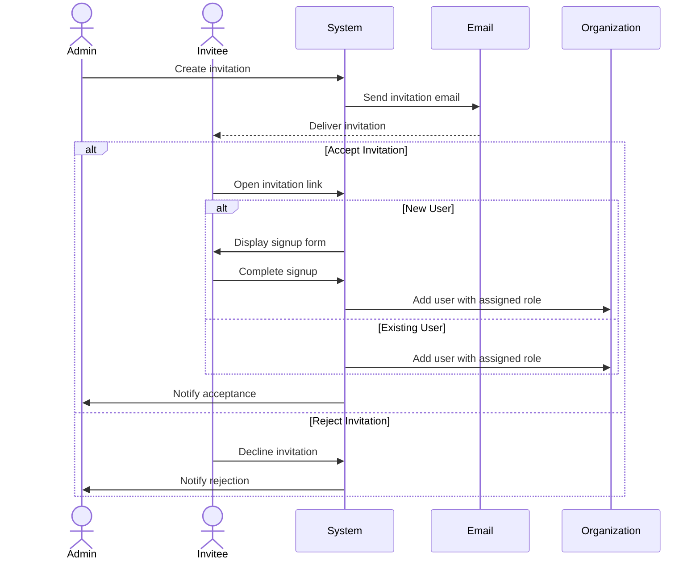

Zyeta implements a comprehensive invitation system that allows organization administrators to invite users to join their organization with predefined roles and permissions.

## Overview

The invitation system enables:

1. Organization administrators to invite new users
2. Assignment of specific roles during invitation
3. Secure email-based verification
4. Streamlined onboarding for new users



## Invitation Lifecycle

Invitations follow a defined lifecycle managed through status transitions:

- **Pending**: Initial state, awaiting response from invitee
- **Accepted**: Invitee has accepted and joined the organization
- **Rejected**: Invitee has explicitly declined the invitation
- **Expired**: Time limit has passed without response
- **Revoked**: Administrator has canceled the invitation

## Creating Invitations

Organization administrators can invite users with a specified role:

```python
invitation = InvitationModel(
    organization_id=org_id,
    role_id=role_id,
    invitee_email=email,
    invited_by=admin_id,
    status=InvitationStatus.PENDING,
    expiry_time=datetime.now() + timedelta(hours=48),
    invite_token=secrets.token_urlsafe(32)
)
```

Key aspects of invitation creation:

- Each invitation is tied to a specific organization
- A specific role is assigned
- A secure random token is generated
- Expiration time is set (default: 48 hours)
- Email notifications are automatically sent

## Email Notifications

The system sends personalized invitation emails:

```python
async def _send_invitation_email(invitation: InvitationModel, org_id: UUID, session: AsyncSession) -> None:
    # Get organization details
    org_query = select(OrganizationModel).where(OrganizationModel.id == org_id)
    org_result = await session.execute(org_query)
    organization = org_result.scalar_one_or_none()
    
    # Get inviter details
    inviter_query = select(UserModel).where(UserModel.id == invitation.invited_by)
    inviter_result = await session.execute(inviter_query)
    inviter = inviter_result.scalar_one_or_none()
    
    # Construct invitation URL
    invitation_url = f"{settings.frontend_url}/invitation/{invitation.invite_token}?email={invitation.invitee_email}"
    
    # Send email
    await send_invitation_email(
        to_email=invitation.invitee_email,
        inviter_name=f"{inviter.first_name} {inviter.last_name}",
        organization_name=organization.name,
        invitation_url=invitation_url
    )
```

These emails contain:
- Organization details
- Inviter's name
- Secure invitation link with token
- Clear instructions for accepting or declining

## Accepting Invitations

When a user follows the invitation link, the system:

1. Validates the invitation token
2. Checks if the invitation is still pending and not expired
3. Verifies the email address matches

For new users, the system:
1. Displays a signup form
2. Creates a new user account
3. Associates the user with the organization using the assigned role

```python
# Create user
user_dict = user_data.model_dump(exclude={"invite_token"})
user_dict["email"] = invitation.invitee_email
user_dict["password"] = utils.get_password_hash(user_dict["password"])
db_user = UserModel(**user_dict)
session.add(db_user)

# Add user to organization
member = OrganizationMemberModel(
    organization_id=invitation.organization_id,
    user_id=db_user.id,
    role_id=invitation.role_id,
    status="active"
)
session.add(member)

# Update invitation status
invitation.status = InvitationStatus.ACCEPTED
```

For existing users, the system simply adds them to the organization with the assigned role.

## Rejecting Invitations

Users can explicitly reject invitations by:
- Following a "Decline" link in the email
- Clicking a reject button in the application interface

```python
invitation.status = InvitationStatus.REJECTED
```

## Managing Pending Invitations

Organization administrators can view and manage pending invitations:

- List all pending invitations
- Resend invitations
- Revoke invitations before they're accepted

The invitation list provides:
- Invitee email address
- Timestamp of invitation
- Current status
- Expiration time

## Invitation Token Security

The invitation system incorporates multiple security measures:

- **Unique Tokens**: Each invitation has a cryptographically secure random token
- **Limited Validity**: Tokens expire after a configurable time period
- **Single Use**: Tokens become invalid after use
- **Email Verification**: Token must be used with the invited email address
- **Organization Context**: Each token is tied to a specific organization

## Role Validation

The system enforces hierarchical role constraints:

```python
async def _validate_inviter_role(
    self,
    user_id: UUID,
    org_id: UUID,
    role_id: UUID,
    session: AsyncSession,
) -> None:
    # Get user's role
    user_member_query = select(OrganizationMemberModel).where(
        and_(
            OrganizationMemberModel.user_id == user_id,
            OrganizationMemberModel.organization_id == org_id,
            OrganizationMemberModel.status == "active"
        )
    )
    user_member_result = await session.execute(user_member_query)
    user_member = user_member_result.scalar_one_or_none()
    
    # Get user role level
    user_role_query = select(RoleModel).where(RoleModel.id == user_member.role_id)
    user_role_result = await session.execute(user_role_query)
    user_role = user_role_result.scalar_one_or_none()
    
    # Get target role level
    target_role_query = select(RoleModel).where(RoleModel.id == role_id)
    target_role_result = await session.execute(target_role_query)
    target_role = target_role_result.scalar_one_or_none()
    
    # Validate role hierarchy
    if user_role.hierarchy_level <= target_role.hierarchy_level:
        raise HTTPException(
            status_code=status.HTTP_403_FORBIDDEN,
            detail="You cannot assign a role with equal or higher privileges than your own"
        )
```

This ensures that:
- Users can only invite others with roles of lower privilege
- Owners can invite admins, members, and guests
- Admins can invite members and guests
- Members can only invite guests (if allowed)

## API Endpoints

The invitation flow is managed through these endpoints:

| Endpoint | Method | Description |
|----------|--------|-------------|
| `/api/invitations/send` | POST | Create a new invitation |
| `/api/invitations/resend` | POST | Resend an existing invitation |
| `/api/invitations/accept` | POST | Accept an invitation |
| `/api/invitations/reject` | POST | Reject an invitation |
| `/api/invitations/list` | GET | List all invitations for an organization |
| `/api/invitations/{id}` | GET | Get details of a specific invitation |

## Request and Response Examples

<CodeGroup>
  <CodeGroupItem title="Sending an Invitation">
  ```json
  // POST /api/invitations/send?org_id=123e4567-e89b-12d3-a456-426614174000
  {
    "role_id": "123e4567-e89b-12d3-a456-426614174001",
    "invitee_email": "user@example.com",
    "expiry_time": "2023-12-31T23:59:59Z"
  }
  ```
  </CodeGroupItem>
  
  <CodeGroupItem title="Accepting an Invitation">
  ```json
  // POST /api/invitations/accept
  {
    "token": "Ab1Cd2Ef3Gh4Ij5Kl6Mn7Op8Qr9St0",
    "email": "user@example.com",
    "first_name": "John",
    "last_name": "Doe",
    "password": "SecurePassword123"
  }
  ```
  </CodeGroupItem>
</CodeGroup>

## Invitation UI Flow

The frontend implements a streamlined invitation flow:

1. User receives email with invitation link
2. User clicks link and is directed to the application
3. System validates the invitation token
4. New users complete a registration form
5. Existing users are prompted to login
6. User is redirected to the organization dashboard

## Next Steps

- [Authentication Overview](overview): Complete authentication system
- [JWT Authentication](jwt-authentication): How token-based authentication works
- [Role-Based Access Control](rbac): Understanding permission management
