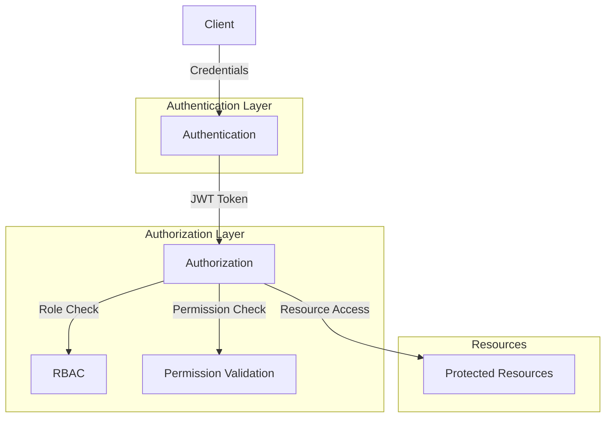
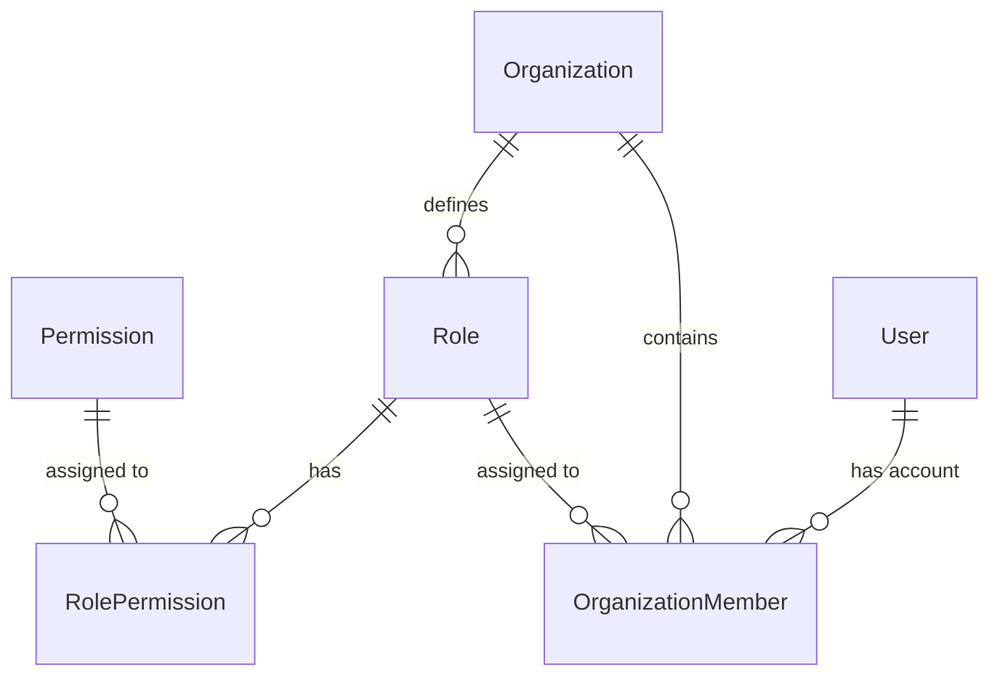

Definable implements a robust, multi-layered authentication and authorization system that secures API endpoints while supporting flexible access control across organizations and resources.

## Architecture

The authentication system is built on these core components:



## Core Components

### Authentication

Authentication verifies user identity through these mechanisms:

- **Credentials-based Login**: Email and password verification
- **JWT Tokens**: Secure, time-limited access tokens
- **Token Validation**: Middleware that validates tokens on every request

### Authorization (RBAC)

Once authenticated, users are authorized through:

- **Role-Based Access Control**: Permissions tied to organizational roles
- **Resource-Action Permissions**: Fine-grained control over what users can do
- **Wildcard Support**: Flexible permission patterns with wildcard matching

### Organization Context

All operations happen within an organization context:

- Users belong to one or more organizations
- Each organization membership has an associated role
- Permissions are evaluated within the current organization context

## Authentication Flow

<Steps>
  <Step title="Login Request">
    User submits credentials (email/password) to the `/api/auth/login` endpoint
  </Step>
  <Step title="Credential Verification">
    System verifies credentials against stored password hash
  </Step>
  <Step title="Token Generation">
    Upon successful verification, the system generates a JWT token containing the user ID
  </Step>
  <Step title="Token Return">
    JWT token is returned to the client for use in subsequent requests
  </Step>
  <Step title="Token Usage">
    Client includes token in Authorization header for subsequent requests
  </Step>
  <Step title="Request Validation">
    JWTBearer middleware validates token and extracts user information
  </Step>
  <Step title="Permission Check">
    RBAC middleware checks if the user has permission to access the requested resource
  </Step>
</Steps>

## User Registration Methods

Definable supports multiple registration paths:

### Self-Registration

Users can sign up directly through:
- Standard signup with email, password, and profile details
- Each new user automatically gets their own organization

### Invitation-Based Registration

Users can be invited to join existing organizations:
- Organization administrators send invitations to email addresses
- Invitations include predefined roles
- Recipients follow secure links to create accounts
- Upon signup, users are automatically added to the organization with the specified role

## Role and Permission System

Definable uses a hierarchical role system with assigned permissions:



### Role Hierarchy

Roles are organized in a hierarchy (higher number = higher privilege):
- **Owner** (Level 100): Full system access
- **Admin** (Level 80): Administrative capabilities
- **Member** (Level 20): Standard user access
- **Guest** (Level 10): Limited access

### Permission Structure

Permissions follow a `resource:action` pattern:
- Resources: `kb`, `conversation`, `organization`, `user`, etc.
- Actions: `read`, `write`, `delete`, `admin`, etc.
- Wildcards: `*:read` (read access to all resources)

## Security Considerations

The authentication system implements these security best practices:

- **Password Hashing**: Passwords are stored as SHA-256 hashes
- **Token Expiration**: JWTs have configurable expiration times
- **Rate Limiting**: API endpoints are protected against brute-force attacks
- **HTTPS**: All communications are encrypted with TLS
- **CORS**: Cross-Origin Resource Sharing restrictions

## Reference Implementation

```python
# JWT Token validation
class JWTBearer(HTTPBearer):
    async def __call__(self, request: Request):
        credentials = await super().__call__(request)
        if not credentials:
            raise HTTPException(status_code=403, detail="Invalid authentication")
        try:
            payload = jwt.decode(
                credentials.credentials, 
                settings.jwt_secret, 
                algorithms=["HS256"]
            )
            return payload
        except jwt.InvalidTokenError:
            raise HTTPException(status_code=403, detail="Invalid or expired token")

# Role-based access control
class RBAC:
    def __init__(self, required_resource: str, required_action: str):
        self.required_resource = required_resource
        self.required_action = required_action
        
    async def __call__(self, token_payload: dict = Depends(JWTBearer())):
        # Check if user has permission
        # ...
        return token_payload
```

## Next Steps

- [JWT Authentication](jwt-authentication): Detailed explanation of JWT implementation
- [Invitation Flow](invitation-flow): How the invitation system works
- [Role-Based Access Control](rbac): Understanding the permission system
