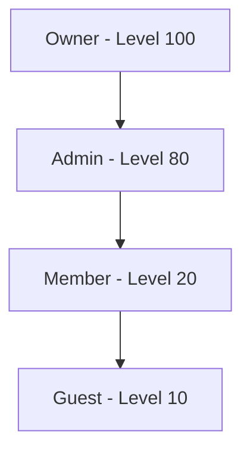
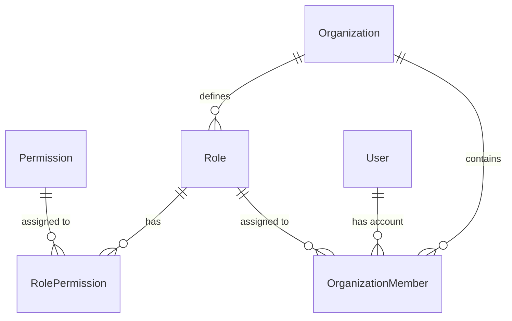

Zyeta implements a robust Role-Based Access Control (RBAC) system that provides fine-grained authorization for all resources within the platform. This page explains how permissions work, how they're assigned to roles, and how to implement permission checks in your code.

## Permission Structure

Permissions in Zyeta follow a simple `resource:action` pattern that makes them intuitive and flexible:

```
{resource}:{action}
```

Where:
- **resource**: The entity being accessed (e.g., `kb`, `conversation`, `organization`)
- **action**: The operation being performed (e.g., `read`, `write`, `delete`, `admin`)

### Examples

```
kb:read         # Permission to read knowledge bases
kb:write        # Permission to create/edit knowledge bases
kb:delete       # Permission to delete knowledge bases
kb:admin        # Full administrative access to knowledge bases
```

### Wildcard Support

Permissions support wildcards to enable broader access control:

```
*:read          # Read access to all resources
kb:*            # Full access to knowledge bases
*:*             # Full access to everything (super admin)
```

## Role Hierarchy

Roles are organized in a hierarchical system with numeric levels:



- **Owner** (Level 100): Full system access, can perform all operations
- **Admin** (Level 80): Administrative capabilities, can manage most resources
- **Member** (Level 20): Standard user access, can use but not administer
- **Guest** (Level 10): Limited access, typically read-only permissions

## Database Structure

The permission system is implemented through these key database models:



### Key Models

#### Role Model

```python
class RoleModel(CRUD):
    """Role model for RBAC."""

    __tablename__ = "roles"

    id: Mapped[UUID] = mapped_column(UUID, primary_key=True, default=uuid.uuid4)
    name: Mapped[str] = mapped_column(String(256), nullable=False)
    level: Mapped[int] = mapped_column(Integer, nullable=False)
    organization_id: Mapped[UUID] = mapped_column(
        UUID, ForeignKey("organizations.id", ondelete="CASCADE")
    )
    is_default: Mapped[bool] = mapped_column(Boolean, default=False)
    created_at: Mapped[datetime] = mapped_column(
        DateTime(timezone=True), default=datetime.now
    )
    updated_at: Mapped[datetime] = mapped_column(
        DateTime(timezone=True), default=datetime.now, onupdate=datetime.now
    )
```

#### Permission Model

Permissions are stored as simple string entries with the `resource:action` format.

## Permission Checks

### Middleware-Based Checks

The RBAC system uses FastAPI dependencies to check permissions for every protected endpoint:

```python
def permission_required(resource: str, action: str):
    """Dependency for checking if a user has a specific permission."""
    
    async def check_permission(
        token_data: dict = Depends(JWTBearer()),
        session: AsyncSession = Depends(get_session),
    ):
        # Get user's role in the current organization
        member = await get_organization_member(token_data, session)
        
        # Get role permissions
        permissions = await get_role_permissions(member.role_id, session)
        
        # Check if the user has the required permission
        if has_permission(permissions, resource, action):
            return token_data
            
        # Check for wildcard permissions
        if has_permission(permissions, "*", action) or has_permission(permissions, resource, "*") or has_permission(permissions, "*", "*"):
            return token_data
            
        raise HTTPException(
            status_code=status.HTTP_403_FORBIDDEN,
            detail="Not enough permissions",
        )
    
    return check_permission
```

### Using RBAC in Endpoints

To protect an endpoint with RBAC, add the permission dependency:

```python
@router.get(
    "/kb/{kb_id}",
    dependencies=[Depends(permission_required("kb", "read"))],
)
async def read_kb(kb_id: UUID):
    # Implementation...
    pass
```

## Default Roles and Permissions

When a new organization is created, the system automatically creates these default roles:

1. **Owner**
   - Level: 100
   - Permissions: `*:*` (full access to everything)

2. **Admin**
   - Level: 80
   - Permissions: Various administrative permissions like `kb:admin`, `conversation:admin`

3. **Member**
   - Level: 20
   - Permissions: Basic usage permissions like `kb:read`, `kb:write`, `conversation:read`, `conversation:write`

4. **Guest**
   - Level: 10
   - Permissions: Limited access permissions like `kb:read`, `conversation:read`

## Creating Custom Roles

Organization owners and admins can create custom roles with specific permission sets:

```python
# Example: Creating a "Content Manager" role
async def create_custom_role(
    name: str,
    level: int,
    permissions: List[str],
    organization_id: UUID,
    session: AsyncSession,
):
    # Create the role
    role = RoleModel(
        name=name,
        level=level,
        organization_id=organization_id,
    )
    session.add(role)
    await session.flush()
    
    # Assign permissions to the role
    for permission_str in permissions:
        permission = await get_or_create_permission(permission_str, session)
        role_permission = RolePermissionModel(
            role_id=role.id,
            permission_id=permission.id,
        )
        session.add(role_permission)
    
    await session.commit()
    return role
```

## Best Practices

### Permission Naming

- Use clear, descriptive names for resources and actions
- Keep permission names lowercase
- Use singular form for resources (e.g., `kb` not `kbs`)
- Use verb form for actions (e.g., `read` not `reader`)

### Permission Checking

- Always check permissions at the API level using the RBAC dependency
- For complex business logic, you may need to check permissions within your service methods
- Remember to check for wildcard permissions as well as specific ones

### Role Management

- Avoid creating too many roles, which can be hard to manage
- Place roles at appropriate levels in the hierarchy
- Define clear boundaries between role capabilities

## Debugging RBAC Issues

If users report access problems:

1. Check which role the user has in the organization
2. Verify the permissions assigned to that role
3. Examine the specific resource and action being requested
4. Look for potential wildcard permissions that should grant access
5. Check if the user's token is valid and not expired

## Next Steps

- [JWT Authentication](jwt-authentication): Learn about the JWT implementation
- [Invitation Flow](invitation-flow): How users are invited to organizations
- [Authentication Overview](overview): Broader view of the authentication system

## Migrations with Alembic

The RBAC system uses Alembic migrations to manage database schema changes and seed default data:

```python
def upgrade() -> None:
    # Create tables for RBAC
    op.create_table(
        "permissions",
        sa.Column("id", sa.UUID(), nullable=False),
        sa.Column("name", sa.String(length=256), nullable=False),
        sa.PrimaryKeyConstraint("id"),
        sa.UniqueConstraint("name"),
    )
    
    op.create_table(
        "role_permissions",
        sa.Column("role_id", sa.UUID(), nullable=False),
        sa.Column("permission_id", sa.UUID(), nullable=False),
        sa.ForeignKeyConstraint(["permission_id"], ["permissions.id"], ondelete="CASCADE"),
        sa.ForeignKeyConstraint(["role_id"], ["roles.id"], ondelete="CASCADE"),
        sa.PrimaryKeyConstraint("role_id", "permission_id"),
    )
    
    # Seed default permissions
    connection = op.get_bind()
    permissions = [
        {"id": uuid.uuid4(), "name": "kb:read"},
        {"id": uuid.uuid4(), "name": "kb:write"},
        {"id": uuid.uuid4(), "name": "kb:delete"},
        # ... more permissions
    ]
    
    for permission in permissions:
        connection.execute(
            sa.text(
                "INSERT INTO permissions (id, name) VALUES (:id, :name)"
            ),
            permission,
        )
```

When adding new resources or modifying permission schemes, create a new Alembic migration to:

1. Add new permission entries
2. Assign default permissions to existing roles
3. Update any permission dependencies

This ensures that all environments (development, staging, production) maintain consistent permission structures.
