AI Agents are the core intelligent entities in Definable.ai that can understand natural language, reason about problems, and take actions to help users accomplish their goals. They combine the power of Large Language Models (LLMs) with external tools and knowledge bases to create versatile, capable assistants.

## What is an AI Agent?

An AI Agent is an autonomous software entity that:
- **Understands** natural language input from users
- **Reasons** about problems using integrated knowledge and context
- **Acts** by calling tools and functions to accomplish tasks
- **Learns** from interactions and improves over time
- **Communicates** results back to users in natural language

## Agent Architecture

```mermaid
graph TB
    subgraph "AI Agent Core"
        Brain[🧠 LLM Brain]
        Memory[💭 Context Memory]
        Planner[📋 Task Planner]
        Controller[🎮 Action Controller]
    end
    
    subgraph "Agent Capabilities"
        Tools[🛠️ Tools]
        KB[📚 Knowledge Base]
        Functions[⚙️ Functions]
    end
    
    subgraph "External World"
        User[👤 User]
        APIs[🌐 External APIs]
        Databases[🗄️ Databases]
        Services[🔧 Services]
    end
    
    User --> Brain
    Brain --> Memory
    Brain --> Planner
    Planner --> Controller
    Controller --> Tools
    Controller --> KB
    Controller --> Functions
    
    Tools --> APIs
    Tools --> Databases
    Tools --> Services
    
    Brain --> User
    
    style Brain fill:#e3f2fd
    style Tools fill:#f3e5f5
    style KB fill:#e8f5e8
    style User fill:#fff3e0
```



## Agent Components

### 1. LLM Brain
The core intelligence powered by language models like GPT-4, Claude, or others.

**Responsibilities:**
- Natural language understanding
- Reasoning and decision making
- Response generation
- Context awareness

### 2. Context Memory
Maintains conversation history and relevant context.

**Features:**
- Short-term conversation memory
- Long-term interaction history
- Context window management
- Memory compression and summarization

### 3. Task Planner
Breaks down complex requests into actionable steps.

**Capabilities:**
- Goal decomposition
- Step prioritization
- Dependency management
- Execution planning

### 4. Action Controller
Manages tool execution and external interactions.

**Functions:**
- Tool selection and invocation
- Parameter validation
- Error handling and retry logic
- Result processing

## Agent Types

Definable.ai supports different types of agents for various use cases:

```mermaid
graph LR
    subgraph "Agent Types"
        Chat[💬 Chat Agents]
        Function[⚙️ Function Agents]
        Workflow[🔄 Workflow Agents]
        Assistant[🤝 Personal Assistants]
    end
    
    subgraph "Use Cases"
        CustomerSupport[📞 Customer Support]
        DataAnalysis[📊 Data Analysis]
        ContentGeneration[✍️ Content Creation]
        TaskAutomation[🤖 Task Automation]
    end
    
    Chat --> CustomerSupport
    Function --> DataAnalysis
    Workflow --> TaskAutomation
    Assistant --> ContentGeneration
    
    style Chat fill:#e3f2fd
    style Function fill:#f3e5f5
    style Workflow fill:#e8f5e8
    style Assistant fill:#fff3e0
```



### Chat Agents
Designed for conversational interactions and customer support.

**Characteristics:**
- Natural conversation flow
- Context-aware responses
- Multi-turn dialogue handling
- Personality and tone configuration

**Example Use Cases:**
- Customer service representatives
- FAQ assistants
- Product recommendation systems
- Educational tutors

### Function Agents
Specialized for executing specific functions and API calls.

**Characteristics:**
- Task-oriented interactions
- Tool-heavy workflows
- Structured input/output
- High accuracy requirements

**Example Use Cases:**
- Data processing systems
- API orchestrators
- Calculation engines
- Integration specialists

### Workflow Agents
Handle complex, multi-step processes and business workflows.

**Characteristics:**
- Process automation
- Step-by-step execution
- State management
- Error recovery

**Example Use Cases:**
- Order processing systems
- Content publishing workflows
- Data migration processes
- Approval workflows

### Personal Assistants
Comprehensive helpers for productivity and daily tasks.

**Characteristics:**
- Multi-domain knowledge
- Personal context awareness
- Proactive suggestions
- Cross-platform integration

**Example Use Cases:**
- Executive assistants
- Research assistants
- Content creators
- Project managers

## Agent Lifecycle


### 1. Design Phase
Define the agent's purpose, capabilities, and constraints.

**Key Activities:**
- Requirements gathering
- Use case definition
- Success metrics identification
- Architecture planning

### 2. Creation Phase
Set up the basic agent structure and configuration.

**Key Activities:**
- Agent initialization
- Model selection
- Basic parameter configuration
- Initial testing

### 3. Configuration Phase
Add tools, knowledge bases, and fine-tune behavior.

**Key Activities:**
- Tool integration
- Knowledge base attachment
- Parameter tuning
- Prompt engineering

### 4. Testing Phase
Validate agent behavior across different scenarios.

**Key Activities:**
- Functional testing
- Performance testing
- Edge case validation
- User acceptance testing

### 5. Deployment Phase
Make the agent available for production use.

**Key Activities:**
- Production deployment
- Monitoring setup
- Access control configuration
- Performance baseline establishment

### 6. Monitoring Phase
Track agent performance and user interactions.

**Key Activities:**
- Metrics collection
- Log analysis
- User feedback gathering
- Performance monitoring

### 7. Optimization Phase
Improve agent performance based on real-world usage.

**Key Activities:**
- Performance analysis
- Configuration adjustments
- Training data updates
- Feature enhancements

## Agent Configuration

### System Prompt
The foundation of agent behavior, defining personality, role, and capabilities.

```markdown
Example System Prompt:
You are a customer support agent for TechCorp's e-commerce platform. 
Your primary goals are to:
1. Help customers with order inquiries and tracking
2. Resolve product-related questions
3. Process returns and exchanges
4. Escalate complex issues to human agents

Guidelines:
- Be friendly, professional, and empathetic
- Provide accurate information using available tools
- Ask clarifying questions when needed
- Maintain customer privacy and security
```

### Parameters
Fine-tune agent behavior and response characteristics.

| Parameter | Description | Range | Default |
|-----------|-------------|-------|---------|
| `temperature` | Response creativity/randomness | 0.0 - 1.0 | 0.7 |
| `max_tokens` | Maximum response length | 1 - 4096 | 1000 |
| `top_p` | Nucleus sampling threshold | 0.0 - 1.0 | 0.9 |
| `frequency_penalty` | Reduce repetition | -2.0 - 2.0 | 0.0 |
| `presence_penalty` | Encourage topic diversity | -2.0 - 2.0 | 0.0 |

### Tool Integration
Connect agents to external capabilities and data sources.

```mermaid
sequenceDiagram
    participant User as User
    participant Agent as AI Agent
    participant Tool as Tool
    participant API as External API
    
    User->>Agent: "What's the weather in New York?"
    Agent->>Agent: Analyze request
    Agent->>Tool: Call weather_tool("New York")
    Tool->>API: GET /weather?city=New York
    API-->>Tool: Weather data
    Tool-->>Agent: Formatted weather info
    Agent->>Agent: Generate natural response
    Agent-->>User: "It's currently 72°F and sunny in New York..."
```



## Agent Capabilities

### Natural Language Processing
- **Understanding**: Parse user intent and extract key information
- **Generation**: Create human-like responses
- **Translation**: Support multiple languages
- **Summarization**: Condense information into key points

### Reasoning and Decision Making
- **Logical reasoning**: Apply rules and constraints
- **Causal reasoning**: Understand cause and effect
- **Probabilistic reasoning**: Handle uncertainty
- **Multi-step planning**: Break down complex tasks

### Learning and Adaptation
- **Few-shot learning**: Learn from examples
- **Context adaptation**: Adjust behavior based on situation
- **Feedback incorporation**: Improve from user corrections
- **Domain specialization**: Focus on specific areas

### Integration Capabilities
- **API connections**: Call external services
- **Database queries**: Access structured data
- **File processing**: Handle documents and media
- **Real-time updates**: Stay current with live data

## Best Practices

### Agent Design
1. **Clear Purpose**: Define specific roles and responsibilities
2. **Focused Scope**: Avoid trying to do everything
3. **Consistent Personality**: Maintain voice and tone
4. **Error Handling**: Plan for failure scenarios

### Configuration Optimization
1. **Iterative Refinement**: Start simple, add complexity gradually
2. **Performance Testing**: Validate across different scenarios
3. **User Feedback**: Incorporate real-world usage patterns
4. **Regular Updates**: Keep knowledge and capabilities current

### Security and Privacy
1. **Access Controls**: Implement proper authentication
2. **Data Protection**: Secure sensitive information
3. **Audit Trails**: Track agent actions and decisions
4. **Compliance**: Meet regulatory requirements

## Performance Metrics

### Quality Metrics
- **Accuracy**: Correctness of responses
- **Relevance**: Appropriateness to user queries
- **Completeness**: Thoroughness of answers
- **Consistency**: Uniform behavior patterns

### Efficiency Metrics
- **Response Time**: Speed of agent replies
- **Token Usage**: Cost efficiency
- **Success Rate**: Task completion percentage
- **User Satisfaction**: Feedback scores

### Usage Metrics
- **Conversation Volume**: Number of interactions
- **Session Duration**: Length of user engagements
- **Feature Utilization**: Tool and capability usage
- **Retention Rate**: User return frequency

## Common Challenges and Solutions

### Challenge: Context Loss
**Problem**: Agent forgets important information from earlier in the conversation.
**Solution**: Implement context summarization and memory management strategies.

### Challenge: Tool Selection
**Problem**: Agent chooses wrong tools or uses them incorrectly.
**Solution**: Improve tool descriptions and provide clear usage examples.

### Challenge: Hallucination
**Problem**: Agent provides incorrect or made-up information.
**Solution**: Ground responses in knowledge base data and implement fact-checking.

### Challenge: Performance Degradation
**Problem**: Agent becomes slower or less accurate over time.
**Solution**: Regular monitoring, optimization, and model updates.

## Next Steps

Now that you understand AI Agents, explore related concepts:

- [**Knowledge Base**](/pages/concepts/knowledge-base) - Learn how agents access and use information
- [**Tools**](/pages/concepts/tools) - Discover how to extend agent capabilities
- [**Vector Database**](/pages/concepts/vector-database) - Understand semantic search and retrieval
- [**LLM Models**](/pages/concepts/models) - Choose the right language model for your agents

Ready to create your first agent? Check out the [**API Reference**](/pages/api-reference/agents-service) or start with our [**Getting Started Guide**](/pages/getting-started/quickstart).