A Knowledge Base is your AI agent's memory and information repository. Think of it as a smart library where your agents can instantly find and retrieve relevant information to answer questions and complete tasks.

## What is a Knowledge Base?

In simple terms, a Knowledge Base is a collection of documents, data, and information that your AI agents can search through and reference when helping users. Instead of just relying on what the AI model learned during training, agents can access up-to-date, specific information from your knowledge base.

### Real-World Example
Imagine you're building a customer support agent for your company:
- **Without Knowledge Base**: The agent only knows general information and might give generic answers
- **With Knowledge Base**: The agent can access your product manuals, FAQ documents, company policies, and recent updates to give accurate, specific answers

## How Knowledge Bases Work

```mermaid
flowchart TD
    A[📄 Upload Documents] --> B[🔍 Document Processing]
    B --> C[✂️ Text Chunking]
    C --> D[🧮 Generate Embeddings]
    D --> E[🗄️ Store in Vector Database]
    
    F[❓ User Question] --> G[🔍 Search Query]
    G --> H[📊 Vector Similarity Search]
    H --> I[📝 Retrieve Relevant Chunks]
    I --> J[🤖 AI Agent Response]
    
    E --> H
    
    style A fill:#e3f2fd
    style F fill:#f3e5f5
    style J fill:#e8f5e8
    style E fill:#fff3e0
```



### Step-by-Step Process

1. **📄 Document Upload**: You upload files (PDFs, Word docs, web pages, etc.)
2. **🔍 Processing**: The system extracts and cleans the text content
3. **✂️ Chunking**: Long documents are split into smaller, manageable pieces
4. **🧮 Embeddings**: Each chunk is converted into a mathematical representation
5. **🗄️ Storage**: These representations are stored in a searchable database
6. **❓ Query Time**: When a user asks a question, the system finds the most relevant chunks
7. **🤖 Response**: The AI agent uses this information to generate accurate answers

## Supported Content Types

<CardGroup cols={2}>
  <Card title="Text Documents" icon="file-text" color="#C084FC">
    PDF, Word, TXT, Markdown files
  </Card>
  <Card title="Web Content" icon="globe" color="#9A4DFC">
    Websites, articles, documentation sites
  </Card>
  <Card title="Structured Data" icon="table" color="#DDB8FD">
    CSV files, spreadsheets, JSON data
  </Card>
  <Card title="Rich Media" icon="image" color="#C084FC">
    Images with text (OCR), presentations
  </Card>
</CardGroup>

## For Business Users

### Why You Need a Knowledge Base

**Before Knowledge Base:**
```
User: "What's your refund policy?"
Agent: "I don't have specific information about refund policies. Please contact support."
```

**After Knowledge Base:**
```
User: "What's your refund policy?"
Agent: "Our refund policy allows returns within 30 days of purchase. Items must be in original condition. Here are the steps to process a refund... [detailed, accurate information from your actual policy documents]"
```

### Business Benefits

- **🎯 Accurate Information**: Agents give precise answers based on your actual documents
- **⚡ Instant Updates**: Update documents once, all agents immediately have new information
- **📈 Better Customer Experience**: Faster, more helpful responses
- **💰 Cost Savings**: Reduce human support workload
- **🔄 Consistency**: Same accurate information across all interactions

### Getting Started (Business User)

1. **Identify Your Content**: Gather FAQs, manuals, policies, product information
2. **Upload Documents**: Drag and drop files into the knowledge base
3. **Test and Refine**: Ask your agent questions to see how it performs
4. **Keep Updated**: Regularly add new information and remove outdated content

## For Developers

### Architecture Overview

```mermaid
---
config:
  layout: elk
  look: neo
---
flowchart TB
 subgraph subGraph0["Knowledge Base System"]
        Ingestion["📥 Document Ingestion"]
        Processing["⚙️ Processing Pipeline"]
        Storage["🗄️ Vector Storage"]
        Retrieval["🔍 Retrieval Engine"]
  end
 subgraph subGraph1["Processing Pipeline"]
        Extract["Text Extraction"]
        Clean["Content Cleaning"]
        Chunk["Chunking Strategy"]
        Embed["Embedding Generation"]
  end
 subgraph subGraph2["Retrieval Strategies"]
        Semantic["Semantic Search"]
        Hybrid["Hybrid Search"]
        Metadata["Metadata Filtering"]
        Rerank["Result Reranking"]
  end
    Processing --> Extract & Clean & Chunk & Embed & Storage
    Retrieval --> Semantic & Hybrid & Metadata & Rerank
    Ingestion --> Processing
    Storage --> Retrieval
    style Processing fill:#e3f2fd
    style Storage fill:#f3e5f5
    style Retrieval fill:#e8f5e8
```



### Document Processing Pipeline

#### 1. Text Extraction
Different file types require different extraction methods:

<CodeGroup>

```python python
# PDF Extraction Example
import fitz  # PyMuPDF

def extract_pdf_text(file_path):
    doc = fitz.open(file_path)
    text = ""
    for page in doc:
        text += page.get_text()
    return text

# Web Scraping Example
import requests
from bs4 import BeautifulSoup

def extract_web_content(url):
    response = requests.get(url)
    soup = BeautifulSoup(response.content, 'html.parser')
    # Remove script and style elements
    for script in soup(["script", "style"]):
        script.extract()
    return soup.get_text()
```

```typescript typescript
// Using Definable.ai API to upload documents
interface DocumentUpload {
  file: File;
  knowledgeBaseId: string;
  metadata?: {
    title?: string;
    category?: string;
    tags?: string[];
  };
}

const uploadDocument = async (upload: DocumentUpload): Promise<void> => {
  const formData = new FormData();
  formData.append('file', upload.file);
  formData.append('knowledge_base_id', upload.knowledgeBaseId);
  
  if (upload.metadata) {
    formData.append('metadata', JSON.stringify(upload.metadata));
  }
  
  const response = await fetch('/api/kb/upload', {
    method: 'POST',
    headers: {
      'Authorization': 'Bearer YOUR_TOKEN',
    },
    body: formData,
  });
  
  if (!response.ok) {
    throw new Error(`Upload failed: ${response.statusText}`);
  }
};
```

```go go
package main

import (
    "bytes"
    "mime/multipart"
    "net/http"
    "os"
)

func uploadDocument(filePath, knowledgeBaseID, token string) error {
    file, err := os.Open(filePath)
    if err != nil {
        return err
    }
    defer file.Close()
    
    var buf bytes.Buffer
    writer := multipart.NewWriter(&buf)
    
    // Add file
    part, err := writer.CreateFormFile("file", filePath)
    if err != nil {
        return err
    }
    
    io.Copy(part, file)
    
    // Add knowledge base ID
    writer.WriteField("knowledge_base_id", knowledgeBaseID)
    writer.Close()
    
    req, err := http.NewRequest("POST", "/api/kb/upload", &buf)
    if err != nil {
        return err
    }
    
    req.Header.Set("Content-Type", writer.FormDataContentType())
    req.Header.Set("Authorization", "Bearer "+token)
    
    client := &http.Client{}
    resp, err := client.Do(req)
    if err != nil {
        return err
    }
    defer resp.Body.Close()
    
    return nil
}
```

</CodeGroup>

#### 2. Chunking Strategies

Different chunking approaches for different content types:

```python
# Semantic Chunking (Recommended)
def semantic_chunk(text, max_chunk_size=1000, overlap=200):
    sentences = split_into_sentences(text)
    chunks = []
    current_chunk = ""
    
    for sentence in sentences:
        if len(current_chunk + sentence) > max_chunk_size:
            chunks.append(current_chunk)
            # Keep some overlap for context
            current_chunk = current_chunk[-overlap:] + sentence
        else:
            current_chunk += sentence
    
    if current_chunk:
        chunks.append(current_chunk)
    
    return chunks

# Fixed-Size Chunking (Simple)
def fixed_chunk(text, chunk_size=1000, overlap=200):
    chunks = []
    start = 0
    
    while start < len(text):
        end = start + chunk_size
        chunk = text[start:end]
        chunks.append(chunk)
        start = end - overlap
    
    return chunks
```

#### 3. Embedding Generation

Transform text chunks into vector representations:

```python
# Using OpenAI Embeddings
import openai

def generate_embeddings(text_chunks):
    embeddings = []
    for chunk in text_chunks:
        response = openai.Embedding.create(
            input=chunk,
            model="text-embedding-ada-002"
        )
        embeddings.append(response['data'][0]['embedding'])
    return embeddings

# Using Sentence Transformers (Local)
from sentence_transformers import SentenceTransformer

model = SentenceTransformer('all-MiniLM-L6-v2')

def generate_local_embeddings(text_chunks):
    embeddings = model.encode(text_chunks)
    return embeddings.tolist()
```

### Retrieval Patterns

#### Semantic Search
Basic similarity search using vector embeddings:

```python
def semantic_search(query, knowledge_base, top_k=5):
    # Generate query embedding
    query_embedding = generate_embedding(query)
    
    # Calculate similarity with all chunks
    similarities = cosine_similarity(query_embedding, knowledge_base.embeddings)
    
    # Get top-k most similar chunks
    top_indices = similarities.argsort()[-top_k:][::-1]
    
    return [knowledge_base.chunks[i] for i in top_indices]
```

#### Hybrid Search
Combine semantic search with keyword search:

```python
def hybrid_search(query, knowledge_base, top_k=5, alpha=0.7):
    # Semantic search results
    semantic_results = semantic_search(query, knowledge_base, top_k * 2)
    
    # Keyword search results (BM25)
    keyword_results = bm25_search(query, knowledge_base, top_k * 2)
    
    # Combine and rerank
    combined_results = combine_results(
        semantic_results, 
        keyword_results, 
        alpha=alpha
    )
    
    return combined_results[:top_k]
```

#### Metadata Filtering
Filter results based on document metadata:

```python
def filtered_search(query, knowledge_base, filters=None, top_k=5):
    # Apply filters first
    if filters:
        filtered_chunks = apply_filters(knowledge_base.chunks, filters)
    else:
        filtered_chunks = knowledge_base.chunks
    
    # Perform semantic search on filtered chunks
    return semantic_search(query, filtered_chunks, top_k)

# Example usage
results = filtered_search(
    query="refund policy",
    knowledge_base=kb,
    filters={
        "category": "customer_service",
        "date_range": ("2024-01-01", "2024-12-31")
    }
)
```

### Advanced Features

#### Query Expansion
Improve search results by expanding the query:

```python
def expand_query(original_query, expansion_model):
    # Generate related terms
    related_terms = expansion_model.get_related_terms(original_query)
    
    # Create expanded query
    expanded_query = f"{original_query} {' '.join(related_terms)}"
    
    return expanded_query
```

#### Result Reranking
Improve result relevance with cross-encoder models:

```python
from sentence_transformers import CrossEncoder

def rerank_results(query, search_results, reranker_model):
    # Create query-document pairs
    pairs = [(query, result.text) for result in search_results]
    
    # Score pairs
    scores = reranker_model.predict(pairs)
    
    # Sort by relevance
    ranked_results = sorted(
        zip(search_results, scores), 
        key=lambda x: x[1], 
        reverse=True
    )
    
    return [result for result, score in ranked_results]
```

### Performance Optimization

#### Indexing Strategies
```python
# Vector index optimization
import faiss

def create_optimized_index(embeddings):
    dimension = embeddings.shape[1]
    
    # For large datasets, use IVF (Inverted File) index
    if len(embeddings) > 100000:
        quantizer = faiss.IndexFlatL2(dimension)
        index = faiss.IndexIVFFlat(quantizer, dimension, 1000)
        index.train(embeddings)
    else:
        # For smaller datasets, use flat index
        index = faiss.IndexFlatL2(dimension)
    
    index.add(embeddings)
    return index
```

#### Caching Strategies
```python
from functools import lru_cache
import redis

# In-memory caching
@lru_cache(maxsize=1000)
def cached_search(query_hash, knowledge_base_id):
    return perform_search(query_hash, knowledge_base_id)

# Redis caching
redis_client = redis.Redis(host='localhost', port=6379, db=0)

def cached_search_redis(query, knowledge_base_id, ttl=3600):
    cache_key = f"search:{hash(query)}:{knowledge_base_id}"
    
    # Try to get from cache
    cached_result = redis_client.get(cache_key)
    if cached_result:
        return json.loads(cached_result)
    
    # Perform search and cache result
    result = perform_search(query, knowledge_base_id)
    redis_client.setex(
        cache_key, 
        ttl, 
        json.dumps(result, default=str)
    )
    
    return result
```

## Configuration Options

### Document Processing Settings

```json
{
  "processing": {
    "chunk_size": 1000,
    "chunk_overlap": 200,
    "chunking_strategy": "semantic",
    "embedding_model": "text-embedding-ada-002",
    "enable_ocr": true,
    "supported_formats": ["pdf", "docx", "txt", "md", "html"]
  },
  "retrieval": {
    "search_type": "hybrid",
    "top_k": 5,
    "similarity_threshold": 0.7,
    "enable_reranking": true,
    "metadata_boost": {
      "title": 1.5,
      "headers": 1.2
    }
  }
}
```

### Quality Control

```python
# Content quality checks
def validate_chunk_quality(chunk):
    checks = {
        "min_length": len(chunk) >= 50,
        "max_length": len(chunk) <= 2000,
        "not_mostly_numbers": sum(c.isdigit() for c in chunk) / len(chunk) < 0.8,
        "has_meaningful_content": has_meaningful_words(chunk)
    }
    return all(checks.values())

# Duplicate detection
def detect_duplicates(chunks, threshold=0.9):
    embeddings = generate_embeddings(chunks)
    duplicates = []
    
    for i, emb1 in enumerate(embeddings):
        for j, emb2 in enumerate(embeddings[i+1:], i+1):
            similarity = cosine_similarity([emb1], [emb2])[0][0]
            if similarity > threshold:
                duplicates.append((i, j, similarity))
    
    return duplicates
```

## Best Practices

### For Content Creators
1. **Structure Your Documents**: Use clear headings and sections
2. **Keep Information Current**: Regularly update outdated content
3. **Use Consistent Terminology**: Maintain consistent language across documents
4. **Include Context**: Provide enough context in each section

### For Developers
1. **Chunk Strategically**: Balance between context and specificity
2. **Monitor Performance**: Track search quality and response times
3. **Implement Feedback Loops**: Use user interactions to improve search
4. **Version Control**: Track changes to knowledge base content

### Security Considerations
1. **Access Control**: Implement proper permissions for sensitive documents
2. **Data Privacy**: Ensure compliance with privacy regulations
3. **Audit Trails**: Log access and modifications
4. **Encryption**: Encrypt sensitive data at rest and in transit

## Common Use Cases

### Customer Support Knowledge Base
```python
# Example: Creating a support KB
kb_config = {
    "name": "Customer Support KB",
    "categories": ["faqs", "troubleshooting", "policies"],
    "auto_categorization": True,
    "search_boost": {
        "faqs": 1.3,
        "recent_updates": 1.2
    }
}
```

### Product Documentation
```python
# Example: Technical documentation KB
kb_config = {
    "name": "API Documentation",
    "chunking_strategy": "code_aware",
    "preserve_code_blocks": True,
    "metadata_extraction": {
        "api_endpoints": True,
        "code_examples": True,
        "version_info": True
    }
}
```

### Research and Analysis
```python
# Example: Research paper KB
kb_config = {
    "name": "Research Papers",
    "citation_extraction": True,
    "academic_parsing": True,
    "metadata_fields": ["authors", "publication_date", "journal", "doi"]
}
```

## Troubleshooting

### Common Issues and Solutions

**Issue**: Search results are not relevant
**Solutions**:
- Adjust chunk size and overlap
- Try different embedding models
- Implement query expansion
- Add result reranking

**Issue**: Slow search performance
**Solutions**:
- Use vector indexing (FAISS, Pinecone)
- Implement caching
- Optimize chunk size
- Use approximate search methods

**Issue**: Memory usage too high
**Solutions**:
- Use smaller embedding models
- Implement batch processing
- Use external vector databases
- Compress embeddings

## Next Steps

Now that you understand Knowledge Bases, explore related concepts:

- [**Vector Database**](/pages/concepts/vector-database) - Deep dive into the search engine that powers knowledge retrieval
- [**AI Agents**](/pages/concepts/agents) - Learn how agents use knowledge bases to provide better responses
- [**Tools**](/pages/concepts/tools) - Discover how to create tools that can search and retrieve information

Ready to implement? Check out the [**Knowledge Base API Reference**](/pages/api-reference/kb-service) or start with our [**Getting Started Guide**](/pages/getting-started/quickstart).