Large Language Models (LLMs) are the "brains" that power your AI agents. They're the technology that enables agents to understand human language, reason about problems, and generate helpful responses. Think of them as the intelligence engine that makes everything else possible.

## What are LLM Models? (Simple Explanation)

An LLM is like having a very knowledgeable assistant who has read millions of books, articles, and documents. This assistant can:

- **Understand** what you're asking, even if you phrase it in different ways
- **Reason** through complex problems step by step
- **Generate** human-like responses that are relevant and helpful
- **Adapt** their communication style to match your needs

### Before and After LLMs

**Traditional Chatbots:**
```
User: "My order hasn't arrived and I'm upset"
Bot: "I see you mentioned 'order'. Here are our shipping FAQ links..."
```

**LLM-Powered Agents:**
```
User: "My order hasn't arrived and I'm upset"
Agent: "I understand how frustrating it must be when your order doesn't arrive on time. Let me help you track your order and see what we can do to resolve this quickly. Can you provide your order number?"
```

## How LLMs Work

```mermaid
flowchart TD
    A[📥 User Input] --> B[🔤 Tokenization]
    B --> C[🧮 Token Processing]
    C --> D[🧠 Neural Network Processing]
    D --> E[📊 Probability Distribution]
    E --> F[🎯 Token Selection]
    F --> G[📝 Text Generation]
    G --> H[📤 Response Output]
    
    subgraph "Model Components"
        I[🔍 Attention Mechanism]
        J[📚 Knowledge Representation]
        K[🎨 Style & Personality]
    end
    
    D --> I
    D --> J
    D --> K
    I --> E
    J --> E
    K --> E
    
    style A fill:#e3f2fd
    style H fill:#e8f5e8
    style D fill:#f3e5f5
```



### The Magic of Understanding

LLMs work by predicting the most likely next words in a sequence, but they do this so well that it creates the appearance of understanding:

- **Context Awareness**: They remember what was said earlier in the conversation
- **Intent Recognition**: They understand what you're trying to accomplish
- **Nuanced Responses**: They can be formal, casual, technical, or simple based on context
- **Creative Thinking**: They can generate new ideas and solutions

## For Business Users

### Model Capabilities Comparison

<CardGroup cols={2}>
  <Card title="Text Generation" icon="edit" color="#C084FC">
    Writing emails, reports, content, and documentation
  </Card>
  <Card title="Question Answering" icon="question-circle" color="#9A4DFC">
    Providing accurate answers from knowledge bases
  </Card>
  <Card title="Code Generation" icon="code" color="#DDB8FD">
    Writing and explaining code in multiple languages
  </Card>
  <Card title="Analysis & Reasoning" icon="chart-bar" color="#C084FC">
    Analyzing data, making recommendations, problem-solving
  </Card>
</CardGroup>

### Popular Models Available

#### OpenAI Models

**GPT-4 Turbo** - Premium Choice
- **Best for**: Complex reasoning, creative tasks, detailed analysis
- **Strengths**: Highest quality responses, excellent at following instructions
- **Use cases**: Customer support, content creation, complex problem solving

**GPT-3.5 Turbo** - Balanced Option
- **Best for**: General purpose tasks, high-volume applications
- **Strengths**: Fast, cost-effective, reliable
- **Use cases**: FAQ systems, basic customer service, simple automation

#### Anthropic Models

**Claude 3 Opus** - Advanced Reasoning
- **Best for**: Complex analysis, research, detailed explanations
- **Strengths**: Excellent reasoning, ethical considerations, long conversations
- **Use cases**: Research assistants, detailed consultations, complex decision making

**Claude 3 Sonnet** - Balanced Performance
- **Best for**: Most business applications, creative tasks
- **Strengths**: Good balance of capability and speed
- **Use cases**: Content creation, customer service, general assistance

**Claude 3 Haiku** - Fast and Efficient
- **Best for**: Quick responses, high-volume applications
- **Strengths**: Very fast, cost-effective
- **Use cases**: Simple Q&A, basic automation, real-time applications

### Choosing the Right Model


### Model Selection Guide

| Use Case | Recommended Model | Why |
|----------|------------------|-----|
| **Customer Support** | Claude 3 Sonnet | Great balance of helpfulness and cost |
| **Content Creation** | GPT-4 Turbo | Excellent creativity and quality |
| **High-Volume FAQ** | GPT-3.5 Turbo | Fast and cost-effective |
| **Technical Analysis** | Claude 3 Opus | Superior reasoning capabilities |
| **Real-time Chat** | Claude 3 Haiku | Fastest response times |
| **Code Generation** | GPT-4 Turbo | Best at programming tasks |

## For Developers

### Model Integration

<CodeGroup>

```python python
from definable import DefinableClient

client = DefinableClient(api_key="your_api_key")

# Create an agent with specific model
agent = client.agents.create(
    name="Customer Support Agent",
    model="gpt-4-turbo",  # or "claude-3-sonnet", "gpt-3.5-turbo"
    system_prompt="You are a helpful customer support agent...",
    parameters={
        "temperature": 0.7,
        "max_tokens": 1000,
        "top_p": 0.9
    }
)

# Test the agent
response = client.agents.chat(
    agent_id=agent.id,
    message="Hello, I need help with my order"
)

print(response.content)
```

```typescript typescript
import { DefinableClient } from '@definable/sdk';

const client = new DefinableClient({ apiKey: 'your_api_key' });

// Create agent with model configuration
const agent = await client.agents.create({
  name: 'Customer Support Agent',
  model: 'claude-3-sonnet',
  systemPrompt: 'You are a helpful customer support agent...',
  parameters: {
    temperature: 0.7,
    maxTokens: 1000,
    topP: 0.9
  }
});

// Use the agent
const response = await client.agents.chat({
  agentId: agent.id,
  message: 'Hello, I need help with my order'
});

console.log(response.content);
```

```go go
package main

import (
    "github.com/definable/go-sdk"
)

func main() {
    client := definable.NewClient("your_api_key")
    
    // Create agent with model
    agent, err := client.Agents.Create(&definable.AgentConfig{
        Name:  "Customer Support Agent",
        Model: "gpt-4-turbo",
        SystemPrompt: "You are a helpful customer support agent...",
        Parameters: map[string]interface{}{
            "temperature": 0.7,
            "max_tokens":  1000,
            "top_p":       0.9,
        },
    })
    
    if err != nil {
        panic(err)
    }
    
    // Test the agent
    response, err := client.Agents.Chat(&definable.ChatRequest{
        AgentID: agent.ID,
        Message: "Hello, I need help with my order",
    })
    
    if err != nil {
        panic(err)
    }
    
    fmt.Println(response.Content)
}
```

</CodeGroup>

### Model Parameters

Understanding and tuning model parameters for optimal performance:

#### Temperature (0.0 - 1.0)
Controls randomness and creativity in responses.

```python
# Conservative, consistent responses
conservative_agent = client.agents.create(
    model="gpt-4-turbo",
    parameters={"temperature": 0.1},  # Low temperature
    system_prompt="Provide factual, consistent customer support responses"
)

# Creative, varied responses  
creative_agent = client.agents.create(
    model="gpt-4-turbo", 
    parameters={"temperature": 0.9},  # High temperature
    system_prompt="Create engaging marketing content"
)
```

#### Max Tokens
Controls response length and cost.

```python
# Short, concise responses
concise_agent = client.agents.create(
    model="claude-3-haiku",
    parameters={"max_tokens": 150},
    system_prompt="Provide brief, direct answers"
)

# Detailed, comprehensive responses
detailed_agent = client.agents.create(
    model="claude-3-opus",
    parameters={"max_tokens": 2000},
    system_prompt="Provide detailed explanations and examples"
)
```

#### Top-p (Nucleus Sampling)
Controls diversity by limiting token selection.

```python
# Focused, predictable responses
focused_agent = client.agents.create(
    model="gpt-3.5-turbo",
    parameters={"top_p": 0.5},  # Lower values = more focused
)

# Diverse, creative responses
diverse_agent = client.agents.create(
    model="gpt-4-turbo",
    parameters={"top_p": 0.95},  # Higher values = more diverse
)
```

### Multi-Model Strategy

Use different models for different parts of your application:

<CodeGroup>

```python python
class MultiModelAgent:
    def __init__(self):
        self.fast_model = "claude-3-haiku"      # Quick responses
        self.smart_model = "gpt-4-turbo"       # Complex reasoning
        self.balanced_model = "claude-3-sonnet" # General purpose
    
    def route_request(self, user_message: str, context: dict) -> str:
        """Route request to appropriate model based on complexity"""
        
        # Simple FAQ or greeting
        if self.is_simple_query(user_message):
            return self.fast_model
        
        # Complex problem requiring reasoning
        elif self.requires_deep_thinking(user_message, context):
            return self.smart_model
        
        # Default to balanced model
        else:
            return self.balanced_model
    
    def is_simple_query(self, message: str) -> bool:
        """Detect simple queries"""
        simple_patterns = [
            "hello", "hi", "thanks", "thank you",
            "what are your hours", "how do I contact",
            "what is your return policy"
        ]
        return any(pattern in message.lower() for pattern in simple_patterns)
    
    def requires_deep_thinking(self, message: str, context: dict) -> bool:
        """Detect complex queries requiring advanced reasoning"""
        complex_indicators = [
            "analyze", "compare", "recommend", "strategy",
            "complex", "technical", "detailed explanation",
            len(message.split()) > 50,  # Long messages
            context.get("conversation_turns", 0) > 5  # Long conversations
        ]
        return any(
            indicator in message.lower() if isinstance(indicator, str) else indicator
            for indicator in complex_indicators
        )

# Usage
agent = MultiModelAgent()

# Route different types of requests
simple_query = "What are your business hours?"
model = agent.route_request(simple_query, {})  # Returns "claude-3-haiku"

complex_query = "Can you analyze our Q3 sales data and recommend optimization strategies?"
model = agent.route_request(complex_query, {})  # Returns "gpt-4-turbo"
```

```python python
# Cost optimization with model fallback
class CostOptimizedAgent:
    def __init__(self):
        self.model_costs = {
            "claude-3-haiku": 0.25,    # per million tokens
            "gpt-3.5-turbo": 0.5,
            "claude-3-sonnet": 3.0,
            "gpt-4-turbo": 10.0,
            "claude-3-opus": 15.0
        }
        self.daily_budget = 100.0  # dollars
        self.current_spend = 0.0
    
    def select_model(self, estimated_tokens: int, priority: str = "normal") -> str:
        """Select model based on budget and priority"""
        
        if priority == "critical":
            return "gpt-4-turbo"  # Best quality regardless of cost
        
        # Calculate remaining budget
        remaining_budget = self.daily_budget - self.current_spend
        
        # Try models in order of preference within budget
        preferred_models = [
            "claude-3-sonnet",
            "gpt-3.5-turbo", 
            "claude-3-haiku"
        ]
        
        for model in preferred_models:
            estimated_cost = (estimated_tokens / 1_000_000) * self.model_costs[model]
            if estimated_cost <= remaining_budget:
                return model
        
        # Fallback to cheapest model
        return "claude-3-haiku"
    
    def track_usage(self, model: str, tokens_used: int):
        """Track spending"""
        cost = (tokens_used / 1_000_000) * self.model_costs[model]
        self.current_spend += cost
        
        print(f"Used {tokens_used} tokens with {model}, cost: ${cost:.4f}")
        print(f"Daily spend: ${self.current_spend:.2f}/{self.daily_budget}")

# Usage
optimizer = CostOptimizedAgent()

# Select model based on budget
model = optimizer.select_model(estimated_tokens=1000, priority="normal")
# ... use model ...
optimizer.track_usage(model, actual_tokens_used=1200)
```

</CodeGroup>

### Model Performance Monitoring

<CodeGroup>

```python python
import time
from dataclasses import dataclass
from typing import List, Dict
import statistics

@dataclass
class ModelMetrics:
    model_name: str
    response_time: float
    token_count: int
    cost: float
    quality_score: float
    timestamp: float

class ModelPerformanceMonitor:
    def __init__(self):
        self.metrics: List[ModelMetrics] = []
        self.quality_evaluator = QualityEvaluator()
    
    def track_request(self, model_name: str, response_time: float, 
                     response_text: str, prompt: str, cost: float):
        """Track a model request"""
        
        # Calculate metrics
        token_count = len(response_text.split())  # Simplified
        quality_score = self.quality_evaluator.evaluate(prompt, response_text)
        
        metrics = ModelMetrics(
            model_name=model_name,
            response_time=response_time,
            token_count=token_count,
            cost=cost,
            quality_score=quality_score,
            timestamp=time.time()
        )
        
        self.metrics.append(metrics)
    
    def get_model_performance(self, model_name: str, hours: int = 24) -> Dict:
        """Get performance summary for a model"""
        cutoff_time = time.time() - (hours * 3600)
        
        # Filter metrics for this model and time period
        model_metrics = [
            m for m in self.metrics 
            if m.model_name == model_name and m.timestamp > cutoff_time
        ]
        
        if not model_metrics:
            return {"error": "No data available"}
        
        return {
            "model": model_name,
            "requests": len(model_metrics),
            "avg_response_time": statistics.mean(m.response_time for m in model_metrics),
            "avg_quality": statistics.mean(m.quality_score for m in model_metrics),
            "total_cost": sum(m.cost for m in model_metrics),
            "avg_tokens": statistics.mean(m.token_count for m in model_metrics),
            "cost_per_request": sum(m.cost for m in model_metrics) / len(model_metrics)
        }
    
    def compare_models(self, hours: int = 24) -> List[Dict]:
        """Compare performance across all models"""
        model_names = set(m.model_name for m in self.metrics)
        
        comparisons = []
        for model in model_names:
            performance = self.get_model_performance(model, hours)
            if "error" not in performance:
                comparisons.append(performance)
        
        # Sort by quality score
        return sorted(comparisons, key=lambda x: x["avg_quality"], reverse=True)

class QualityEvaluator:
    def evaluate(self, prompt: str, response: str) -> float:
        """Evaluate response quality (simplified)"""
        
        score = 0.0
        
        # Length appropriateness (not too short, not too long)
        response_length = len(response.split())
        if 10 <= response_length <= 200:
            score += 0.3
        
        # Relevance (simple keyword matching)
        prompt_words = set(prompt.lower().split())
        response_words = set(response.lower().split())
        overlap = len(prompt_words & response_words) / len(prompt_words)
        score += overlap * 0.4
        
        # Politeness indicators
        polite_phrases = ["please", "thank you", "happy to help", "sorry"]
        if any(phrase in response.lower() for phrase in polite_phrases):
            score += 0.2
        
        # Completeness (ends with proper punctuation)
        if response.strip().endswith((".", "!", "?")):
            score += 0.1
        
        return min(score, 1.0)  # Cap at 1.0

# Usage
monitor = ModelPerformanceMonitor()

# Track requests
start_time = time.time()
response = "Thank you for your question! Our return policy allows..."
end_time = time.time()

monitor.track_request(
    model_name="claude-3-sonnet",
    response_time=end_time - start_time,
    response_text=response,
    prompt="What is your return policy?",
    cost=0.003
)

# Get performance reports
performance = monitor.get_model_performance("claude-3-sonnet")
comparison = monitor.compare_models()
```

</CodeGroup>

### Model Fine-tuning and Customization

<CodeGroup>

```python python
class CustomModelTrainer:
    def __init__(self, base_model: str):
        self.base_model = base_model
        self.training_examples = []
    
    def add_training_example(self, input_text: str, expected_output: str, 
                           category: str = None):
        """Add a training example"""
        self.training_examples.append({
            "input": input_text,
            "output": expected_output,
            "category": category,
            "timestamp": time.time()
        })
    
    def analyze_training_data(self) -> Dict:
        """Analyze training data quality"""
        if not self.training_examples:
            return {"error": "No training data"}
        
        # Calculate statistics
        input_lengths = [len(ex["input"].split()) for ex in self.training_examples]
        output_lengths = [len(ex["output"].split()) for ex in self.training_examples]
        
        categories = {}
        for ex in self.training_examples:
            cat = ex.get("category", "uncategorized")
            categories[cat] = categories.get(cat, 0) + 1
        
        return {
            "total_examples": len(self.training_examples),
            "avg_input_length": statistics.mean(input_lengths),
            "avg_output_length": statistics.mean(output_lengths),
            "categories": categories,
            "quality_score": self.calculate_quality_score()
        }
    
    def calculate_quality_score(self) -> float:
        """Calculate training data quality score"""
        if not self.training_examples:
            return 0.0
        
        score = 0.0
        
        # Diversity score (unique inputs)
        unique_inputs = len(set(ex["input"] for ex in self.training_examples))
        diversity = unique_inputs / len(self.training_examples)
        score += diversity * 0.4
        
        # Consistency score (similar inputs have similar outputs)
        # Simplified implementation
        score += 0.3
        
        # Completeness score (all examples have both input and output)
        complete = all(ex["input"] and ex["output"] for ex in self.training_examples)
        score += 0.3 if complete else 0.0
        
        return score
    
    def generate_few_shot_prompt(self, new_input: str, num_examples: int = 3) -> str:
        """Generate few-shot prompt with examples"""
        if not self.training_examples:
            return new_input
        
        # Select relevant examples (simplified - just take recent ones)
        examples = self.training_examples[-num_examples:]
        
        prompt_parts = [
            "Here are some examples of how to respond:",
            ""
        ]
        
        for i, example in enumerate(examples, 1):
            prompt_parts.extend([
                f"Example {i}:",
                f"Input: {example['input']}",
                f"Output: {example['output']}",
                ""
            ])
        
        prompt_parts.extend([
            "Now respond to this input:",
            f"Input: {new_input}",
            "Output:"
        ])
        
        return "\n".join(prompt_parts)

# Usage for domain-specific training
trainer = CustomModelTrainer("claude-3-sonnet")

# Add customer service examples
trainer.add_training_example(
    input_text="My order is late",
    expected_output="I apologize for the delay. Let me check your order status and provide an update. Can you please provide your order number?",
    category="order_issues"
)

trainer.add_training_example(
    input_text="I want to return this item",
    expected_output="I'd be happy to help you with a return. Our return policy allows returns within 30 days. Can you tell me what item you'd like to return?",
    category="returns"
)

# Analyze training data
analysis = trainer.analyze_training_data()
print(f"Training data quality: {analysis['quality_score']:.2f}")

# Generate few-shot prompt
prompt = trainer.generate_few_shot_prompt("I can't find my tracking number")
```

</CodeGroup>

## Model Comparison

### Performance Benchmarks

| Model | Speed | Quality | Cost | Best Use Case |
|-------|-------|---------|------|---------------|
| **GPT-4 Turbo** | ⭐⭐⭐ | ⭐⭐⭐⭐⭐ | ⭐⭐ | Complex reasoning, creative tasks |
| **Claude 3 Opus** | ⭐⭐ | ⭐⭐⭐⭐⭐ | ⭐ | Research, analysis, long conversations |
| **Claude 3 Sonnet** | ⭐⭐⭐⭐ | ⭐⭐⭐⭐ | ⭐⭐⭐ | General purpose, balanced performance |
| **GPT-3.5 Turbo** | ⭐⭐⭐⭐⭐ | ⭐⭐⭐ | ⭐⭐⭐⭐ | High volume, cost-sensitive applications |
| **Claude 3 Haiku** | ⭐⭐⭐⭐⭐ | ⭐⭐⭐ | ⭐⭐⭐⭐⭐ | Real-time applications, simple tasks |

### Capability Matrix

```mermaid
radar
    title Model Capabilities Comparison
    data
        GPT-4 Turbo
        Claude 3 Opus
        Claude 3 Sonnet
        GPT-3.5 Turbo
        Claude 3 Haiku
    plot
        Reasoning [90, 95, 80, 70, 60]
        Creativity [95, 85, 80, 75, 65]
        Speed [60, 50, 80, 90, 95]
        Cost Efficiency [40, 30, 70, 85, 95]
        Code Generation [90, 80, 75, 70, 60]
        Long Context [85, 90, 85, 70, 60]
```

## Best Practices

### Model Selection
1. **Start Simple**: Begin with a balanced model like Claude 3 Sonnet
2. **Test Thoroughly**: Evaluate different models with your specific use cases
3. **Consider Costs**: Factor in both token costs and performance needs
4. **Monitor Performance**: Track quality, speed, and user satisfaction

### Parameter Tuning
1. **Temperature**: Lower for consistent responses, higher for creativity
2. **Max Tokens**: Set appropriate limits for your use case
3. **System Prompts**: Craft clear, specific instructions
4. **Context Management**: Handle long conversations efficiently

### Quality Assurance
1. **Evaluation Metrics**: Define clear quality measures
2. **A/B Testing**: Compare different models and parameters
3. **User Feedback**: Collect and analyze user satisfaction
4. **Continuous Monitoring**: Track performance over time

### Cost Management
1. **Budget Planning**: Set daily/monthly spending limits
2. **Usage Monitoring**: Track token consumption patterns
3. **Model Routing**: Use cheaper models for simple tasks
4. **Caching**: Avoid regenerating similar responses

## Troubleshooting

### Common Issues

**Issue**: Responses are inconsistent
**Solutions**:
- Lower the temperature parameter
- Improve system prompt clarity
- Add more specific examples
- Consider using a more stable model

**Issue**: Costs are too high
**Solutions**:
- Use cheaper models for simple tasks
- Implement response caching
- Optimize prompts to be more concise
- Set token limits appropriately

**Issue**: Responses are too slow
**Solutions**:
- Switch to faster models (Claude Haiku, GPT-3.5)
- Reduce max_tokens parameter
- Implement async processing
- Use streaming responses

**Issue**: Quality is not good enough
**Solutions**:
- Upgrade to higher-quality models (GPT-4, Claude Opus)
- Improve system prompts
- Add relevant context from knowledge base
- Fine-tune with domain-specific examples

## Future Considerations

### Model Evolution
- **New Models**: Stay updated with latest releases
- **Capability Improvements**: Models continuously get better
- **Cost Reductions**: Prices typically decrease over time
- **Specialized Models**: Domain-specific models may become available

### Integration Trends
- **Multimodal Models**: Text + images + audio
- **Longer Context**: Handling more information at once
- **Better Reasoning**: Improved logical thinking
- **Real-time Processing**: Faster response times

## Next Steps

Now that you understand LLM Models, explore how they integrate with other concepts:

- [**AI Agents**](/pages/concepts/agents) - Learn how agents use different models
- [**Tools**](/pages/concepts/tools) - Discover how models interact with external tools
- [**Knowledge Base**](/pages/concepts/knowledge-base) - See how models use retrieved information

Ready to choose the right model for your use case? Check out the [**LLM Service API Reference**](/pages/api-reference/llm-service) or start with our [**Getting Started Guide**](/pages/getting-started/quickstart).