Definable.ai is built around several core concepts that work together to create a powerful AI agent platform. Understanding these concepts is essential for effectively using the platform to build, deploy, and monetize AI solutions.

## Platform Architecture

```mermaid
---
config:
  layout: elk
---
flowchart LR
 subgraph subGraph0["Core Concepts"]
        Agent["🤖 AI Agents"]
        KB["📚 Knowledge Base"]
        VectorDB["🔍 Vector Database"]
        Tools["🛠️ Tools"]
        Models["🧠 LLM Models"]
  end
 subgraph subGraph1["Platform Services"]
        Auth["🔐 Authentication"]
        Org["🏢 Organizations"]
        Deploy["🚀 Deployments"]
        Chat["💬 Conversations"]
  end
    Agent --> Models & Tools & KB & Deploy
    KB --> VectorDB
    Deploy --> Chat
    Auth --> Agent & KB & Tools
    Org --> Agent & KB
    style Agent fill:#e3f2fd
    style KB fill:#f3e5f5
    style VectorDB fill:#e8f5e8
    style Tools fill:#fff3e0
    style Models fill:#fce4ec

```

## Concept Relationships

## 🎯 Explore Core Components

<CardGroup cols={2}>
  <Card 
    title="🤖 AI Agents" 
    icon="robot" 
    href="/pages/concepts/agents" 
    color="#6366F1"
  >
    **The Intelligence Layer** - Autonomous entities that understand context, reason through problems, and take meaningful actions to help users accomplish their goals ✨
  </Card>
  <Card 
    title="📚 Knowledge Base" 
    icon="database" 
    href="/pages/concepts/knowledge-base" 
    color="#8B5CF6"
  >
    **The Memory System** - Intelligent repository where your agents access domain-specific information, documents, and data to provide accurate, contextual responses 🧠
  </Card>
  <Card 
    title="🔍 Vector Database" 
    icon="search" 
    href="/pages/concepts/vector-database" 
    color="#A855F7"
  >
    **The Search Engine** - Advanced semantic search technology that understands meaning, not just keywords, to find the most relevant information instantly 🎯
  </Card>
  <Card 
    title="🛠️ Tools" 
    icon="wrench" 
    href="/pages/concepts/tools" 
    color="#C084FC"
  >
    **The Action Layer** - Extensible functions that give your agents superpowers - from API calls to calculations, file processing to integrations 🚀
  </Card>
  <Card 
    title="🧠 LLM Models" 
    icon="brain" 
    href="/pages/concepts/models" 
    color="#D946EF"
  >
    **The Reasoning Core** - Choose from GPT-4, Claude, and other cutting-edge language models that power natural conversation and intelligent decision-making 💫
  </Card>
  <Card 
    title="🎨 Integration Hub" 
    icon="puzzle-piece" 
    href="/pages/architecture/overview" 
    color="#EC4899"
  >
    **The Connection Point** - Seamlessly connect all components together to create powerful, scalable AI applications that solve real-world problems 🌟
  </Card>
</CardGroup>

## 🚀 Learning Paths

<CardGroup cols={3}>
  <Card 
    title="👩‍💼 For Business Users"
    icon="briefcase"
    color="#10B981"
  >
    **Start Here** 📍
    1. [What is Definable.ai?](/pages/introduction)
    2. [AI Agents Explained](/pages/concepts/agents)
    3. [Setting up Knowledge](/pages/concepts/knowledge-base)
    4. [Quick Start Guide](/pages/getting-started/quickstart)
  </Card>
  <Card 
    title="👨‍💻 For Developers"
    icon="code"
    color="#3B82F6"
  >
    **Technical Path** 🛠️
    1. [Core Concepts Overview](/pages/concepts/overview)
    2. [API Architecture](/pages/api-reference/overview)
    3. [Building Agents](/pages/api-reference/agents-service)
    4. [Deployment Guide](/pages/getting-started/development-workflow)
  </Card>
  <Card 
    title="🏗️ For Architects"
    icon="building"
    color="#F59E0B"
  >
    **System Design** 📐
    1. [Platform Architecture](/pages/architecture/overview)
    2. [Vector Databases](/pages/concepts/vector-database)
    3. [Security Model](/pages/authentication/overview)
    4. [Scale Considerations](/pages/architecture/service-architecture)
  </Card>
</CardGroup>

## How They Work Together

### 1. Agent Creation Flow

### 2. Query Processing Flow

## Key Benefits

### For Developers
- **Modular Architecture**: Each component serves a specific purpose and can be independently configured
- **Scalable Design**: Components can be scaled based on demand
- **Flexible Integration**: Mix and match components based on your use case

### For Organizations
- **Centralized Management**: Control access and usage across all components
- **Cost Optimization**: Pay only for what you use
- **Security**: Built-in authentication and access controls

### for End Users
- **Intelligent Responses**: Agents leverage knowledge bases for accurate information
- **Extended Capabilities**: Tools allow agents to perform complex actions
- **Consistent Experience**: Standardized interaction patterns across deployments

## Getting Started

To start building with Definable.ai, follow this recommended path:

1. **[Understand Agents](/pages/concepts/agents)** - Learn how AI agents work and their capabilities
2. **[Set up Knowledge Base](/pages/concepts/knowledge-base)** - Create repositories of information for your agents
3. **[Configure Vector Database](/pages/concepts/vector-database)** - Understand how semantic search powers your knowledge base
4. **[Add Tools](/pages/concepts/tools)** - Extend agent capabilities with custom functions
5. **[Choose Models](/pages/concepts/models)** - Select the right language model for your use case

## Next Steps

Ready to dive deeper? Explore each concept in detail:

- [**AI Agents**](/pages/concepts/agents) - The core intelligence of your applications
- [**Knowledge Base**](/pages/concepts/knowledge-base) - Information repository and management
- [**Vector Database**](/pages/concepts/vector-database) - Semantic search and retrieval
- [**Tools**](/pages/concepts/tools) - Extending agent capabilities
- [**LLM Models**](/pages/concepts/models) - Language model selection and configuration

Or jump straight to implementation with our [**Getting Started Guide**](/pages/getting-started/quickstart).