Tools are the superpowers that make AI agents truly useful. While language models are great at understanding and generating text, tools allow agents to take real actions in the world - like searching the web, calling APIs, accessing databases, or running calculations.

## What are Tools? (Simple Explanation)

Think of tools as apps that your AI agent can use. Just like you might use a calculator app, weather app, or email app on your phone, AI agents can use tools to:

- **Get Information**: Search the web, query databases, read files
- **Perform Actions**: Send emails, create calendar events, make API calls
- **Process Data**: Run calculations, analyze spreadsheets, generate reports
- **Interact with Services**: Book appointments, place orders, update records

### Before and After Tools

**Without Tools:**
```
User: "What's the weather like in New York today?"
Agent: "I don't have access to current weather data. You might want to check a weather website."
```

**With Weather Tool:**
```
User: "What's the weather like in New York today?"
Agent: [Uses weather tool] "It's currently 72°F and sunny in New York with a light breeze. Perfect day to go outside!"
```

## How Tools Work

```mermaid
sequenceDiagram
    participant User as 👤 User
    participant Agent as 🤖 AI Agent
    participant Tool as 🛠️ Tool
    participant API as 🌐 External Service
    
    User->>Agent: "Book me a flight to Paris"
    Agent->>Agent: Analyze request
    Agent->>Tool: flight_search_tool(destination="Paris")
    Tool->>API: GET /flights?destination=PAR
    API-->>Tool: Flight data
    Tool-->>Agent: Formatted flight options
    Agent->>Agent: Generate natural response
    Agent-->>User: "I found 3 flights to Paris. The best option is..."
    
    alt User wants to book
        User->>Agent: "Book the first option"
        Agent->>Tool: flight_booking_tool(flight_id="123")
        Tool->>API: POST /bookings
        API-->>Tool: Booking confirmation
        Tool-->>Agent: Booking details
        Agent-->>User: "Great! Your flight is booked. Confirmation: ABC123"
    end
```



## For Business Users

### Types of Tools

<CardGroup cols={2}>
  <Card title="Information Tools" icon="search" color="#C084FC">
    Web search, database queries, document retrieval
  </Card>
  <Card title="Communication Tools" icon="mail" color="#9A4DFC">
    Email, Slack, SMS, notifications
  </Card>
  <Card title="Productivity Tools" icon="calendar" color="#DDB8FD">
    Calendar management, task creation, file operations
  </Card>
  <Card title="Business Tools" icon="chart-bar" color="#C084FC">
    CRM updates, inventory management, analytics
  </Card>
</CardGroup>

### Business Use Cases

#### Customer Support Agent Tools
```
Tools Available:
✅ Order lookup tool
✅ Inventory checker
✅ Refund processor
✅ Email sender
✅ Knowledge base search

Customer: "I want to return my order"
Agent Actions:
1. Uses order lookup tool → Finds order details
2. Uses refund processor → Initiates return
3. Uses email sender → Sends confirmation
4. Provides complete, helpful response
```

#### Sales Assistant Tools
```
Tools Available:
✅ CRM integration
✅ Product catalog
✅ Pricing calculator
✅ Calendar booking
✅ Quote generator

Lead: "I need a quote for 100 units"
Agent Actions:
1. Uses product catalog → Gets product details
2. Uses pricing calculator → Calculates bulk pricing
3. Uses quote generator → Creates professional quote
4. Uses calendar booking → Schedules follow-up call
```

### Benefits for Your Business

- **🚀 Increased Efficiency**: Agents handle complex tasks automatically
- **📊 Better Data Access**: Real-time information from your systems
- **🔗 System Integration**: Connect all your business tools
- **⚡ Faster Response Times**: Instant access to information and actions
- **📈 Scalability**: Handle more requests without hiring more staff

## For Developers

### Tool Architecture

```mermaid
---
config:
  layout: elk
---
flowchart TB
 subgraph subGraph0["Tool System"]
        Registry["📋 Tool Registry"]
        Schema["📄 Tool Schema"]
        Executor["⚙️ Tool Executor"]
        Validator["✅ Input Validator"]
  end
 subgraph subGraph1["Tool Types"]
        HTTP["🌐 HTTP Tools"]
        Database["🗄️ Database Tools"]
        Function["⚙️ Function Tools"]
        Custom["🔧 Custom Tools"]
  end
 subgraph subGraph2["Agent Integration"]
        Selection["🎯 Tool Selection"]
        Execution["▶️ Tool Execution"]
        Response["📤 Response Processing"]
  end
    Registry --> Schema & HTTP & Database & Function & Custom
    Schema --> Validator
    Validator --> Executor
    Executor --> Selection
    Selection --> Execution
    Execution --> Response
    style Registry fill:#e3f2fd
    style Executor fill:#f3e5f5
    style Response fill:#e8f5e8
```



### Tool Schema Definition

Tools are defined using JSON Schema to specify their interface:

<CodeGroup>

```json json
{
  "name": "weather_tool",
  "description": "Get current weather information for a specific city",
  "parameters": {
    "type": "object",
    "properties": {
      "city": {
        "type": "string",
        "description": "The city name to get weather for"
      },
      "units": {
        "type": "string",
        "enum": ["celsius", "fahrenheit"],
        "default": "celsius",
        "description": "Temperature units"
      }
    },
    "required": ["city"]
  },
  "returns": {
    "type": "object",
    "properties": {
      "temperature": {"type": "number"},
      "condition": {"type": "string"},
      "humidity": {"type": "number"},
      "wind_speed": {"type": "number"}
    }
  }
}
```

```python python
from pydantic import BaseModel
from typing import Optional, Literal

class WeatherToolInput(BaseModel):
    city: str
    units: Literal["celsius", "fahrenheit"] = "celsius"

class WeatherToolOutput(BaseModel):
    temperature: float
    condition: str
    humidity: float
    wind_speed: float

def weather_tool(input: WeatherToolInput) -> WeatherToolOutput:
    """Get current weather information for a specific city"""
    # Implementation here
    pass
```

```typescript typescript
interface WeatherToolInput {
  city: string;
  units?: 'celsius' | 'fahrenheit';
}

interface WeatherToolOutput {
  temperature: number;
  condition: string;
  humidity: number;
  wind_speed: number;
}

const weatherTool = {
  name: 'weather_tool',
  description: 'Get current weather information for a specific city',
  parameters: {
    type: 'object',
    properties: {
      city: {
        type: 'string',
        description: 'The city name to get weather for'
      },
      units: {
        type: 'string',
        enum: ['celsius', 'fahrenheit'],
        default: 'celsius'
      }
    },
    required: ['city']
  },
  execute: async (input: WeatherToolInput): Promise<WeatherToolOutput> => {
    // Implementation here
  }
};
```

</CodeGroup>

### Creating Custom Tools

#### Simple HTTP API Tool

<CodeGroup>

```python python
import requests
from typing import Dict, Any

class HTTPTool:
    def __init__(self, name: str, base_url: str, headers: Dict[str, str] = None):
        self.name = name
        self.base_url = base_url
        self.headers = headers or {}
    
    def get(self, endpoint: str, params: Dict[str, Any] = None) -> Dict[str, Any]:
        """Make GET request to API"""
        url = f"{self.base_url}/{endpoint.lstrip('/')}"
        response = requests.get(url, params=params, headers=self.headers)
        response.raise_for_status()
        return response.json()
    
    def post(self, endpoint: str, data: Dict[str, Any]) -> Dict[str, Any]:
        """Make POST request to API"""
        url = f"{self.base_url}/{endpoint.lstrip('/')}"
        response = requests.post(url, json=data, headers=self.headers)
        response.raise_for_status()
        return response.json()

# Example: GitHub API Tool
github_tool = HTTPTool(
    name="github_api",
    base_url="https://api.github.com",
    headers={"Authorization": "token YOUR_GITHUB_TOKEN"}
)

def search_repositories(query: str, limit: int = 5) -> Dict[str, Any]:
    """Search GitHub repositories"""
    params = {"q": query, "per_page": limit, "sort": "stars"}
    return github_tool.get("search/repositories", params)
```

```typescript typescript
class HTTPTool {
  private name: string;
  private baseUrl: string;
  private headers: Record<string, string>;

  constructor(name: string, baseUrl: string, headers: Record<string, string> = {}) {
    this.name = name;
    this.baseUrl = baseUrl;
    this.headers = headers;
  }

  async get(endpoint: string, params?: Record<string, any>): Promise<any> {
    const url = new URL(endpoint, this.baseUrl);
    if (params) {
      Object.entries(params).forEach(([key, value]) => {
        url.searchParams.append(key, String(value));
      });
    }

    const response = await fetch(url.toString(), {
      method: 'GET',
      headers: this.headers,
    });

    if (!response.ok) {
      throw new Error(`HTTP error! status: ${response.status}`);
    }

    return response.json();
  }

  async post(endpoint: string, data: Record<string, any>): Promise<any> {
    const url = new URL(endpoint, this.baseUrl);
    
    const response = await fetch(url.toString(), {
      method: 'POST',
      headers: {
        'Content-Type': 'application/json',
        ...this.headers,
      },
      body: JSON.stringify(data),
    });

    if (!response.ok) {
      throw new Error(`HTTP error! status: ${response.status}`);
    }

    return response.json();
  }
}

// Example: Weather API Tool
const weatherTool = new HTTPTool(
  'weather_api',
  'https://api.openweathermap.org/data/2.5',
  { 'appid': 'YOUR_API_KEY' }
);

const getCurrentWeather = async (city: string): Promise<any> => {
  return weatherTool.get('weather', { q: city, units: 'metric' });
};
```

```go go
package main

import (
    "bytes"
    "encoding/json"
    "fmt"
    "net/http"
    "net/url"
)

type HTTPTool struct {
    Name    string
    BaseURL string
    Headers map[string]string
    Client  *http.Client
}

func NewHTTPTool(name, baseURL string, headers map[string]string) *HTTPTool {
    return &HTTPTool{
        Name:    name,
        BaseURL: baseURL,
        Headers: headers,
        Client:  &http.Client{},
    }
}

func (h *HTTPTool) Get(endpoint string, params map[string]string) (map[string]interface{}, error) {
    // Build URL with parameters
    u, err := url.Parse(h.BaseURL + "/" + endpoint)
    if err != nil {
        return nil, err
    }

    if params != nil {
        q := u.Query()
        for key, value := range params {
            q.Add(key, value)
        }
        u.RawQuery = q.Encode()
    }

    // Create request
    req, err := http.NewRequest("GET", u.String(), nil)
    if err != nil {
        return nil, err
    }

    // Add headers
    for key, value := range h.Headers {
        req.Header.Set(key, value)
    }

    // Make request
    resp, err := h.Client.Do(req)
    if err != nil {
        return nil, err
    }
    defer resp.Body.Close()

    // Parse response
    var result map[string]interface{}
    err = json.NewDecoder(resp.Body).Decode(&result)
    return result, err
}

// Example usage
func main() {
    weatherTool := NewHTTPTool(
        "weather_api",
        "https://api.openweathermap.org/data/2.5",
        map[string]string{"appid": "YOUR_API_KEY"},
    )

    weather, err := weatherTool.Get("weather", map[string]string{
        "q":     "New York",
        "units": "metric",
    })
    
    if err != nil {
        fmt.Printf("Error: %v\n", err)
        return
    }

    fmt.Printf("Weather data: %+v\n", weather)
}
```

</CodeGroup>

#### Database Query Tool

<CodeGroup>

```python python
import sqlite3
import pandas as pd
from typing import List, Dict, Any

class DatabaseTool:
    def __init__(self, database_path: str):
        self.database_path = database_path
    
    def execute_query(self, query: str, params: tuple = None) -> List[Dict[str, Any]]:
        """Execute SQL query and return results"""
        with sqlite3.connect(self.database_path) as conn:
            conn.row_factory = sqlite3.Row  # Return dict-like rows
            cursor = conn.cursor()
            
            if params:
                cursor.execute(query, params)
            else:
                cursor.execute(query)
            
            # Convert to list of dictionaries
            rows = cursor.fetchall()
            return [dict(row) for row in rows]
    
    def get_table_schema(self, table_name: str) -> List[Dict[str, str]]:
        """Get table schema information"""
        query = f"PRAGMA table_info({table_name})"
        return self.execute_query(query)
    
    def search_customers(self, name: str = None, email: str = None) -> List[Dict[str, Any]]:
        """Search customers by name or email"""
        conditions = []
        params = []
        
        if name:
            conditions.append("name LIKE ?")
            params.append(f"%{name}%")
        
        if email:
            conditions.append("email LIKE ?")
            params.append(f"%{email}%")
        
        if not conditions:
            return []
        
        query = f"SELECT * FROM customers WHERE {' AND '.join(conditions)}"
        return self.execute_query(query, tuple(params))

# Example usage
db_tool = DatabaseTool("company.db")

# Agent can use this tool to search for customers
customer_results = db_tool.search_customers(name="John", email="john@")
```

```python python
# Advanced database tool with connection pooling
from sqlalchemy import create_engine, text
from sqlalchemy.pool import QueuePool
import pandas as pd

class AdvancedDatabaseTool:
    def __init__(self, database_url: str):
        self.engine = create_engine(
            database_url,
            poolclass=QueuePool,
            pool_size=5,
            max_overflow=10
        )
    
    def execute_safe_query(self, query_template: str, **kwargs) -> pd.DataFrame:
        """Execute parameterized query safely"""
        # Predefined safe queries
        safe_queries = {
            "customer_lookup": """
                SELECT customer_id, name, email, phone, created_date
                FROM customers 
                WHERE customer_id = :customer_id
            """,
            "order_history": """
                SELECT order_id, order_date, total_amount, status
                FROM orders 
                WHERE customer_id = :customer_id
                ORDER BY order_date DESC
                LIMIT :limit
            """,
            "product_search": """
                SELECT product_id, name, price, stock_quantity
                FROM products 
                WHERE name ILIKE :search_term
                AND active = true
                LIMIT :limit
            """
        }
        
        if query_template not in safe_queries:
            raise ValueError(f"Query template '{query_template}' not allowed")
        
        query = safe_queries[query_template]
        
        with self.engine.connect() as conn:
            result = conn.execute(text(query), kwargs)
            return pd.DataFrame(result.fetchall(), columns=result.keys())
    
    def get_customer_summary(self, customer_id: int) -> Dict[str, Any]:
        """Get comprehensive customer information"""
        customer_info = self.execute_safe_query(
            "customer_lookup", 
            customer_id=customer_id
        )
        
        order_history = self.execute_safe_query(
            "order_history",
            customer_id=customer_id,
            limit=10
        )
        
        return {
            "customer": customer_info.to_dict(orient='records')[0] if not customer_info.empty else None,
            "recent_orders": order_history.to_dict(orient='records'),
            "total_orders": len(order_history),
            "total_spent": order_history['total_amount'].sum() if not order_history.empty else 0
        }
```

</CodeGroup>

#### File Processing Tool

<CodeGroup>

```python python
import os
import pandas as pd
from pathlib import Path
from typing import Union, Dict, Any, List
import json
import yaml

class FileProcessingTool:
    def __init__(self, base_directory: str):
        self.base_directory = Path(base_directory)
        self.supported_formats = ['.csv', '.json', '.yaml', '.yml', '.txt', '.xlsx']
    
    def read_file(self, file_path: str) -> Dict[str, Any]:
        """Read file and return structured data"""
        full_path = self.base_directory / file_path
        
        if not full_path.exists():
            return {"error": f"File {file_path} not found"}
        
        if not full_path.is_file():
            return {"error": f"{file_path} is not a file"}
        
        suffix = full_path.suffix.lower()
        
        try:
            if suffix == '.csv':
                df = pd.read_csv(full_path)
                return {
                    "type": "csv",
                    "rows": len(df),
                    "columns": list(df.columns),
                    "data": df.to_dict(orient='records')[:100]  # Limit to first 100 rows
                }
            
            elif suffix == '.json':
                with open(full_path, 'r') as f:
                    data = json.load(f)
                return {
                    "type": "json",
                    "data": data
                }
            
            elif suffix in ['.yaml', '.yml']:
                with open(full_path, 'r') as f:
                    data = yaml.safe_load(f)
                return {
                    "type": "yaml",
                    "data": data
                }
            
            elif suffix == '.txt':
                with open(full_path, 'r') as f:
                    content = f.read()
                return {
                    "type": "text",
                    "length": len(content),
                    "content": content[:1000]  # First 1000 chars
                }
            
            elif suffix == '.xlsx':
                df = pd.read_excel(full_path)
                return {
                    "type": "excel",
                    "rows": len(df),
                    "columns": list(df.columns),
                    "data": df.to_dict(orient='records')[:100]
                }
            
            else:
                return {"error": f"Unsupported file format: {suffix}"}
                
        except Exception as e:
            return {"error": f"Error reading file: {str(e)}"}
    
    def list_files(self, directory: str = "", pattern: str = "*") -> List[Dict[str, Any]]:
        """List files in directory"""
        target_dir = self.base_directory / directory
        
        if not target_dir.exists():
            return [{"error": f"Directory {directory} not found"}]
        
        files = []
        for file_path in target_dir.glob(pattern):
            if file_path.is_file():
                stat = file_path.stat()
                files.append({
                    "name": file_path.name,
                    "path": str(file_path.relative_to(self.base_directory)),
                    "size": stat.st_size,
                    "modified": stat.st_mtime,
                    "extension": file_path.suffix
                })
        
        return sorted(files, key=lambda x: x['modified'], reverse=True)
    
    def analyze_csv(self, file_path: str) -> Dict[str, Any]:
        """Analyze CSV file structure and content"""
        full_path = self.base_directory / file_path
        
        try:
            df = pd.read_csv(full_path)
            
            analysis = {
                "shape": df.shape,
                "columns": list(df.columns),
                "dtypes": df.dtypes.to_dict(),
                "null_counts": df.isnull().sum().to_dict(),
                "sample_data": df.head().to_dict(orient='records')
            }
            
            # Add statistics for numeric columns
            numeric_cols = df.select_dtypes(include=['number']).columns
            if len(numeric_cols) > 0:
                analysis["statistics"] = df[numeric_cols].describe().to_dict()
            
            return analysis
            
        except Exception as e:
            return {"error": f"Error analyzing CSV: {str(e)}"}

# Example usage
file_tool = FileProcessingTool("/data/uploads")

# Agent can use these tools
files = file_tool.list_files("customer_data", "*.csv")
customer_data = file_tool.read_file("customer_data/customers.csv")
analysis = file_tool.analyze_csv("sales_data/monthly_sales.csv")
```

</CodeGroup>

### Tool Registration and Management

<CodeGroup>

```python python
from typing import Dict, Callable, Any
from functools import wraps
import inspect

class ToolRegistry:
    def __init__(self):
        self.tools: Dict[str, Dict[str, Any]] = {}
    
    def register_tool(self, name: str, description: str, parameters: Dict[str, Any]):
        """Decorator to register a tool"""
        def decorator(func: Callable):
            # Extract function signature
            sig = inspect.signature(func)
            
            tool_info = {
                "name": name,
                "description": description,
                "parameters": parameters,
                "function": func,
                "signature": str(sig)
            }
            
            self.tools[name] = tool_info
            
            @wraps(func)
            def wrapper(*args, **kwargs):
                # Add logging, validation, etc.
                try:
                    result = func(*args, **kwargs)
                    return {"success": True, "result": result}
                except Exception as e:
                    return {"success": False, "error": str(e)}
            
            return wrapper
        return decorator
    
    def get_tool(self, name: str) -> Dict[str, Any]:
        """Get tool information"""
        return self.tools.get(name)
    
    def list_tools(self) -> List[Dict[str, Any]]:
        """List all available tools"""
        return [
            {
                "name": tool_info["name"],
                "description": tool_info["description"],
                "parameters": tool_info["parameters"]
            }
            for tool_info in self.tools.values()
        ]
    
    def execute_tool(self, name: str, **kwargs) -> Dict[str, Any]:
        """Execute a tool with given parameters"""
        if name not in self.tools:
            return {"success": False, "error": f"Tool '{name}' not found"}
        
        tool = self.tools[name]
        try:
            result = tool["function"](**kwargs)
            return {"success": True, "result": result}
        except Exception as e:
            return {"success": False, "error": str(e)}

# Usage example
registry = ToolRegistry()

@registry.register_tool(
    name="calculate_tip",
    description="Calculate tip amount for a bill",
    parameters={
        "type": "object",
        "properties": {
            "bill_amount": {"type": "number", "description": "Total bill amount"},
            "tip_percentage": {"type": "number", "default": 15, "description": "Tip percentage"}
        },
        "required": ["bill_amount"]
    }
)
def calculate_tip(bill_amount: float, tip_percentage: float = 15) -> Dict[str, float]:
    """Calculate tip and total amount"""
    tip_amount = bill_amount * (tip_percentage / 100)
    total_amount = bill_amount + tip_amount
    
    return {
        "bill_amount": bill_amount,
        "tip_percentage": tip_percentage,
        "tip_amount": tip_amount,
        "total_amount": total_amount
    }

# Agent can now use this tool
result = registry.execute_tool("calculate_tip", bill_amount=50.0, tip_percentage=20)
```

</CodeGroup>

### Error Handling and Validation

<CodeGroup>

```python python
from pydantic import BaseModel, ValidationError
from typing import Any, Dict
import logging

class ToolExecutor:
    def __init__(self):
        self.logger = logging.getLogger(__name__)
    
    def validate_input(self, tool_schema: Dict[str, Any], input_data: Dict[str, Any]) -> tuple[bool, str]:
        """Validate input against tool schema"""
        try:
            # Create Pydantic model from schema
            properties = tool_schema.get("parameters", {}).get("properties", {})
            required = tool_schema.get("parameters", {}).get("required", [])
            
            # Check required fields
            for field in required:
                if field not in input_data:
                    return False, f"Missing required field: {field}"
            
            # Type validation would go here
            return True, "Valid"
            
        except Exception as e:
            return False, f"Validation error: {str(e)}"
    
    def execute_with_retries(self, tool_func: Callable, max_retries: int = 3, **kwargs) -> Dict[str, Any]:
        """Execute tool with retry logic"""
        last_error = None
        
        for attempt in range(max_retries):
            try:
                result = tool_func(**kwargs)
                self.logger.info(f"Tool executed successfully on attempt {attempt + 1}")
                return {"success": True, "result": result, "attempts": attempt + 1}
                
            except Exception as e:
                last_error = e
                self.logger.warning(f"Tool execution failed on attempt {attempt + 1}: {str(e)}")
                
                if attempt < max_retries - 1:
                    time.sleep(2 ** attempt)  # Exponential backoff
        
        return {
            "success": False, 
            "error": f"Tool failed after {max_retries} attempts: {str(last_error)}",
            "attempts": max_retries
        }
    
    def execute_with_timeout(self, tool_func: Callable, timeout_seconds: int = 30, **kwargs) -> Dict[str, Any]:
        """Execute tool with timeout"""
        import signal
        
        def timeout_handler(signum, frame):
            raise TimeoutError(f"Tool execution timed out after {timeout_seconds} seconds")
        
        # Set up timeout
        old_handler = signal.signal(signal.SIGALRM, timeout_handler)
        signal.alarm(timeout_seconds)
        
        try:
            result = tool_func(**kwargs)
            return {"success": True, "result": result}
        except TimeoutError as e:
            return {"success": False, "error": str(e)}
        except Exception as e:
            return {"success": False, "error": f"Tool execution failed: {str(e)}"}
        finally:
            signal.alarm(0)  # Cancel timeout
            signal.signal(signal.SIGALRM, old_handler)  # Restore handler
```

</CodeGroup>

## Tool Categories

### Built-in Tools

Definable.ai provides several built-in tools out of the box:

<CardGroup cols={2}>
  <Card title="Web Search" icon="search" color="#C084FC">
    Search the internet for current information
  </Card>
  <Card title="Calculator" icon="calculator" color="#9A4DFC">
    Perform mathematical calculations and conversions
  </Card>
  <Card title="Code Executor" icon="code" color="#DDB8FD">
    Run Python, JavaScript, and other code snippets
  </Card>
  <Card title="File Reader" icon="file" color="#C084FC">
    Read and process various file formats
  </Card>
</CardGroup>

### Integration Tools

Connect with popular services and platforms:

- **CRM Integration**: Salesforce, HubSpot, Pipedrive
- **Communication**: Slack, Microsoft Teams, Discord
- **Productivity**: Google Workspace, Microsoft 365
- **E-commerce**: Shopify, WooCommerce, Amazon
- **Analytics**: Google Analytics, Mixpanel
- **Databases**: PostgreSQL, MySQL, MongoDB

### Custom Tools

Build tools specific to your business needs:

- **Internal APIs**: Connect to your company's systems
- **Proprietary Data**: Access your unique data sources
- **Business Logic**: Implement your specific workflows
- **Third-party Services**: Integrate with specialized tools

## Best Practices

### Tool Design
1. **Single Responsibility**: Each tool should do one thing well
2. **Clear Documentation**: Provide detailed descriptions and examples
3. **Error Handling**: Implement robust error handling and recovery
4. **Parameter Validation**: Validate inputs before processing

### Security
1. **Authentication**: Secure access to sensitive tools
2. **Authorization**: Control which agents can use which tools
3. **Input Sanitization**: Validate and sanitize all inputs
4. **Audit Logging**: Track tool usage and results

### Performance
1. **Caching**: Cache results when appropriate
2. **Timeouts**: Set reasonable timeout limits
3. **Rate Limiting**: Prevent abuse and overuse
4. **Async Processing**: Use async operations for I/O operations

### Testing
1. **Unit Tests**: Test each tool function individually
2. **Integration Tests**: Test tool interactions with external services
3. **Error Scenarios**: Test failure cases and error handling
4. **Performance Tests**: Ensure tools perform within acceptable limits

## Troubleshooting

### Common Issues

**Issue**: Tool returns incorrect results
**Solutions**:
- Validate input parameters
- Check API documentation for changes
- Add more comprehensive error handling
- Test with different input combinations

**Issue**: Tool is too slow
**Solutions**:
- Implement caching for repeated requests
- Use async operations where possible
- Optimize database queries
- Consider pagination for large datasets

**Issue**: Tool fails intermittently
**Solutions**:
- Add retry logic with exponential backoff
- Implement circuit breaker pattern
- Check network connectivity and timeouts
- Monitor external service status

## Next Steps

Now that you understand Tools, explore how they integrate with other concepts:

- [**AI Agents**](/pages/concepts/agents) - Learn how agents select and use tools
- [**Knowledge Base**](/pages/concepts/knowledge-base) - Create tools that search and retrieve information
- [**Vector Database**](/pages/concepts/vector-database) - Build tools that perform semantic search

Ready to create your first tool? Check out the [**Tools API Reference**](/pages/api-reference/tools-service) or start with our [**Getting Started Guide**](/pages/getting-started/quickstart).