A Vector Database is the smart search engine that powers your AI agents' ability to find relevant information instantly. Think of it as Google for your knowledge base, but instead of matching keywords, it understands the *meaning* behind questions and finds the most relevant answers.

## What is a Vector Database? (Simple Explanation)

Imagine you have a library with thousands of books, but instead of organizing them alphabetically, you organize them by *meaning* and *topic similarity*. A vector database does exactly this with your documents and data.

### Traditional Search vs. Vector Search

**Traditional Keyword Search:**
```
User: "How do I return a broken item?"
Search looks for: "return" AND "broken" AND "item"
Might miss: Documents that say "refund defective product"
```

**Vector Search:**
```
User: "How do I return a broken item?"
Search understands: User wants to return a defective product
Finds: "Refund policy for defective products", "Exchange damaged goods", "Return broken merchandise"
```

## How Vector Databases Work


### The Magic: Embeddings

**Embeddings** are the secret sauce that converts text into numbers (vectors) that represent meaning:

- "Happy" and "joyful" get similar numbers (close in vector space)
- "Happy" and "sad" get different numbers (far apart in vector space)
- "Dog" and "puppy" are closer than "dog" and "car"

## For Business Users

### Why Vector Databases Matter

**Scenario**: Customer asks "My order hasn't arrived yet"

**Without Vector Database:**
- Agent searches for exact words: "order", "arrived"
- Misses documents about "shipping delays", "delivery issues", "package tracking"

**With Vector Database:**
- Understands the meaning: customer has a delivery concern
- Finds all relevant content: shipping policies, tracking guides, delay notifications
- Provides comprehensive, helpful response

### Business Benefits

<CardGroup cols={2}>
  <Card title="Better Search Results" icon="search" color="#C084FC">
    Find relevant information even with different wording
  </Card>
  <Card title="Faster Responses" icon="zap" color="#9A4DFC">
    Instant semantic search across all your content
  </Card>
  <Card title="Improved Accuracy" icon="target" color="#DDB8FD">
    Understand intent, not just keywords
  </Card>
  <Card title="Multilingual Support" icon="globe" color="#C084FC">
    Search across different languages seamlessly
  </Card>
</CardGroup>

### Real-World Examples

#### E-commerce Support
```
Customer Question: "This product is defective"
Vector DB Finds:
- "Return policy for faulty items"
- "How to exchange broken products"  
- "Warranty claims for damaged goods"
- "Quality assurance complaints"
```

#### HR Knowledge Base
```
Employee Question: "I need time off for my wedding"
Vector DB Finds:
- "Personal leave policies"
- "Vacation request procedures"
- "Special occasion time off"
- "Marriage leave benefits"
```

#### Technical Documentation
```
Developer Question: "API is returning 500 errors"
Vector DB Finds:
- "Server error troubleshooting"
- "HTTP status code explanations"
- "API error handling guide"
- "Internal server error solutions"
```

## For Developers

### Vector Database Architecture

```mermaid
graph TB
    subgraph "Vector Database Core"
        Index[🗂️ Vector Index]
        Storage[💾 Vector Storage]
        Search[🔍 Search Engine]
        Cache[⚡ Query Cache]
    end
    
    subgraph "Index Types"
        Flat[Flat Index<br/>Exact Search]
        IVF[IVF Index<br/>Fast Approximate]
        HNSW[HNSW Index<br/>Graph-based]
        LSH[LSH Index<br/>Locality Sensitive]
    end
    
    subgraph "Distance Metrics"
        Cosine[Cosine Similarity]
        Euclidean[Euclidean Distance]
        Dot[Dot Product]
        Manhattan[Manhattan Distance]
    end
    
    Index --> Flat
    Index --> IVF
    Index --> HNSW
    Index --> LSH
    
    Search --> Cosine
    Search --> Euclidean
    Search --> Dot
    Search --> Manhattan
    
    style Index fill:#e3f2fd
    style Search fill:#f3e5f5
    style Storage fill:#e8f5e8
```



### Embedding Models

Different models for different use cases:

<CodeGroup>

```python python
# OpenAI Embeddings (Most Popular)
import openai

def get_openai_embedding(text, model="text-embedding-ada-002"):
    response = openai.Embedding.create(
        input=text,
        model=model
    )
    return response['data'][0]['embedding']

# Usage
text = "The quick brown fox jumps over the lazy dog"
embedding = get_openai_embedding(text)
print(f"Embedding dimension: {len(embedding)}")  # 1536 dimensions
```

```python python
# Sentence Transformers (Open Source)
from sentence_transformers import SentenceTransformer

# Load pre-trained model
model = SentenceTransformer('all-MiniLM-L6-v2')

def get_local_embedding(text):
    embeddings = model.encode([text])
    return embeddings[0].tolist()

# Usage
text = "The quick brown fox jumps over the lazy dog"
embedding = get_local_embedding(text)
print(f"Embedding dimension: {len(embedding)}")  # 384 dimensions
```

```python python
# Multilingual Embeddings
from sentence_transformers import SentenceTransformer

# Model that works well across languages
model = SentenceTransformer('paraphrase-multilingual-MiniLM-L12-v2')

def get_multilingual_embedding(text):
    embeddings = model.encode([text])
    return embeddings[0].tolist()

# Examples in different languages
texts = [
    "Hello, how are you?",  # English
    "Hola, ¿cómo estás?",   # Spanish  
    "Bonjour, comment allez-vous?",  # French
    "こんにちは、元気ですか？"  # Japanese
]

embeddings = [get_multilingual_embedding(text) for text in texts]
```

</CodeGroup>

### Similarity Metrics

Choose the right distance metric for your use case:

```python
import numpy as np
from scipy.spatial.distance import cosine, euclidean

def cosine_similarity(vec1, vec2):
    """
    Best for: Text embeddings, normalized vectors
    Range: -1 to 1 (1 = identical, -1 = opposite)
    """
    return 1 - cosine(vec1, vec2)

def euclidean_distance(vec1, vec2):
    """
    Best for: Geometric data, when magnitude matters
    Range: 0 to infinity (0 = identical)
    """
    return euclidean(vec1, vec2)

def dot_product_similarity(vec1, vec2):
    """
    Best for: When you want to consider vector magnitudes
    Range: depends on vector magnitudes
    """
    return np.dot(vec1, vec2)

# Example comparison
vec1 = [0.5, 0.3, 0.8]
vec2 = [0.6, 0.2, 0.7]

print(f"Cosine similarity: {cosine_similarity(vec1, vec2):.3f}")
print(f"Euclidean distance: {euclidean_distance(vec1, vec2):.3f}")
print(f"Dot product: {dot_product_similarity(vec1, vec2):.3f}")
```

### Vector Database Implementations

#### FAISS (Facebook AI Similarity Search)

```python
import faiss
import numpy as np

class FAISSVectorDB:
    def __init__(self, dimension):
        self.dimension = dimension
        self.index = faiss.IndexFlatL2(dimension)  # L2 distance
        self.texts = []
    
    def add_vectors(self, vectors, texts):
        """Add vectors to the database"""
        vectors = np.array(vectors).astype('float32')
        self.index.add(vectors)
        self.texts.extend(texts)
    
    def search(self, query_vector, k=5):
        """Search for similar vectors"""
        query_vector = np.array([query_vector]).astype('float32')
        distances, indices = self.index.search(query_vector, k)
        
        results = []
        for i, idx in enumerate(indices[0]):
            if idx != -1:  # Valid result
                results.append({
                    'text': self.texts[idx],
                    'distance': distances[0][i],
                    'similarity': 1 / (1 + distances[0][i])  # Convert to similarity
                })
        return results

# Usage example
db = FAISSVectorDB(dimension=384)

# Add some example data
texts = [
    "The cat sat on the mat",
    "Dogs are great pets", 
    "I love machine learning",
    "Python is a programming language"
]
vectors = [get_local_embedding(text) for text in texts]
db.add_vectors(vectors, texts)

# Search
query = "feline on carpet"
query_vector = get_local_embedding(query)
results = db.search(query_vector, k=2)

for result in results:
    print(f"Text: {result['text']}")
    print(f"Similarity: {result['similarity']:.3f}")
```

#### Pinecone (Cloud Vector Database)

```python
import pinecone

# Initialize Pinecone
pinecone.init(api_key="your-api-key", environment="us-west1-gcp")

class PineconeVectorDB:
    def __init__(self, index_name, dimension):
        self.index_name = index_name
        
        # Create index if it doesn't exist
        if index_name not in pinecone.list_indexes():
            pinecone.create_index(
                name=index_name,
                dimension=dimension,
                metric='cosine'
            )
        
        self.index = pinecone.Index(index_name)
    
    def add_vectors(self, vectors, texts, ids=None):
        """Add vectors with metadata"""
        if ids is None:
            ids = [f"doc_{i}" for i in range(len(vectors))]
        
        # Prepare data for upsert
        vectors_to_upsert = [
            (id, vector, {"text": text})
            for id, vector, text in zip(ids, vectors, texts)
        ]
        
        self.index.upsert(vectors_to_upsert)
    
    def search(self, query_vector, k=5, filter=None):
        """Search with optional metadata filtering"""
        results = self.index.query(
            vector=query_vector,
            top_k=k,
            include_metadata=True,
            filter=filter
        )
        
        return [{
            'id': match['id'],
            'text': match['metadata']['text'],
            'score': match['score']
        } for match in results['matches']]

# Usage
db = PineconeVectorDB("my-knowledge-base", dimension=1536)

# Add documents with categories
texts = ["Customer service policy", "Return procedures", "Shipping information"]
vectors = [get_openai_embedding(text) for text in texts]
metadata_filters = [{"category": "support"}, {"category": "returns"}, {"category": "shipping"}]

db.add_vectors(vectors, texts)

# Search with filtering
query_vector = get_openai_embedding("How do I return an item?")
results = db.search(query_vector, k=3, filter={"category": "returns"})
```

#### Chroma (Open Source)

```python
import chromadb

class ChromaVectorDB:
    def __init__(self, collection_name):
        self.client = chromadb.Client()
        self.collection = self.client.create_collection(
            name=collection_name,
            metadata={"hnsw:space": "cosine"}
        )
    
    def add_documents(self, documents, embeddings=None, ids=None, metadatas=None):
        """Add documents to collection"""
        if ids is None:
            ids = [f"doc_{i}" for i in range(len(documents))]
        
        self.collection.add(
            documents=documents,
            embeddings=embeddings,
            ids=ids,
            metadatas=metadatas
        )
    
    def search(self, query, n_results=5, where=None):
        """Search for similar documents"""
        results = self.collection.query(
            query_texts=[query],
            n_results=n_results,
            where=where
        )
        
        return [{
            'document': doc,
            'distance': dist,
            'metadata': meta
        } for doc, dist, meta in zip(
            results['documents'][0],
            results['distances'][0], 
            results['metadatas'][0]
        )]

# Usage
db = ChromaVectorDB("support_docs")

# Add documents
documents = [
    "Our return policy allows 30 days for returns",
    "Shipping takes 3-5 business days",
    "Customer service is available 24/7"
]

metadatas = [
    {"category": "returns", "priority": "high"},
    {"category": "shipping", "priority": "medium"},
    {"category": "support", "priority": "high"}
]

db.add_documents(documents, metadatas=metadatas)

# Search
results = db.search("How long for delivery?", n_results=2)
```

### Advanced Vector Operations

#### Hybrid Search (Combining Vector + Keyword Search)

```python
from rank_bm25 import BM25Okapi

class HybridSearchDB:
    def __init__(self):
        self.vector_db = ChromaVectorDB("hybrid_search")
        self.documents = []
        self.bm25 = None
    
    def add_documents(self, documents):
        self.documents = documents
        
        # Build BM25 index
        tokenized_docs = [doc.lower().split() for doc in documents]
        self.bm25 = BM25Okapi(tokenized_docs)
        
        # Add to vector database
        self.vector_db.add_documents(documents)
    
    def hybrid_search(self, query, k=5, alpha=0.7):
        """
        Combine vector and keyword search
        alpha: weight for vector search (1-alpha for keyword search)
        """
        # Vector search
        vector_results = self.vector_db.search(query, n_results=k*2)
        
        # Keyword search
        tokenized_query = query.lower().split()
        keyword_scores = self.bm25.get_scores(tokenized_query)
        
        # Combine scores
        combined_scores = {}
        
        # Add vector scores
        for result in vector_results:
            doc_idx = self.documents.index(result['document'])
            vector_score = 1 / (1 + result['distance'])  # Convert distance to similarity
            combined_scores[doc_idx] = alpha * vector_score
        
        # Add keyword scores
        for idx, score in enumerate(keyword_scores):
            if idx in combined_scores:
                combined_scores[idx] += (1 - alpha) * score
            else:
                combined_scores[idx] = (1 - alpha) * score
        
        # Sort by combined score
        sorted_results = sorted(
            combined_scores.items(), 
            key=lambda x: x[1], 
            reverse=True
        )[:k]
        
        return [
            {
                'document': self.documents[idx],
                'combined_score': score,
                'index': idx
            }
            for idx, score in sorted_results
        ]
```

#### Query Expansion and Re-ranking

```python
from sentence_transformers import CrossEncoder

class AdvancedVectorDB:
    def __init__(self):
        self.vector_db = ChromaVectorDB("advanced_search")
        self.reranker = CrossEncoder('cross-encoder/ms-marco-MiniLM-L-6-v2')
    
    def expand_query(self, query, expansion_terms=3):
        """Expand query with related terms"""
        # In practice, you might use a language model for this
        expansion_map = {
            "return": ["refund", "exchange", "send back"],
            "broken": ["damaged", "defective", "faulty"],
            "delivery": ["shipping", "shipping", "postal"]
        }
        
        expanded_terms = []
        for word in query.lower().split():
            if word in expansion_map:
                expanded_terms.extend(expansion_map[word][:expansion_terms])
        
        return f"{query} {' '.join(expanded_terms)}"
    
    def search_with_reranking(self, query, k=5, rerank_top=20):
        """Search with query expansion and result re-ranking"""
        # Expand query
        expanded_query = self.expand_query(query)
        
        # Get initial results
        initial_results = self.vector_db.search(expanded_query, n_results=rerank_top)
        
        # Re-rank using cross-encoder
        if len(initial_results) > 1:
            query_doc_pairs = [
                (query, result['document']) 
                for result in initial_results
            ]
            
            rerank_scores = self.reranker.predict(query_doc_pairs)
            
            # Combine with original scores
            for i, result in enumerate(initial_results):
                result['rerank_score'] = rerank_scores[i]
            
            # Sort by rerank score
            initial_results.sort(key=lambda x: x['rerank_score'], reverse=True)
        
        return initial_results[:k]
```

### Performance Optimization

#### Batch Processing

```python
import asyncio
from concurrent.futures import ThreadPoolExecutor

class OptimizedVectorDB:
    def __init__(self):
        self.vector_db = PineconeVectorDB("optimized_db", 1536)
        self.executor = ThreadPoolExecutor(max_workers=4)
    
    def batch_embed(self, texts, batch_size=100):
        """Process embeddings in batches"""
        embeddings = []
        
        for i in range(0, len(texts), batch_size):
            batch = texts[i:i + batch_size]
            batch_embeddings = [
                get_openai_embedding(text) for text in batch
            ]
            embeddings.extend(batch_embeddings)
        
        return embeddings
    
    async def async_search(self, queries, k=5):
        """Perform multiple searches concurrently"""
        loop = asyncio.get_event_loop()
        
        tasks = [
            loop.run_in_executor(
                self.executor,
                self.vector_db.search,
                get_openai_embedding(query),
                k
            )
            for query in queries
        ]
        
        results = await asyncio.gather(*tasks)
        return results
```

#### Caching Strategy

```python
import redis
import json
import hashlib
from functools import wraps

def cache_search_results(ttl=3600):
    """Decorator to cache search results"""
    redis_client = redis.Redis(host='localhost', port=6379, db=0)
    
    def decorator(func):
        @wraps(func)
        def wrapper(self, query, *args, **kwargs):
            # Create cache key
            key_data = f"{query}:{args}:{sorted(kwargs.items())}"
            cache_key = f"search:{hashlib.md5(key_data.encode()).hexdigest()}"
            
            # Try to get from cache
            cached_result = redis_client.get(cache_key)
            if cached_result:
                return json.loads(cached_result)
            
            # Perform search
            result = func(self, query, *args, **kwargs)
            
            # Cache result
            redis_client.setex(
                cache_key,
                ttl,
                json.dumps(result, default=str)
            )
            
            return result
        return wrapper
    return decorator

class CachedVectorDB:
    def __init__(self):
        self.vector_db = ChromaVectorDB("cached_search")
    
    @cache_search_results(ttl=1800)  # Cache for 30 minutes
    def search(self, query, k=5):
        return self.vector_db.search(query, n_results=k)
```

## Configuration and Tuning

### Index Selection Guide

```python
def choose_index_type(num_vectors, query_latency_requirement, accuracy_requirement):
    """
    Guide for choosing the right index type
    """
    if num_vectors < 10000:
        return "FlatIndex"  # Exact search, small dataset
    
    elif query_latency_requirement == "low" and accuracy_requirement == "high":
        return "IVFFlat"  # Good balance
    
    elif query_latency_requirement == "very_low":
        return "HNSW"  # Fastest search
    
    elif num_vectors > 1000000:
        return "IVFPQs"  # Memory efficient for large datasets
    
    else:
        return "IVF"  # General purpose

# Example configurations
configs = {
    "small_precise": {
        "index_type": "FlatIndex",
        "vectors": "<10K",
        "use_case": "High accuracy, small dataset"
    },
    "large_fast": {
        "index_type": "HNSW", 
        "vectors": ">100K",
        "use_case": "Fast queries, good accuracy"
    },
    "massive_memory_efficient": {
        "index_type": "IVFPQ",
        "vectors": ">1M", 
        "use_case": "Memory constrained, large scale"
    }
}
```

### Monitoring and Analytics

```python
import time
from datetime import datetime
import logging

class MonitoredVectorDB:
    def __init__(self):
        self.vector_db = ChromaVectorDB("monitored_db")
        self.metrics = {
            "total_queries": 0,
            "avg_latency": 0,
            "cache_hits": 0,
            "cache_misses": 0
        }
        
        # Setup logging
        logging.basicConfig(level=logging.INFO)
        self.logger = logging.getLogger(__name__)
    
    def search_with_monitoring(self, query, k=5):
        """Search with performance monitoring"""
        start_time = time.time()
        
        try:
            results = self.vector_db.search(query, n_results=k)
            
            # Update metrics
            latency = time.time() - start_time
            self.metrics["total_queries"] += 1
            self.metrics["avg_latency"] = (
                (self.metrics["avg_latency"] * (self.metrics["total_queries"] - 1) + latency) 
                / self.metrics["total_queries"]
            )
            
            # Log performance
            self.logger.info(f"Query latency: {latency:.3f}s, Results: {len(results)}")
            
            return results
            
        except Exception as e:
            self.logger.error(f"Search failed: {str(e)}")
            raise
    
    def get_performance_report(self):
        """Generate performance report"""
        return {
            "timestamp": datetime.now().isoformat(),
            "total_queries": self.metrics["total_queries"],
            "average_latency": f"{self.metrics['avg_latency']:.3f}s",
            "cache_hit_rate": (
                self.metrics["cache_hits"] / 
                (self.metrics["cache_hits"] + self.metrics["cache_misses"])
                if (self.metrics["cache_hits"] + self.metrics["cache_misses"]) > 0 
                else 0
            )
        }
```

## Common Patterns and Use Cases

### Recommendation Systems

```python
class RecommendationVectorDB:
    def __init__(self):
        self.vector_db = PineconeVectorDB("recommendations", 1536)
    
    def add_user_preferences(self, user_id, preferences, interactions):
        """Add user preference vectors"""
        user_vector = self.create_user_embedding(preferences, interactions)
        self.vector_db.add_vectors(
            [user_vector], 
            [f"user_profile_{user_id}"],
            ids=[user_id]
        )
    
    def get_recommendations(self, user_id, k=10):
        """Get recommendations based on user similarity"""
        user_results = self.vector_db.search(
            query_vector=None,  # Get user's own vector
            k=1,
            filter={"id": user_id}
        )
        
        if user_results:
            user_vector = user_results[0]['vector']
            similar_users = self.vector_db.search(user_vector, k=k+1)
            
            # Remove the user themselves and return recommendations
            return [user for user in similar_users if user['id'] != user_id]
        
        return []
```

### Semantic Deduplication

```python
class DeduplicationVectorDB:
    def __init__(self, similarity_threshold=0.95):
        self.vector_db = ChromaVectorDB("deduplication")
        self.similarity_threshold = similarity_threshold
        self.processed_docs = set()
    
    def add_document_if_unique(self, document, doc_id=None):
        """Add document only if it's not a duplicate"""
        doc_embedding = get_local_embedding(document)
        
        # Search for similar documents
        similar_docs = self.vector_db.search(document, n_results=5)
        
        # Check if any similar document exceeds threshold
        for similar_doc in similar_docs:
            similarity = 1 / (1 + similar_doc['distance'])
            if similarity > self.similarity_threshold:
                return False, f"Duplicate of: {similar_doc['document'][:50]}..."
        
        # Add document if unique
        doc_id = doc_id or f"doc_{len(self.processed_docs)}"
        self.vector_db.add_documents([document], ids=[doc_id])
        self.processed_docs.add(doc_id)
        
        return True, "Document added successfully"
```

## Best Practices

### For Data Scientists
1. **Choose the Right Embedding Model**: Consider domain, language, and performance requirements
2. **Experiment with Similarity Metrics**: Cosine similarity works well for most text applications
3. **Monitor Embedding Quality**: Use visualization tools to inspect embedding spaces
4. **Version Control Embeddings**: Track model versions and embedding changes

### For Engineers
1. **Plan for Scale**: Choose indexes that can grow with your data
2. **Implement Caching**: Cache frequent queries to improve performance
3. **Monitor Performance**: Track latency, accuracy, and resource usage
4. **Handle Failures Gracefully**: Implement fallback mechanisms

### For Product Teams
1. **Define Success Metrics**: Measure search relevance and user satisfaction
2. **A/B Testing**: Compare different embedding models and configurations
3. **User Feedback Loop**: Collect and incorporate user feedback
4. **Regular Evaluation**: Continuously assess and improve search quality

## Troubleshooting Guide

### Common Issues

**Issue**: Search results are not relevant
**Solutions**:
- Try different embedding models
- Adjust similarity thresholds
- Implement query expansion
- Use hybrid search approaches

**Issue**: Slow query performance
**Solutions**:
- Use approximate indexes (HNSW, IVF)
- Implement result caching
- Optimize vector dimensions
- Consider batch processing

**Issue**: High memory usage
**Solutions**:
- Use quantized indexes (PQ, SQ)
- Implement data streaming
- Consider cloud-based solutions
- Optimize embedding dimensions

**Issue**: Poor multilingual performance
**Solutions**:
- Use multilingual embedding models
- Consider language-specific indexes
- Implement translation layers
- Test with diverse language samples

## Next Steps

Now that you understand Vector Databases, explore how they integrate with other concepts:

- [**Knowledge Base**](/pages/concepts/knowledge-base) - See how vector databases power knowledge retrieval
- [**AI Agents**](/pages/concepts/agents) - Learn how agents use vector search to find relevant information
- [**Tools**](/pages/concepts/tools) - Discover tools that can search and analyze vector data

Ready to implement? Check out the [**Knowledge Base API Reference**](/pages/api-reference/kb-service) or start with our [**Getting Started Guide**](/pages/getting-started/quickstart).