This guide outlines the process for creating and managing database migrations in the Zyeta backend using Alembic.

## Overview

Zyeta uses [Alembic](https://alembic.sqlalchemy.org/) to manage database migrations. Alembic is an SQL migration tool for SQLAlchemy that provides:

- Version control for database schemas
- Ability to upgrade and downgrade between versions
- Auto-generation of migrations based on model changes
- A flexible environment for migration script execution

The database migration system follows a numbered sequence approach, with each migration file prefixed with a sequential number (e.g., `001_create_base_tables.py`, `002_create_models_and_agents.py`).

### Migration Workflow Visualization

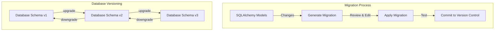

## Setup

The Alembic configuration is in the project root directory:

- `alembic.ini`: Contains database connection information and Alembic settings
- `alembic/`: Directory containing migration scripts and environment configuration:
  - `env.py`: The Alembic environment setup
  - `script.py.mako`: Template for generating migration files
  - `versions/`: Directory containing migration scripts

### Project Structure for Migrations

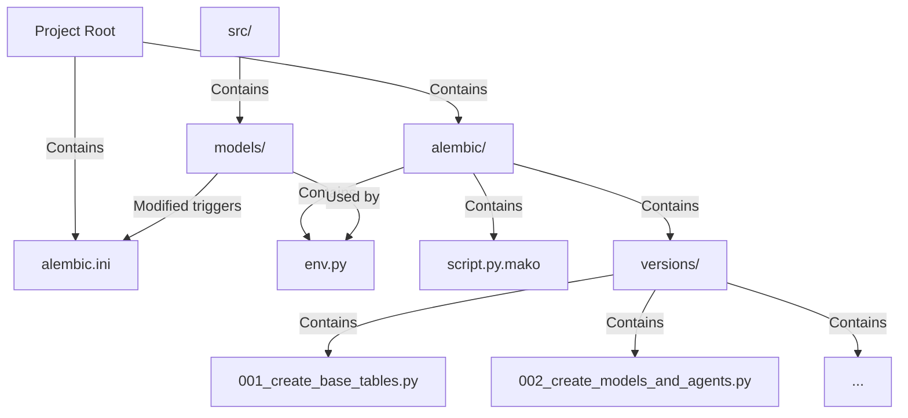

## Creating a New Migration

### Automatic Migration Generation

Alembic can automatically detect changes between your SQLAlchemy models and the current database schema to generate migrations:

1. Make changes to your SQLAlchemy models in the `src/models/` directory
2. Ensure the new model is imported in the models `__init__.py` file
3. Run the following command to generate a migration:

```bash
# Generate migration with auto-detected changes
alembic revision --autogenerate -m "Description of changes"
```

This will create a new file in the `alembic/versions/` directory with a format like `<revision_id>_description_of_changes.py`.

### Automatic Migration Process

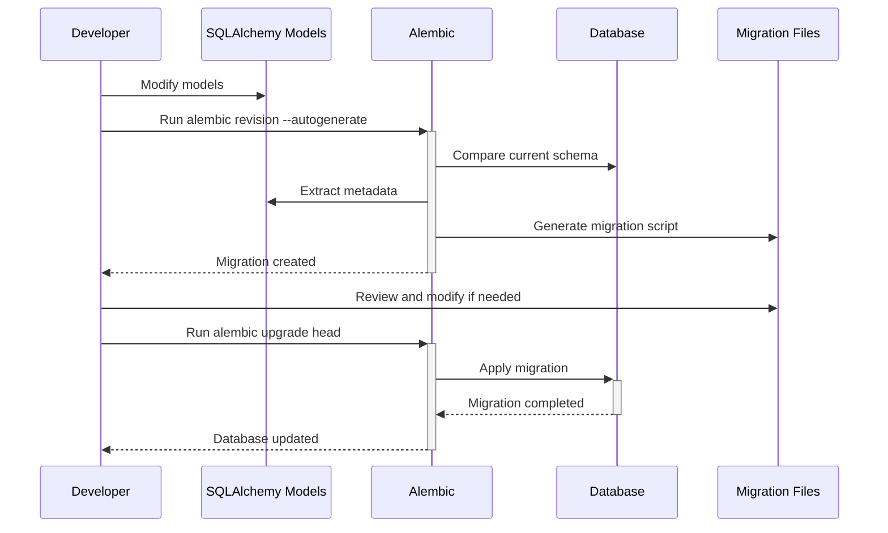

### Manual Migration Creation

For more complex changes or to insert seed data, create a manual migration:

```bash
# Create a blank migration file
alembic revision -m "Description of changes"
```

Then edit the generated file to include your migration logic in the `upgrade()` and `downgrade()` functions.

## Migration File Format

Each migration file follows this structure:

```python
"""Description of changes

Revision ID: <revision_id>
Revises: <previous_revision_id>
Create Date: <timestamp>
"""

from typing import Sequence, Union

from alembic import op
import sqlalchemy as sa

# revision identifiers
revision: str = "<revision_id>"
down_revision: Union[str, None] = "<previous_revision_id>"
branch_labels: Union[str, Sequence[str], None] = None
depends_on: Union[str, Sequence[str], None] = None

def upgrade() -> None:
    # Migration code that brings the database one step forward
    # Example: op.create_table(), op.add_column(), etc.
    pass

def downgrade() -> None:
    # Migration code that brings the database one step backward
    # Example: op.drop_table(), op.drop_column(), etc.
    pass
```

### Migration Dependencies

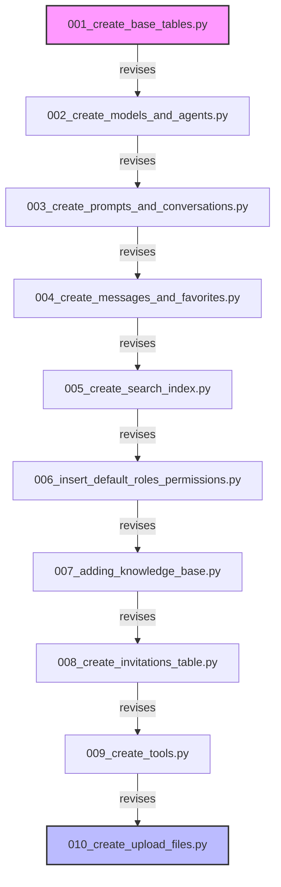

### Naming Convention

Following the project's convention, you should:

1. Prefix your migration file with the next sequential number
2. Add a short descriptive name
3. For example, if the latest migration is `010_create_upload_files.py`, name yours `011_your_feature_name.py`

To rename the file after generation:

```bash
mv alembic/versions/<revision_id>_description_of_changes.py alembic/versions/<revision_id>_011_your_feature_name.py
```

## Running Migrations

### Upgrading the Database

To apply all pending migrations:

```bash
alembic upgrade head
```

To upgrade to a specific revision:

```bash
alembic upgrade <revision_id>
```

To upgrade a relative number of steps:

```bash
alembic upgrade +1  # Upgrade one step
```

### Downgrading the Database

To downgrade to a previous revision:

```bash
alembic downgrade <revision_id>
```

To downgrade a relative number of steps:

```bash
alembic downgrade -1  # Downgrade one step
```

To downgrade to the base (before any migrations):

```bash
alembic downgrade base
```

### Migration State Flow

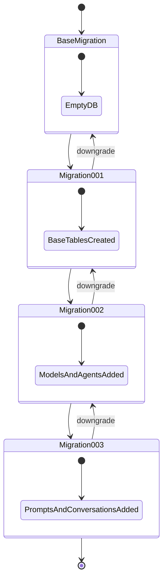

### Checking Migration Status

To see the current database revision:

```bash
alembic current
```

To see migration history:

```bash
alembic history
```

To see which migrations need to be applied:

```bash
alembic history -i
```

## Migration Examples

### Creating a Table

```python
def upgrade() -> None:
    op.create_table(
        "your_table_name",
        sa.Column("id", postgresql.UUID(), server_default=sa.text("gen_random_uuid()"), nullable=False),
        sa.Column("name", sa.String(255), nullable=False),
        sa.Column("description", sa.Text(), nullable=True),
        sa.Column("organization_id", postgresql.UUID(), nullable=False),
        sa.Column("is_active", sa.Boolean(), server_default="true", nullable=False),
        sa.Column("created_at", sa.TIMESTAMP(), server_default=sa.text("CURRENT_TIMESTAMP"), nullable=False),
        sa.Column("updated_at", sa.TIMESTAMP(), server_default=sa.text("CURRENT_TIMESTAMP"), nullable=False),
        sa.PrimaryKeyConstraint("id"),
        sa.ForeignKeyConstraint(["organization_id"], ["organizations.id"], ondelete="CASCADE"),
    )
    
    # Create index on columns
    op.create_index("ix_your_table_name_organization_id", "your_table_name", ["organization_id"])
    
    # Create update trigger for updated_at column
    op.execute(f"""
        CREATE TRIGGER update_your_table_name_updated_at
            BEFORE UPDATE ON your_table_name
            FOR EACH ROW
            EXECUTE PROCEDURE update_updated_at_column();
    """)

def downgrade() -> None:
    # Remove the trigger first
    op.execute("DROP TRIGGER IF EXISTS update_your_table_name_updated_at ON your_table_name")
    
    # Then drop the table
    op.drop_table("your_table_name")
```

### Example Table Schema

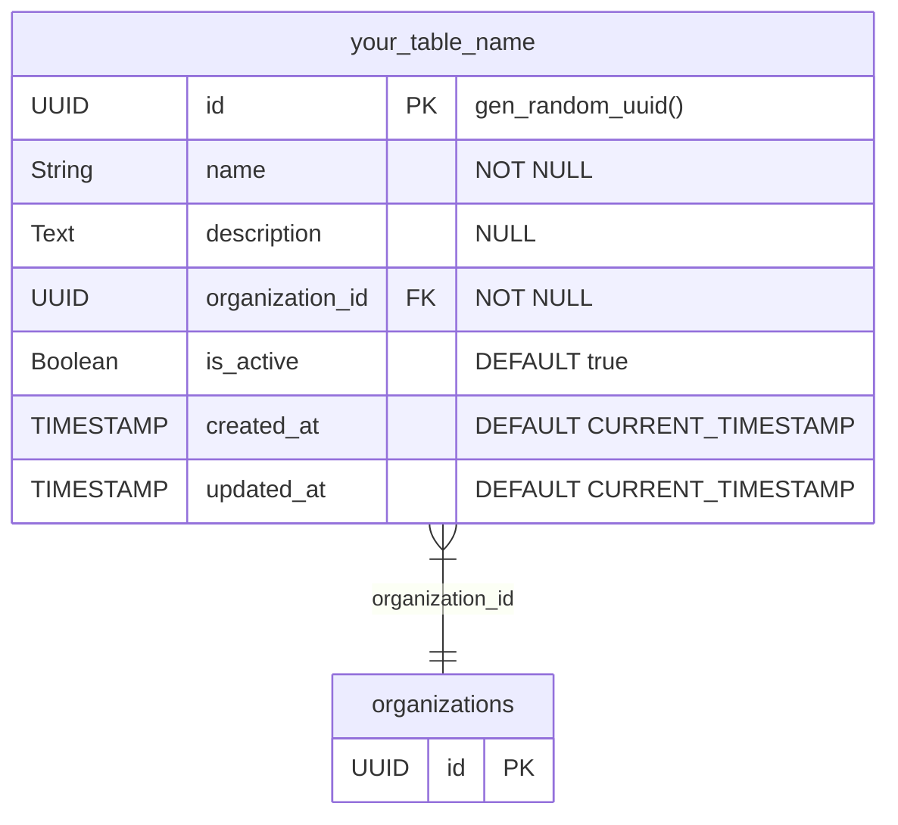

### Adding a Column

```python
def upgrade() -> None:
    op.add_column("your_table_name", sa.Column("new_column", sa.String(100), nullable=True))

def downgrade() -> None:
    op.drop_column("your_table_name", "new_column")
```

### Column Addition Visualization

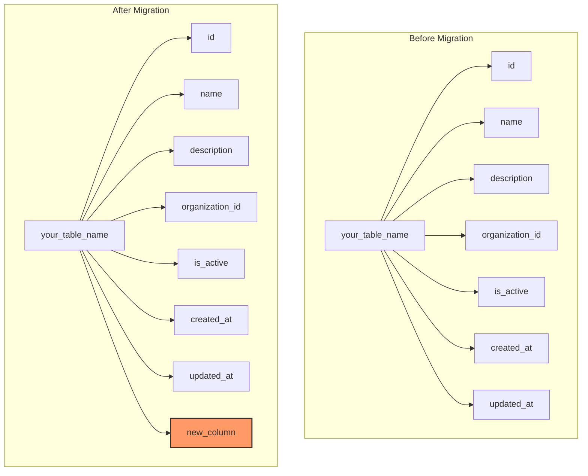

### Modifying a Column

```python
def upgrade() -> None:
    op.alter_column("your_table_name", "existing_column", 
                   existing_type=sa.String(50),
                   type_=sa.String(100),
                   nullable=False)

def downgrade() -> None:
    op.alter_column("your_table_name", "existing_column", 
                   existing_type=sa.String(100),
                   type_=sa.String(50),
                   nullable=True)
```

### Adding a Foreign Key

```python
def upgrade() -> None:
    op.add_column("your_table_name", sa.Column("parent_id", postgresql.UUID(), nullable=True))
    op.create_foreign_key(
        "fk_your_table_name_parent",
        "your_table_name", "parent_table", 
        ["parent_id"], ["id"],
        ondelete="CASCADE"
    )

def downgrade() -> None:
    op.drop_constraint("fk_your_table_name_parent", "your_table_name", type_="foreignkey")
    op.drop_column("your_table_name", "parent_id")
```

### Relationship Visualization

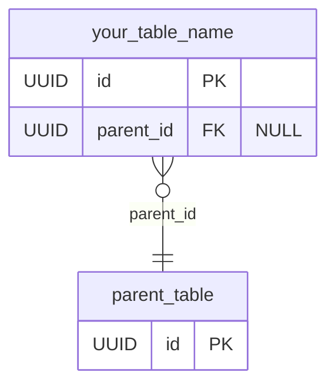

### Inserting Seed Data

```python
def upgrade() -> None:
    # Generate a UUID for new record
    new_id = str(uuid4())
    
    op.execute(f"""
        INSERT INTO your_table_name (id, name, description, organization_id, created_at, updated_at)
        VALUES (
            '{new_id}',
            'Default Item',
            'This is a default item created by migration',
            'your-org-id',
            CURRENT_TIMESTAMP,
            CURRENT_TIMESTAMP
        )
    """)

def downgrade() -> None:
    op.execute("""
        DELETE FROM your_table_name
        WHERE name = 'Default Item'
    """)
```

## Best Practices

### General Guidelines

1. **One migration per change**: Create separate migrations for distinct changes to make them easier to understand and maintain
2. **Test migrations**: Test both upgrade and downgrade paths before applying to production
3. **Be concise but descriptive**: Use clear naming conventions that indicate what each migration does
4. **Comment your code**: Add comments to complex migration logic to explain the purpose

### Database Changes

1. **Non-destructive changes**: Prefer adding over dropping where possible
2. **Nullable columns**: When adding new columns to existing tables, make them nullable or provide a default value
3. **Data migrations**: Separate schema changes from data migrations when possible
4. **Indexes**: Add appropriate indexes for foreign keys and frequently queried columns
5. **Updated_at triggers**: Add triggers for `updated_at` columns as demonstrated in the example migrations

### Migration Decision Flow

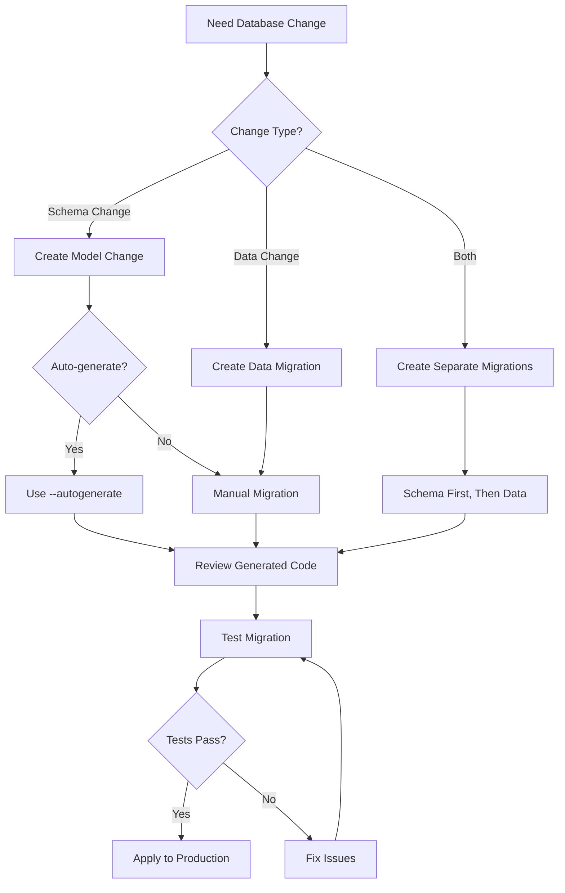

### SQL Execution

1. **Use SQLAlchemy operations**: Prefer Alembic's operation helpers (`op.*`) over raw SQL when possible
2. **Transaction safety**: Ensure your migrations are transaction-safe
3. **Idempotence**: Make migrations idempotent where possible to avoid errors on reapplication
4. **Performance**: Be mindful of migration performance on large tables; consider batch operations

### Version Control

1. **Commit migrations**: Always commit migration files to version control
2. **Do not edit applied migrations**: Create new migrations rather than modifying existing ones that have been applied

## Troubleshooting

### Common Issues

1. **Autogeneration misses changes**: Alembic can't detect all types of changes. Always review auto-generated migrations.
2. **Migration conflicts**: If multiple developers create migrations simultaneously, conflicts may occur. Coordinate migrations or adjust revision chains as needed.
3. **Database connection issues**: Verify your database connection settings in `alembic.ini`.
4. **SQLAlchemy model not detected**: Ensure your model is imported in the models `__init__.py` file.

### Troubleshooting Flow

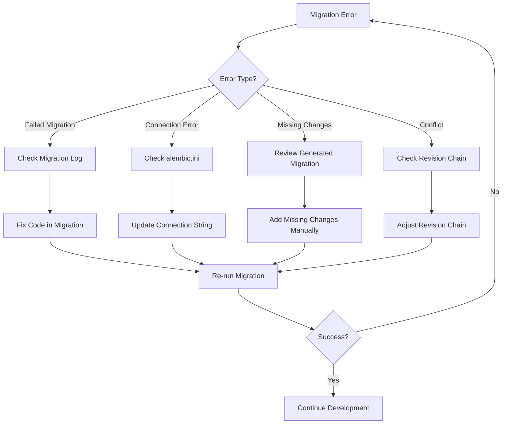

### Fixing a Failed Migration

If a migration fails midway:

1. Fix the issue in the migration script
2. Run `alembic upgrade head` again, or specifically target the failed migration

If you need to revert a partial migration:

1. Manually fix the database state if necessary
2. Mark the current revision: `alembic stamp <last_successful_revision>`
3. Then try upgrading again

## Migration Workflow Summary

1. Make changes to SQLAlchemy models
2. Generate a migration with `alembic revision --autogenerate -m "description"`
3. Review and edit the generated migration file if necessary
4. Rename the file to follow the sequential numbering convention
5. Test the migration in a development environment
6. Apply the migration with `alembic upgrade head`
7. Commit the migration file to version control

### Complete Migration Lifecycle

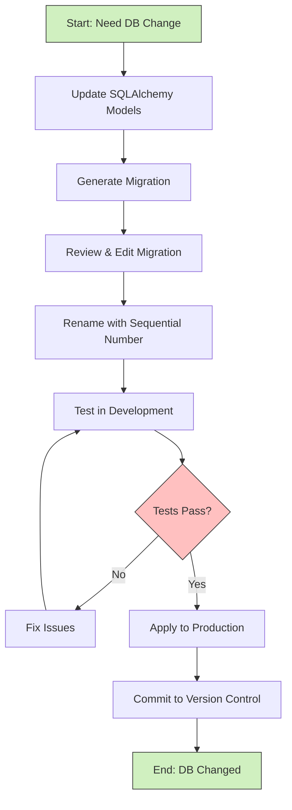

By following this guide and examining existing migrations, you'll be able to create and manage database migrations effectively in the Zyeta backend.
