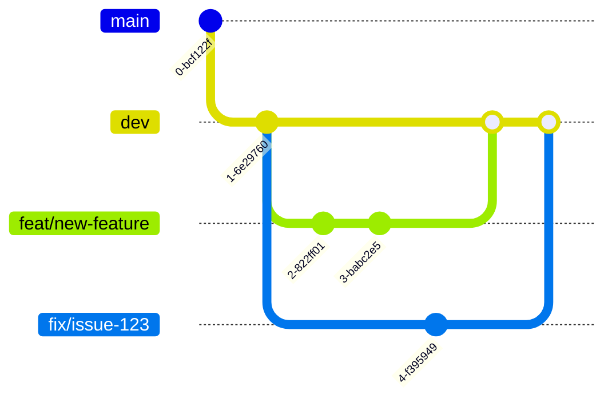

This guide outlines the recommended development workflow for the Definable backend project. Following these practices will help maintain code quality and ensure smooth collaboration.

## Development Environment

Before starting development, ensure you have:

1. Completed the [installation process](/pages/getting-started/installation)
2. Set up your [environment variables](/pages/getting-started/environment-setup)
3. Installed pre-commit hooks with `pre-commit install`

## Git Workflow

We follow a branch-based workflow to manage code changes:

### Branching Strategy



- **Main Branch**: Always contains stable, production-ready code
- **Dev Branch**: All new features and bug fixes are merged in the `dev` branch then escalated further.
- **Feature Branches**: For new features (`feat/feature-name`)
- **Bugfix Branches**: For bug fixes (`fix/issue-id`)
- **Release Branches**: For preparing releases (`release/v1.2.3`)

### Branch Naming Convention

- `feat/short-description` - For new features
- `fix/issue-id` - For bug fixes
- `refactor/component-name` - For code refactoring
- `docs/what-changed` - For documentation updates

## Code Change Process

### 1. Create a New Branch

```bash
git checkout main
git pull
git checkout -b feature/my-new-feature
```

### 2. Make Changes

Write your code following the project's coding standards (enforced by Ruff and Mypy).

### 3. Run Tests Locally

```bash
# Run unit tests
pytest tests/unit

# Run integration tests
pytest tests/integration

# Run with coverage
pytest --cov=src tests/
```

### 4. Commit Changes

```bash
# Add files
git add .

# Commit (this will trigger pre-commit hooks)
git commit -m "Add feature: detailed description"
```

<Note>
The pre-commit hooks will run Ruff for linting and Mypy for type checking. Fix any issues before proceeding.
</Note>

### 5. Push Changes

```bash
git push origin feature/my-new-feature
```

### 6. Create a Pull Request

Create a pull request on GitHub with:

- Clear title describing the change
- Detailed description of what was changed and why
- References to any related issues
- Ensure the PR is directed to the `dev` branch for review.

### 7. Code Review

All pull requests require at least one review before merging into `dev`. Reviewers should check:

- Code correctness
- Test coverage
- Adherence to project standards
- Documentation

### 8. Merge

Once approved, the PR can be merged into the `dev` branch. After sufficient testing and validation, changes can be merged into `master` and then into the `release` branch.

## Code Quality Standards

### Style Guide

We use Ruff for linting with the following key rules:

- 2-space indentation
- 150 character line length
- Python 3.10+ features allowed

### Type Annotations

All code should use type annotations and pass Mypy checks:

```python
def add_user(name: str, age: int) -> User:
    """
    Create a new user.
    
    Args:
        name: The user's name
        age: The user's age
    
    Returns:
        A new User instance
    """
    return User(name=name, age=age)
```

### Documentation

All modules, classes, and functions should have docstrings following Google's style guide:

```python
def function(arg1: str, arg2: int) -> bool:
    """Short description of function.
    
    Longer description explaining the function's purpose and any
    notable behavior.
    
    Args:
        arg1: Description of arg1
        arg2: Description of arg2
    
    Returns:
        Description of return value
        
    Raises:
        ValueError: Description of when this error is raised
    """
```

## Adding New Components

### Adding a New Service

1. Create a new directory in `src/services/[service_name]/`
2. Add the required files:
   - `service.py` - Main service implementation
   - `schema.py` - Pydantic models

Example service structure:

```python
from fastapi import Depends, HTTPException
from sqlalchemy.ext.asyncio import AsyncSession

from database import get_db
from services.__base.acquire import Acquire

from .schema import MyRequestSchema, MyResponseSchema

class MyNewService:
    """My new service description."""

    http_exposed = ["get=resource", "post=resource"]

    def __init__(self, acquire: Acquire):
        """Initialize service."""
        self.acquire = acquire
        self.logger = acquire.logger
        
    async def get_resource(
        self, 
        resource_id: str, 
        session: AsyncSession = Depends(get_db)
    ) -> MyResponseSchema:
        """Get a resource by ID."""
        # Implementation
```

### Adding a New Model

1. Create a new file in `src/models/` named `[model_name]_model.py`
2. Define your SQLAlchemy model
3. Update `src/models/__init__.py` to export your model

Example model:

```python
from sqlalchemy import Column, Integer, String, ForeignKey
from sqlalchemy.dialects.postgresql import UUID
from uuid import uuid4

from database.models import Base, CRUD

class MyNewModel(Base, CRUD):
    """My new model description."""
    
    __tablename__ = "my_new_models"
    
    id = Column(UUID(as_uuid=True), primary_key=True, default=uuid4)
    name = Column(String, nullable=False)
    description = Column(String)
    related_id = Column(UUID(as_uuid=True), ForeignKey("related_table.id"))
```

4. Create a migration:

```bash
alembic revision --autogenerate -m "Add my new model"
alembic upgrade head
```

## Database Migrations

### Creating Migrations

```bash
# Generate a migration based on model changes
alembic revision --autogenerate -m "Description of changes"

# Apply migrations
alembic upgrade head

# Revert migrations
alembic downgrade -1  # Revert one migration
alembic downgrade base  # Revert all migrations
```

## Debugging

### Logging

Use the logger provided by the Acquire class:

```python
def my_function(self):
    self.logger.debug("Debug message with data", extra_field=value)
    self.logger.info("Info message")
    self.logger.warning("Warning message")
    self.logger.error("Error message", exc_info=True)
```

### FastAPI Debug Mode

For local development, use FastAPI's debug mode:

```bash
python -m src.app --dev
```

This enables auto-reload on code changes.

## Deployment Pipeline

Our code follows this deployment pipeline:

<Steps>
  <Step title="Development">
    Local development and testing
  </Step>
  <Step title="Continuous Integration">
    Automated tests and checks run on GitHub Actions
  </Step>
  <Step title="Staging Deployment">
    Automatic deployment to the staging environment after merging into the `dev` branch.
  </Step>
  <Step title="Production Deployment">
    Manual approval and deployment to production
  </Step>
</Steps>

## Troubleshooting

<AccordionGroup>
  <Accordion title="Pre-commit Hooks Failing">
    If pre-commit hooks are failing:
    
    - Check Ruff errors: `ruff check src/`
    - Check Mypy errors: `mypy src/`
    - Fix the issues before committing again
  </Accordion>
  
  <Accordion title="Database Migration Issues">
    If you encounter migration errors:
    
    - Check for model conflicts or circular imports
    - Try recreating the migration with `alembic revision --autogenerate -m "Fixed migration"`
    - In worst case, you can reset: `alembic downgrade base` then `alembic upgrade head`
  </Accordion>
  
  <Accordion title="Dependency Issues">
    If you encounter new dependency issues:
    
    - Update Poetry: `poetry update`
    - Check for locked versions: `poetry show -o`
    - Add specific dependency: `poetry add package-name`
    - Update lock file: `poetry lock --no-update`
  </Accordion>
</AccordionGroup>

## Best Practices

1. **Write tests first**: Follow test-driven development when possible
2. **Keep services focused**: Each service should have a single responsibility
3. **Use async properly**: Ensure all I/O operations are async
4. **Handle exceptions**: Always catch and handle exceptions appropriately
5. **Validate inputs**: Use Pydantic models for data validation
6. **Document your code**: Write clear docstrings and comments
7. **Review your own code**: Do a self-review before requesting reviews

By following this development workflow, you'll contribute high-quality code to the Definable backend project while maintaining a smooth collaborative process.