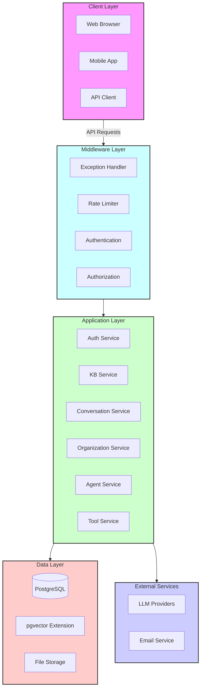

The Zyeta backend is a powerful, scalable system designed to provide AI-driven knowledge base and conversation capabilities. Built with modern asynchronous Python, the platform leverages FastAPI, PostgreSQL with vector extensions, and integrates with leading LLM providers.

## Core Features

<CardGroup cols={2}>
  <Card title="Knowledge Base Management" icon="brain">
    Store, index, and retrieve documents with semantic search capabilities
  </Card>
  <Card title="Conversational AI" icon="comments">
    Interact with LLMs through persistent conversation contexts
  </Card>
  <Card title="Multi-Organization Support" icon="building">
    Isolated environments with role-based access control
  </Card>
  <Card title="Custom Agents" icon="robot">
    Configurable AI agents with specialized capabilities
  </Card>
  <Card title="Tool Integration" icon="wrench">
    Extend agent capabilities with custom tools
  </Card>
  <Card title="LLM Provider Flexibility" icon="plug">
    Connect to various LLM providers (OpenAI, Anthropic, etc.)
  </Card>
</CardGroup>

## System Architecture

Zyeta follows a modular, service-oriented architecture built with FastAPI:

## Key Components

### API Layer

The API layer provides RESTful endpoints for all platform functionality:

- **FastAPI Framework**: Modern, high-performance web framework
- **Automatic Documentation**: OpenAPI/Swagger docs for all endpoints
- **Type Validation**: Pydantic models for request/response validation
- **Authentication**: JWT-based auth with role-based access control

### Service Layer

Services encapsulate business logic for specific domains:

- **Authentication Service**: User management, login, registration
- **Knowledge Base Service**: Document storage, indexing, and retrieval
- **Organization Service**: Multi-tenant organization management
- **Conversation Service**: LLM interaction and message history
- **Agent Service**: Configurable AI agent management
- **Tool Service**: Custom tool creation for agents

### Data Layer

The data layer handles persistent storage and retrieval:

- **PostgreSQL**: Primary relational database
- **pgvector Extension**: Vector storage for embeddings
- **SQLAlchemy ORM**: Async database access with transaction support
- **Alembic Migrations**: Database schema version control

### Integration Layer

The backend connects to various external services:

- **LLM Providers**: OpenAI, Anthropic, and others
- **File Storage**: S3-compatible storage for documents
- **Email Services**: User notifications and invitations

## Key Features In Depth

### Knowledge Base System

The knowledge base system allows storage and retrieval of documents with semantic search:

<Steps>
  <Step title="Document Upload">
    Users upload documents in various formats (PDF, DOCX, TXT)
  </Step>
  <Step title="Text Extraction">
    Text is extracted from documents using appropriate parsers
  </Step>
  <Step title="Chunking">
    Documents are split into manageable chunks for embedding
  </Step>
  <Step title="Embedding Generation">
    LLM-based embeddings are created for each chunk
  </Step>
  <Step title="Vector Storage">
    Embeddings are stored in pgvector for efficient similarity search
  </Step>
  <Step title="Semantic Search">
    User queries are converted to embeddings and matched against stored vectors
  </Step>
</Steps>

### Conversation System

The conversation system enables persistent interactions with LLMs:

- **Streaming Responses**: Real-time streaming of LLM responses
- **History Management**: Persistent conversation history
- **Context Window Management**: Smart handling of token limits
- **RAG Integration**: Augment conversations with knowledge base results

### Organization & RBAC

The multi-organization system with role-based access control:

- **Organization Isolation**: Data separation between organizations
- **Role Hierarchy**: Configurable role levels (Owner, Admin, Member, Guest)
- **Fine-grained Permissions**: Resource:action permission model
- **Invitation Flow**: Email-based user invitations

## Technology Stack

- **Language**: Python 3.10+
- **Web Framework**: FastAPI
- **Database**: PostgreSQL 15+ with pgvector
- **ORM**: SQLAlchemy 2.0 (async)
- **Authentication**: JWT tokens
- **Validation**: Pydantic
- **Testing**: Pytest
- **Linting**: Ruff, mypy
- **Deployment**: Docker + Kubernetes

## Getting Started

To get started with the Zyeta backend:

- [Installation Guide](/pages/getting-started/installation): Setting up your development environment
- [Environment Setup](/pages/getting-started/environment-setup): Configuring required variables
- [Development Workflow](/pages/getting-started/development-workflow): Working with the codebase
- [Architecture Details](/pages/architecture/overview): In-depth architectural overview

## API Reference

For API documentation, see the [API Reference](/pages/api-reference/overview) section. 