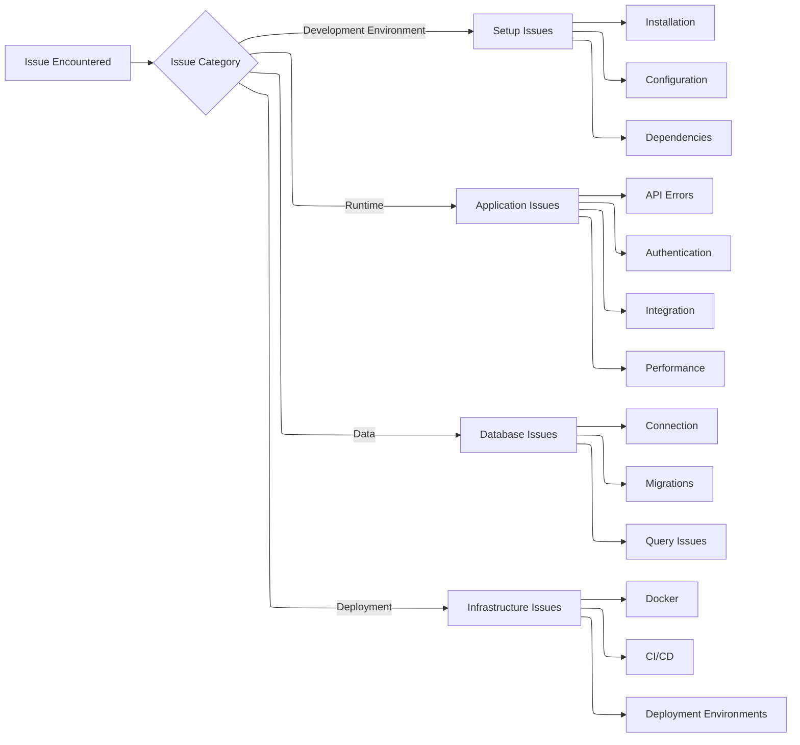

This guide provides solutions for common issues you may encounter when setting up, developing, or deploying the Definable backend.

## Overview

When troubleshooting issues with the Definable backend, it's helpful to categorize the problem:



## Quick Solutions for Common Issues

<CardGroup cols={2}>
  <Card title="Installation Issues" icon="wrench" href="/pages/troubleshooting/installation-issues">
    Problems with setting up the development environment
  </Card>
  <Card title="Database Issues" icon="database" href="/pages/troubleshooting/database-issues">
    Database connection, migration, and query problems
  </Card>
  <Card title="API Errors" icon="server" href="/pages/troubleshooting/api-errors">
    Common API errors and their solutions
  </Card>
  <Card title="Authentication Issues" icon="lock" href="/pages/troubleshooting/authentication-issues">
    Problems with JWT, RBAC, and user authentication
  </Card>
</CardGroup>

## Diagnostic Process

When troubleshooting, follow this general process:

1. **Identify the symptoms** - What exactly is happening? What error messages are you seeing?
2. **Check the logs** - Application logs, database logs, and error messages often contain valuable information
3. **Isolate the problem** - Is it a configuration issue, code bug, or infrastructure problem?
4. **Check for recent changes** - Did the issue appear after a recent code change or environment modification?
5. **Test simple solutions first** - Often, restarting services or clearing caches can resolve issues
6. **Consult documentation** - Check this troubleshooting guide for common solutions

## Logging

The Definable backend uses the `loguru` library for logging. To enable more detailed logs:

```python
# In your local development environment
from loguru import logger
logger.add("debug.log", level="DEBUG")
```

## Getting Support

If you're unable to resolve an issue using this documentation:

1. Check for similar issues in the GitHub repository
2. Contact the development team through the appropriate channels
3. Provide detailed information about the issue, including:
   - Error messages
   - Steps to reproduce
   - Environment details
   - Recent changes to your setup

## Troubleshooting Guides

For detailed solutions to specific problems, refer to these guides:

- [Installation Issues](/troubleshooting/installation-issues) - Environment setup, dependency problems
- [Database Issues](/troubleshooting/database-issues) - Connection, migration, and data problems
- [API Errors](/troubleshooting/api-errors) - Common API errors and their solutions
- [Authentication Issues](/troubleshooting/authentication-issues) - JWT, RBAC, and user authentication
- [Docker & Deployment](/troubleshooting/deployment-issues) - Container and deployment problems
- [Integration Issues](/troubleshooting/integration-issues) - Issues with external services
- [Performance Issues](/troubleshooting/performance-issues) - Slow responses and optimization 