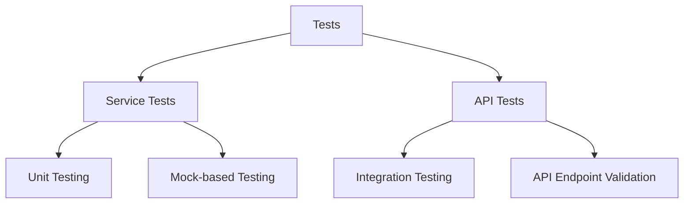
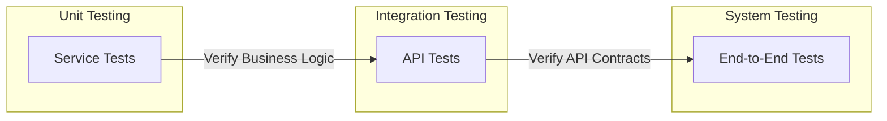
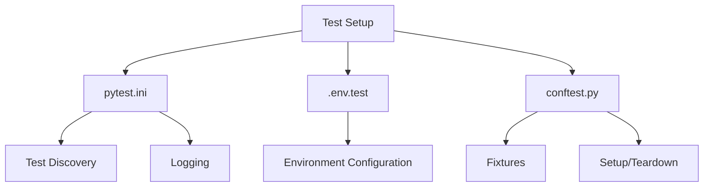
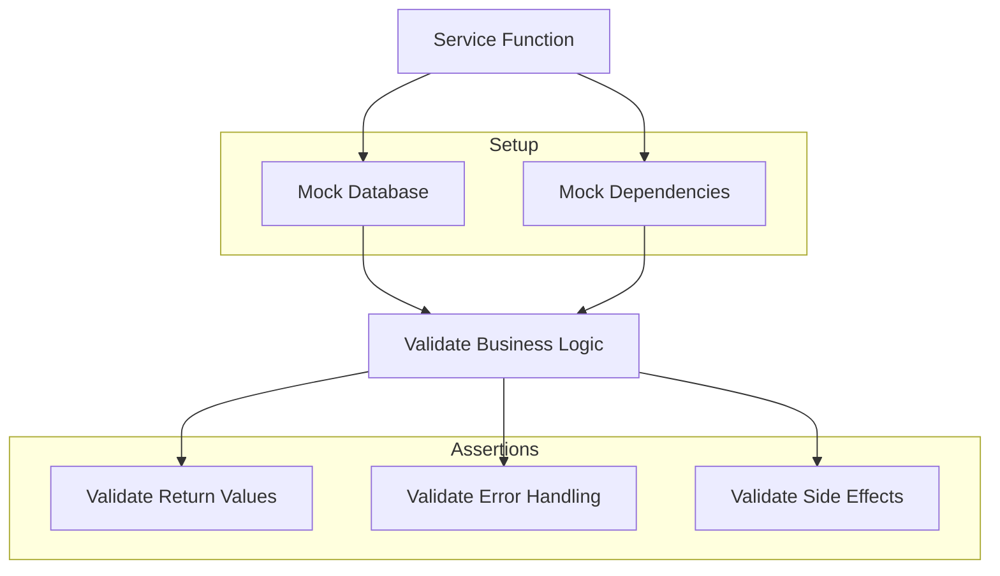
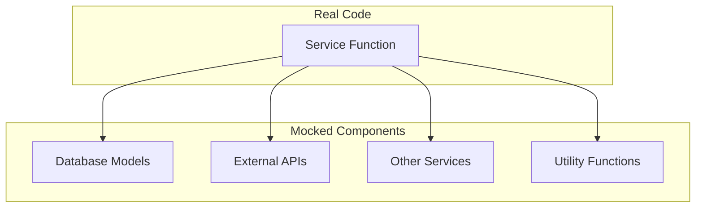
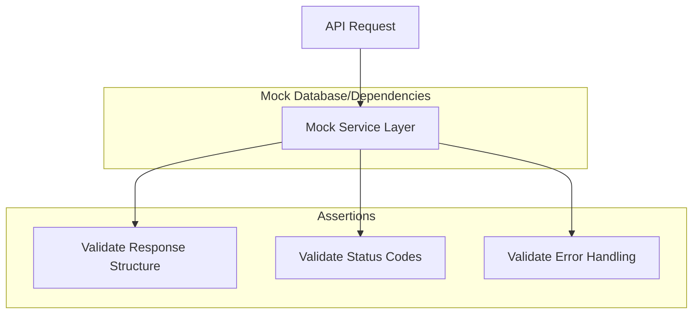
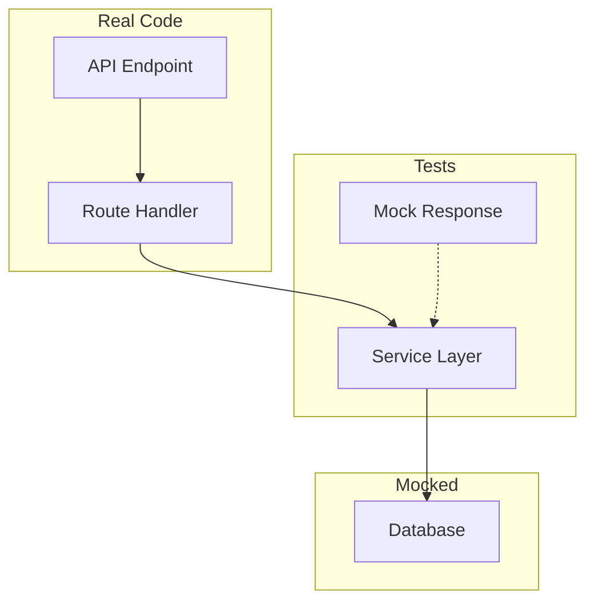
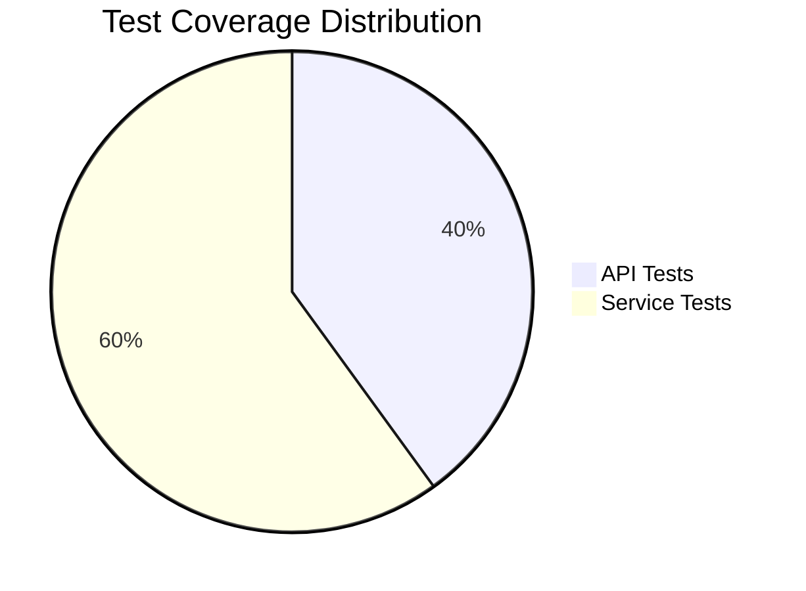
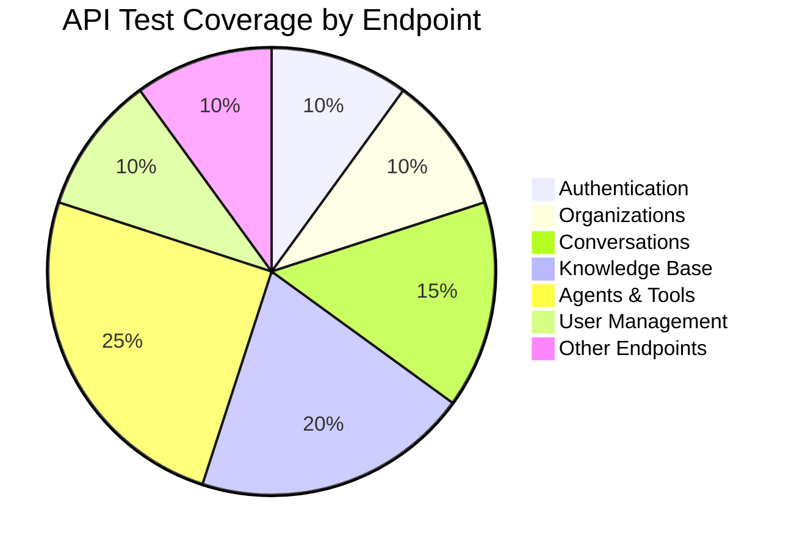
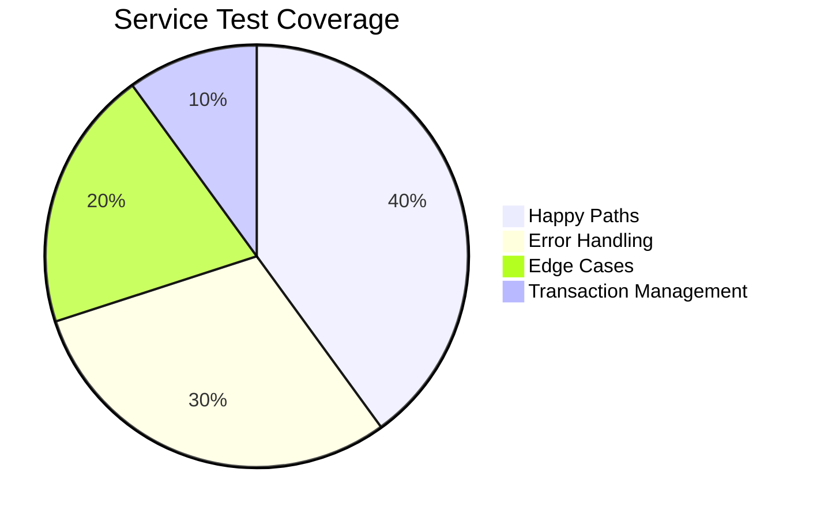

# Testing Documentation

This directory contains the comprehensive test suite for the Zyeta backend application. The test suite is organized into multiple levels of testing to ensure the application's reliability, functionality, and performance.

## Table of Contents

- [Test Structure](#test-structure)
- [Test Types](#test-types)
  - [Service Tests](#service-tests)
  - [API Tests](#api-tests)
- [Test Flow](#test-flow)
- [Setup and Configuration](#setup-and-configuration)
- [Service Testing](#service-testing)
  - [Methodology](#service-test-methodology)
  - [Mock Strategy](#service-mock-strategy)
  - [Database Mocking](#database-mocking)
  - [Mock Models](#mock-models)
  - [Async Testing](#async-testing)
- [API Testing](#api-testing)
  - [Methodology](#api-test-methodology)
  - [Mock Strategy](#api-mock-strategy)
  - [Test Client](#test-client)
  - [Authentication](#authentication)
  - [Test Generator](#test-generator)
- [Running Tests](#running-tests)
- [Test Coverage](#test-coverage)
- [Best Practices](#best-practices)
- [Integration with CI/CD](#integration-with-cicd)

## Test Structure

The test suite is organized into the following directories:

```
tests/
├── api_tests/       # API integration tests
│   ├── conftest.py                # API test fixtures
│   ├── test_agents.py             # Tests for agent endpoints
│   ├── test_auth.py               # Tests for authentication endpoints
│   ├── test_conversation.py       # Tests for conversation endpoints
│   ├── test_generator.py          # Test generator for creating API test templates
│   ├── test_invitations.py        # Tests for invitation endpoints
│   ├── test_kb.py                 # Tests for knowledge base endpoints
│   ├── test_llm.py                # Tests for LLM model endpoints
│   ├── test_organization.py       # Tests for organization endpoints
│   ├── test_public_upload.py      # Tests for public upload endpoints
│   ├── test_roles.py              # Tests for role endpoints
│   └── test_tools.py              # Tests for tools endpoints
├── services/        # Service unit tests
│   ├── test_agents.py             # Tests for agent services
│   ├── test_auth.py               # Tests for authentication services
│   ├── test_conversation.py       # Tests for conversation services
│   ├── test_invitations.py        # Tests for invitation services
│   ├── test_kb.py                 # Tests for knowledge base services
│   ├── test_llm.py                # Tests for LLM model services
│   ├── test_org.py                # Tests for organization services
│   ├── test_public_upload.py      # Tests for public upload services
│   ├── test_roles.py              # Tests for role services
│   └── test_tools.py              # Tests for tools services
├── conftest.py      # Shared test fixtures
└── README.md        # This documentation
```

## Test Types



### Service Tests

Service tests focus on testing the business logic in isolation, without involving HTTP requests or API endpoints.

- **Purpose**: Verify that individual service functions work correctly with proper inputs and produce expected outputs
- **Coverage**: Business logic, data validation, error handling
- **Mocking**: External dependencies, database connections, other services

### API Tests

API tests verify the HTTP endpoints and the request-response flow, ensuring that API contracts are maintained.

- **Purpose**: Verify that API endpoints handle requests correctly and return proper responses
- **Coverage**: Request validation, response formatting, error handling, authentication
- **Integration**: Tests the integration between routers, services, and dependencies

## Test Flow



## Setup and Configuration

The test environment is configured using:

- **pytest.ini**: Contains pytest configuration, including test discovery patterns, logging settings, and environment variables
- **conftest.py**: Contains shared fixtures and setup/teardown logic
- **.env.test**: Contains environment variables specific to the testing environment



## Service Testing

### Service Test Methodology



Each service test typically follows this pattern:

1. **Setup**: 
   - Mock database session and models
   - Mock external dependencies
   - Prepare test data

2. **Execute**: 
   - Call the service function with test parameters

3. **Verify**: 
   - Assert correct data manipulation
   - Verify expected return values
   - Check error handling for edge cases

### Service Mock Strategy

Service tests use extensive mocking to isolate the business logic:



Common mocked components include:

- **Database**: Sessions, queries, models, and transactions
- **Authentication**: User context and permissions
- **External Services**: LLM APIs, storage, email services
- **Utilities**: Time, UUIDs, encryption

### Database Mocking

The tests use a sophisticated approach to mock SQLAlchemy database operations:

```python
@pytest.fixture
def mock_db_session():
    """Create a mock database session."""
    session = AsyncMock()
    
    # Setup scalar and execute methods
    scalar_mock = AsyncMock()
    session.scalar = scalar_mock
    
    execute_mock = AsyncMock()
    execute_result = AsyncMock()
    execute_result.unique.return_value = execute_result
    execute_result.scalars.return_value = execute_result
    execute_result.scalar_one_or_none.return_value = None
    execute_result.scalar_one.return_value = None
    execute_result.first.return_value = None
    execute_result.all.return_value = []
    execute_result.mappings.return_value = execute_result
    
    execute_mock.return_value = execute_result
    session.execute = execute_mock
    
    session.add = MagicMock()
    session.commit = AsyncMock()
    session.refresh = AsyncMock()
    session.flush = AsyncMock()
    session.rollback = AsyncMock()
    return session
```

### Mock Models

Service tests use custom mock model classes that simulate database models without requiring a database connection:

```python
class MockUserModel:
    def __init__(self, **kwargs):
        self.id = kwargs.get('id', uuid4())
        self.email = kwargs.get('email', 'test@example.com')
        self.first_name = kwargs.get('first_name', 'Test')
        self.last_name = kwargs.get('last_name', 'User')
        self.password_hash = kwargs.get('password_hash', 'hash')
        self.created_at = kwargs.get('created_at', datetime.now(timezone.utc))
        self.updated_at = kwargs.get('updated_at', datetime.now(timezone.utc))
        self.__dict__ = {**self.__dict__, **kwargs}
```

### Async Testing

Most service functions are asynchronous, and tests use pytest-asyncio to handle this:

```python
@pytest.mark.asyncio
async def test_get_user(mock_db_session):
    """Test getting a user by ID."""
    # Setup mock
    user_id = uuid4()
    mock_user = MockUserModel(id=user_id)
    mock_db_session.execute.return_value.scalar_one_or_none.return_value = mock_user
    
    # Execute
    result = await user_service.get_user(user_id, session=mock_db_session)
    
    # Verify
    assert result.id == user_id
    assert result.email == mock_user.email
    mock_db_session.execute.assert_called_once()
```

## API Testing

### API Test Methodology



Each API test follows a similar pattern:

1. **Setup**: Prepare test data and mock service layer responses
2. **Execute**: Make the API request using the TestClient
3. **Verify**: Assert the response structure, status code, and content

### API Mock Strategy



The API tests mock the service layer to isolate testing to the API layer. This approach:

- Focuses tests on API contract and route handling
- Makes tests faster and more reliable
- Avoids database dependencies

### Test Client

The tests use FastAPI's `TestClient` for making HTTP requests. The client is configured in the conftest.py file:

```python
@pytest.fixture
def client():
    """Create a test client."""
    from fastapi.testclient import TestClient
    from main import app
    return TestClient(app)
```

### Authentication

Many API endpoints require authentication. The tests handle this by:

1. Mocking the authentication middleware
2. Providing authentication fixtures:

```python
@pytest.fixture
def auth_headers():
    """Create authentication headers."""
    return {"Authorization": "Bearer test_token"}
```

### Test Generator

The `test_generator.py` file contains utilities for generating API test templates based on API specifications. This helps ensure consistent test coverage and structure.

Usage:

```python
from test_generator import generate_api_tests

# Generate API tests from a Postman collection
generate_api_tests("api.json", "tests/api_tests")
```

You can use the generator to create template test files for any missing API endpoints:

```bash
cd /path/to/zyeta.backend
python -m tests.api_tests.test_generator
```

This will create template test files in `tests/api_tests/generated/` that you can use as a starting point to implement missing tests.

## Test Fixtures

The test fixtures are defined in `conftest.py` files at various levels:

- Root level: Global fixtures available to all tests
- Directory level: Fixtures specific to test directories

Common fixtures include:

- `client`: A TestClient instance for making HTTP requests
- `mock_db_session`: A mocked database session
- `auth_headers`: Authentication headers for authorized requests
- `org_id`: A sample organization ID for testing

## Running Tests

To run all tests:

```bash
pytest
```

To run specific test directories:

```bash
pytest tests/api_tests
pytest tests/services
```

To run tests for a specific service or API:

```bash
pytest tests/api_tests/test_auth.py
pytest tests/services/test_auth.py
```

To run a specific test:

```bash
pytest tests/api_tests/test_auth.py::TestAuthAPI::test_login
pytest tests/services/test_auth.py::TestAuthService::test_login
```

## Test Coverage

We aim for high test coverage across both service and API layers. Each service file should have a corresponding test file, and each API endpoint should have test coverage for common request scenarios and edge cases.







## Best Practices

1. **Isolation**: Tests should be isolated and not depend on the state from other tests
2. **Mocking**: External dependencies should be mocked to ensure fast and reliable tests
3. **Coverage**: Aim for comprehensive coverage of both happy paths and error scenarios
4. **Assertions**: Use specific assertions that provide clear error messages
5. **Maintenance**: Keep tests up to date with API changes and refactoring
6. **Consistency**: Follow consistent patterns for test setup and assertions
7. **Parameterization**: Use pytest's parametrize for testing variations of the same endpoint
8. **Documentation**: Document test fixtures and complex test setups
9. **Test both paths**: Test both success and failure scenarios
10. **Validate side effects**: Check that database operations occur as expected

## Integration with CI/CD

These tests are integrated into the CI/CD pipeline via the GitHub Actions workflow in `.github/workflows/run-tests.yml`. The workflow runs both service unit tests and API integration tests to ensure comprehensive coverage. 